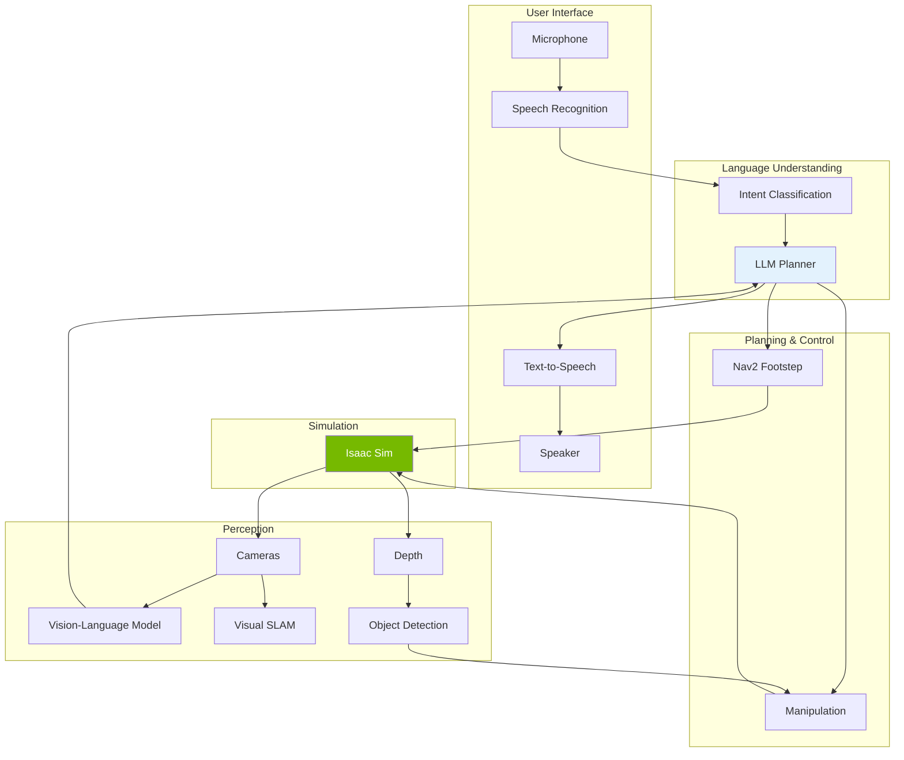

# Capstone Project

## Project Overview

The capstone project integrates all concepts from the four modules into a complete voice-controlled humanoid robot system. You will build an end-to-end application where a user can give natural language commands to a simulated humanoid robot that perceives its environment, plans actions, and executes tasks.

## Learning Outcomes

By completing this capstone, you will demonstrate ability to:

1. **Integrate** ROS 2 communication across multiple subsystems
2. **Configure** NVIDIA Isaac Sim for realistic humanoid simulation
3. **Implement** Visual SLAM for robot localization
4. **Deploy** voice-to-action pipelines for natural interaction
5. **Build** a complete perception-planning-action loop

## Project Architecture



## Project Specifications

### Scenario

The humanoid robot operates in a simulated home environment with:
- Living room with couch, coffee table, and TV
- Kitchen with counter, refrigerator, and cabinets
- Multiple rooms connected by doorways
- Various manipulable objects (cups, books, remotes)

### Required Capabilities

| Capability | Description | Module Source |
|------------|-------------|---------------|
| Voice Command | Accept natural language commands via microphone | Module 4 |
| Scene Understanding | Describe current scene on request | Module 4 |
| Navigation | Walk to specified locations | Module 3 |
| Object Detection | Identify and locate objects | Module 4 |
| Pick and Place | Grasp and move objects | Module 1, 3 |
| Status Feedback | Speak status updates to user | Module 4 |

### Example Commands

- "Go to the kitchen"
- "What do you see?"
- "Pick up the cup on the table"
- "Bring me the book from the bedroom"
- "Where is the remote?"
- "Clean up the living room"

## Implementation Phases

### Phase 1: Environment Setup (Week 1)

1. Create Isaac Sim scene with home environment
2. Import humanoid URDF with proper physics
3. Configure ROS 2 bridge for all topics
4. Verify sensor simulation (cameras, IMU, F/T)

**Deliverables:**
- [ ] Isaac Sim scene file
- [ ] Launch file for simulation
- [ ] Verified ROS 2 topic list

### Phase 2: Perception Pipeline (Week 2)

1. Implement Visual SLAM for localization
2. Deploy object detection model
3. Create vision-language scene description
4. Build semantic map of environment

**Deliverables:**
- [ ] SLAM producing accurate odometry
- [ ] Object detection with >80% mAP
- [ ] Scene description responding to queries

### Phase 3: Voice Interface (Week 3)

1. Set up speech recognition node
2. Implement intent classification
3. Create text-to-speech feedback
4. Test end-to-end voice pipeline

**Deliverables:**
- [ ] >90% command recognition accuracy
- [ ] Intent extraction for all command types
- [ ] Natural speech feedback

### Phase 4: Planning & Navigation (Week 4)

1. Configure Nav2 for bipedal locomotion
2. Implement footstep planner
3. Create LLM-based task planner
4. Integrate perception with planning

**Deliverables:**
- [ ] Reliable navigation between rooms
- [ ] Task decomposition for complex commands
- [ ] Recovery from navigation failures

### Phase 5: Manipulation & Integration (Week 5)

1. Implement grasp planning
2. Create pick-and-place actions
3. Integrate all subsystems
4. End-to-end testing

**Deliverables:**
- [ ] Successful object manipulation
- [ ] Complete command execution loop
- [ ] Demo video of full system

## Evaluation Criteria

### Technical Requirements (60%)

| Criterion | Weight | Description |
|-----------|--------|-------------|
| Navigation | 15% | Robot walks to commanded locations |
| Perception | 15% | Accurate object detection and localization |
| Voice Interface | 15% | Correct command understanding and feedback |
| Manipulation | 15% | Successful pick and place operations |

### Code Quality (20%)

| Criterion | Weight | Description |
|-----------|--------|-------------|
| Architecture | 10% | Clean separation of concerns |
| Documentation | 5% | README and inline comments |
| Testing | 5% | Unit tests for key components |

### Demonstration (20%)

| Criterion | Weight | Description |
|-----------|--------|-------------|
| Live Demo | 10% | Successful execution of test commands |
| Presentation | 5% | Clear explanation of system |
| Robustness | 5% | Handling of edge cases |

## Getting Started

### Repository Structure

```
capstone/
├── launch/
│   ├── simulation.launch.py
│   ├── perception.launch.py
│   ├── voice.launch.py
│   └── full_system.launch.py
├── config/
│   ├── nav2_params.yaml
│   ├── slam_params.yaml
│   └── voice_params.yaml
├── src/
│   ├── perception/
│   ├── planning/
│   ├── voice/
│   └── control/
├── isaac_sim/
│   ├── scenes/
│   └── scripts/
├── tests/
└── README.md
```

### Initial Setup

```bash
# Create workspace
mkdir -p ~/capstone_ws/src
cd ~/capstone_ws/src

# Clone starter template
git clone https://github.com/your-org/capstone-template.git capstone

# Install dependencies
cd ~/capstone_ws
rosdep install --from-paths src --ignore-src -y

# Build
colcon build
source install/setup.bash
```

### Launch Commands

```bash
# Launch simulation only
ros2 launch capstone simulation.launch.py

# Launch full system
ros2 launch capstone full_system.launch.py

# Run tests
colcon test --packages-select capstone
```

## Tips for Success

1. **Start with simulation** - Get Isaac Sim working first before adding complexity
2. **Test incrementally** - Verify each component before integration
3. **Use visualization** - RViz helps debug perception and planning issues
4. **Log everything** - Detailed logs help identify problems
5. **Plan for failure** - Implement recovery behaviors from the start

## Resources

- [Isaac Sim Documentation](https://docs.omniverse.nvidia.com/isaacsim)
- [Nav2 Documentation](https://navigation.ros.org/)
- [Whisper Speech Recognition](https://github.com/openai/whisper)
- [Module Code Examples](/docs/resources/references)

## Submission

Submit your completed capstone project including:

1. Complete source code in Git repository
2. README with setup and run instructions
3. 5-minute demo video showing system capabilities
4. Brief report (2-3 pages) describing architecture and challenges

---

Good luck with your capstone project! This is your opportunity to demonstrate mastery of Physical AI and Humanoid Robotics concepts.
