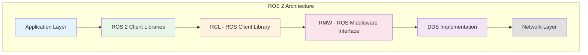
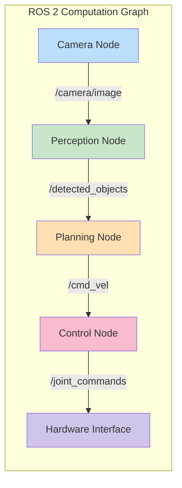

# ROS 2 Architecture

## Learning Outcomes

By the end of this chapter, you will be able to:

1. **Explain** the fundamental architecture of ROS 2 and its key differences from ROS 1
2. **Describe** the role of DDS (Data Distribution Service) in ROS 2 communication
3. **Identify** the core components of a ROS 2 system and their interactions
4. **Configure** a basic ROS 2 workspace for development

## Prerequisites

- Python 3.10+ installed
- Basic understanding of distributed systems concepts
- Familiarity with Linux command line

## Introduction to ROS 2

The Robot Operating System 2 (ROS 2) is not an operating system in the traditional sense, but rather a flexible framework for writing robot software. It provides a collection of tools, libraries, and conventions that aim to simplify the task of creating complex and robust robot behavior across a wide variety of robotic platforms.



### Why ROS 2?

ROS 2 was developed to address limitations in the original ROS (now called ROS 1):

| Feature | ROS 1 | ROS 2 |
|---------|-------|-------|
| Real-time support | Limited | Built-in via DDS |
| Security | None | DDS Security |
| Multi-robot | Complex | Native support |
| Embedded systems | Limited | First-class support |
| Windows/macOS | Community ports | Official support |
| Lifecycle management | None | Managed nodes |

## Core Concepts

### The Computation Graph

ROS 2 organizes robotic software as a **computation graph**—a peer-to-peer network of processes that communicate via topics, services, and actions.



### Data Distribution Service (DDS)

ROS 2 uses DDS as its middleware, providing:

- **Quality of Service (QoS)**: Fine-grained control over communication reliability
- **Discovery**: Automatic node discovery without a central master
- **Real-time**: Deterministic communication patterns
- **Security**: Authentication, encryption, and access control

```python
# Example: Setting QoS profiles in rclpy
from rclpy.qos import QoSProfile, ReliabilityPolicy, HistoryPolicy

qos_profile = QoSProfile(
    reliability=ReliabilityPolicy.RELIABLE,
    history=HistoryPolicy.KEEP_LAST,
    depth=10
)
```

### Workspaces and Packages

ROS 2 organizes code into **packages** within **workspaces**:

```bash
ros2_ws/                    # Workspace root
├── src/                    # Source space
│   ├── my_robot/          # Package 1
│   │   ├── package.xml    # Package manifest
│   │   ├── setup.py       # Python build config
│   │   └── my_robot/      # Python module
│   │       └── __init__.py
│   └── robot_interfaces/   # Package 2
│       ├── package.xml
│       ├── CMakeLists.txt
│       └── msg/
│           └── CustomMsg.msg
├── build/                  # Build artifacts
├── install/                # Install space
└── log/                    # Build logs
```

## Setting Up Your Environment

### Installation

For Ubuntu 24.04 with ROS 2 Jazzy:

```bash
# Add ROS 2 repository
sudo apt update && sudo apt install software-properties-common
sudo add-apt-repository universe
sudo curl -sSL https://raw.githubusercontent.com/ros/rosdistro/master/ros.key -o /usr/share/keyrings/ros-archive-keyring.gpg
echo "deb [arch=$(dpkg --print-architecture) signed-by=/usr/share/keyrings/ros-archive-keyring.gpg] http://packages.ros.org/ros2/ubuntu $(. /etc/os-release && echo $UBUNTU_CODENAME) main" | sudo tee /etc/apt/sources.list.d/ros2.list > /dev/null

# Install ROS 2 Jazzy
sudo apt update
sudo apt install ros-jazzy-desktop

# Source the installation
source /opt/ros/jazzy/setup.bash
```

### Creating a Workspace

```bash
# Create workspace directory
mkdir -p ~/ros2_ws/src
cd ~/ros2_ws

# Build the workspace (even empty)
colcon build

# Source the workspace
source install/setup.bash
```

### Creating Your First Package

```bash
cd ~/ros2_ws/src

# Create a Python package
ros2 pkg create --build-type ament_python my_first_package \
    --dependencies rclpy std_msgs

# Package structure created:
# my_first_package/
# ├── package.xml
# ├── setup.py
# ├── setup.cfg
# ├── resource/
# │   └── my_first_package
# └── my_first_package/
#     └── __init__.py
```

## The ROS 2 Graph in Action

Let's create a minimal node to understand the architecture:

```python
#!/usr/bin/env python3
"""Minimal ROS 2 node demonstrating architecture concepts."""

import rclpy
from rclpy.node import Node
from std_msgs.msg import String


class MinimalPublisher(Node):
    """A minimal ROS 2 publisher node."""

    def __init__(self):
        super().__init__('minimal_publisher')

        # Create a publisher on the 'topic' topic
        self.publisher_ = self.create_publisher(
            String,           # Message type
            'topic',          # Topic name
            10                # QoS history depth
        )

        # Create a timer that fires every 0.5 seconds
        timer_period = 0.5
        self.timer = self.create_timer(timer_period, self.timer_callback)
        self.i = 0

        self.get_logger().info('MinimalPublisher node started')

    def timer_callback(self):
        """Callback function executed by the timer."""
        msg = String()
        msg.data = f'Hello, ROS 2! Message #{self.i}'
        self.publisher_.publish(msg)
        self.get_logger().info(f'Publishing: "{msg.data}"')
        self.i += 1


def main(args=None):
    rclpy.init(args=args)
    node = MinimalPublisher()

    try:
        rclpy.spin(node)  # Keep node running
    except KeyboardInterrupt:
        pass
    finally:
        node.destroy_node()
        rclpy.shutdown()


if __name__ == '__main__':
    main()
```

## Exercises

### Exercise 1: Explore the ROS 2 Graph

1. Start the demo talker node: `ros2 run demo_nodes_cpp talker`
2. In another terminal, list active nodes: `ros2 node list`
3. List active topics: `ros2 topic list`
4. Echo the topic content: `ros2 topic echo /chatter`

### Exercise 2: Create a Package

1. Create a new Python package named `my_humanoid`
2. Add `rclpy` and `geometry_msgs` as dependencies
3. Build the workspace with `colcon build`
4. Source the workspace and verify: `ros2 pkg list | grep my_humanoid`

### Exercise 3: Inspect QoS Settings

1. Run: `ros2 topic info /chatter --verbose`
2. Note the QoS settings for reliability and durability
3. Research what each setting means for robot communication

## Assessment Questions

1. **What is the role of DDS in ROS 2, and how does it differ from ROS 1's communication approach?**

2. **Explain the relationship between nodes, topics, and messages in the ROS 2 computation graph.**

3. **Why is Quality of Service (QoS) important for humanoid robotics applications?**

4. **What are the advantages of ROS 2's decentralized architecture over ROS 1's master-based approach?**

## Summary

In this chapter, we explored the fundamental architecture of ROS 2:

- **ROS 2** is a middleware framework providing tools and conventions for robot software development
- **DDS** enables distributed, real-time communication without a central master
- **Workspaces** and **packages** organize code into modular, reusable components
- The **computation graph** represents the network of nodes communicating via topics, services, and actions

This architectural foundation prepares us for the next chapter, where we'll dive deep into nodes, topics, and services—the building blocks of ROS 2 applications.

---

**Next**: [Nodes, Topics, and Services](./nodes-topics-services)
