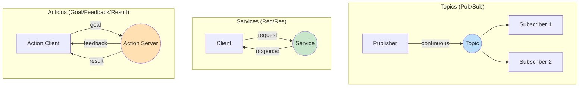

# Nodes, Topics, and Services

## Learning Outcomes

By the end of this chapter, you will be able to:

1. **Create** ROS 2 nodes using Python (rclpy)
2. **Implement** publisher-subscriber communication using topics
3. **Design** request-response patterns using services
4. **Utilize** actions for long-running tasks with feedback
5. **Debug** communication issues using ROS 2 CLI tools

## Prerequisites

- Completed Chapter 1: ROS 2 Architecture
- ROS 2 Jazzy installed and configured
- Basic Python proficiency

## Communication Patterns Overview

ROS 2 provides three primary communication patterns, each suited to different use cases:



| Pattern | Use Case | Example |
|---------|----------|---------|
| **Topics** | Continuous data streams | Sensor readings, joint states |
| **Services** | One-time requests | Enable motor, get parameter |
| **Actions** | Long-running tasks | Navigate to goal, execute trajectory |

## Nodes: The Basic Building Block

A **node** is a process that performs computation. In humanoid robotics, you might have separate nodes for:

- Camera processing
- Balance control
- Motion planning
- Speech recognition
- Each actuator controller

### Creating a Node

```python
#!/usr/bin/env python3
"""Example ROS 2 node for humanoid robot sensor processing."""

import rclpy
from rclpy.node import Node
from sensor_msgs.msg import Imu, JointState
from geometry_msgs.msg import Twist


class HumanoidSensorNode(Node):
    """Node that processes humanoid robot sensor data."""

    def __init__(self):
        super().__init__('humanoid_sensor_node')

        # Declare parameters with defaults
        self.declare_parameter('update_rate', 100.0)
        self.declare_parameter('robot_name', 'humanoid_01')

        # Get parameter values
        self.update_rate = self.get_parameter('update_rate').value
        self.robot_name = self.get_parameter('robot_name').value

        self.get_logger().info(
            f'Starting sensor node for {self.robot_name} '
            f'at {self.update_rate} Hz'
        )

    def process_sensor_data(self):
        """Process incoming sensor data."""
        pass  # Implementation here


def main(args=None):
    rclpy.init(args=args)
    node = HumanoidSensorNode()

    try:
        rclpy.spin(node)
    except KeyboardInterrupt:
        node.get_logger().info('Shutting down sensor node')
    finally:
        node.destroy_node()
        rclpy.shutdown()


if __name__ == '__main__':
    main()
```

## Topics: Publish-Subscribe Communication

Topics enable **one-to-many** communication. Publishers send messages to a named topic, and any number of subscribers receive them.

### Publisher Example

```python
#!/usr/bin/env python3
"""Publisher node for humanoid robot joint commands."""

import rclpy
from rclpy.node import Node
from sensor_msgs.msg import JointState
import math


class JointCommandPublisher(Node):
    """Publishes joint commands for humanoid robot."""

    def __init__(self):
        super().__init__('joint_command_publisher')

        # Create publisher
        self.publisher = self.create_publisher(
            JointState,
            '/humanoid/joint_commands',
            10  # QoS queue depth
        )

        # Joint names for a simple humanoid leg
        self.joint_names = [
            'left_hip_yaw', 'left_hip_roll', 'left_hip_pitch',
            'left_knee', 'left_ankle_pitch', 'left_ankle_roll',
            'right_hip_yaw', 'right_hip_roll', 'right_hip_pitch',
            'right_knee', 'right_ankle_pitch', 'right_ankle_roll'
        ]

        # Timer for periodic publishing
        self.timer = self.create_timer(0.01, self.publish_command)  # 100 Hz
        self.t = 0.0

        self.get_logger().info('Joint command publisher started')

    def publish_command(self):
        """Generate and publish joint commands."""
        msg = JointState()
        msg.header.stamp = self.get_clock().now().to_msg()
        msg.name = self.joint_names

        # Simple sinusoidal motion for demonstration
        msg.position = [
            0.0,                           # left_hip_yaw
            0.0,                           # left_hip_roll
            0.3 * math.sin(self.t),        # left_hip_pitch
            -0.6 * abs(math.sin(self.t)),  # left_knee
            -0.3 * math.sin(self.t),       # left_ankle_pitch
            0.0,                           # left_ankle_roll
            0.0,                           # right_hip_yaw
            0.0,                           # right_hip_roll
            -0.3 * math.sin(self.t),       # right_hip_pitch
            -0.6 * abs(math.sin(self.t)),  # right_knee
            0.3 * math.sin(self.t),        # right_ankle_pitch
            0.0,                           # right_ankle_roll
        ]

        self.publisher.publish(msg)
        self.t += 0.01


def main(args=None):
    rclpy.init(args=args)
    node = JointCommandPublisher()
    rclpy.spin(node)
    node.destroy_node()
    rclpy.shutdown()


if __name__ == '__main__':
    main()
```

### Subscriber Example

```python
#!/usr/bin/env python3
"""Subscriber node for humanoid robot joint states."""

import rclpy
from rclpy.node import Node
from sensor_msgs.msg import JointState


class JointStateSubscriber(Node):
    """Subscribes to and processes joint state feedback."""

    def __init__(self):
        super().__init__('joint_state_subscriber')

        # Create subscription
        self.subscription = self.create_subscription(
            JointState,
            '/humanoid/joint_states',
            self.joint_state_callback,
            10
        )

        self.get_logger().info('Joint state subscriber started')

    def joint_state_callback(self, msg: JointState):
        """Process received joint states."""
        # Log joint positions
        for name, position in zip(msg.name, msg.position):
            self.get_logger().debug(f'{name}: {position:.3f} rad')

        # Check for any joints exceeding limits
        for name, position in zip(msg.name, msg.position):
            if abs(position) > 2.0:  # Simple limit check
                self.get_logger().warn(
                    f'Joint {name} near limit: {position:.3f} rad'
                )


def main(args=None):
    rclpy.init(args=args)
    node = JointStateSubscriber()
    rclpy.spin(node)
    node.destroy_node()
    rclpy.shutdown()


if __name__ == '__main__':
    main()
```

## Services: Request-Response Communication

Services are used for **synchronous** operations that complete quickly. The client sends a request and waits for a response.

### Defining a Custom Service

Create `srv/SetJointPosition.srv`:

```
# Request
string joint_name
float64 position
float64 max_velocity
---
# Response
bool success
string message
```

### Service Server

```python
#!/usr/bin/env python3
"""Service server for setting individual joint positions."""

import rclpy
from rclpy.node import Node
from my_humanoid_interfaces.srv import SetJointPosition


class JointPositionServer(Node):
    """Service server for joint position commands."""

    def __init__(self):
        super().__init__('joint_position_server')

        # Create service
        self.srv = self.create_service(
            SetJointPosition,
            '/humanoid/set_joint_position',
            self.set_position_callback
        )

        # Track current positions
        self.joint_positions = {}

        self.get_logger().info('Joint position service ready')

    def set_position_callback(self, request, response):
        """Handle joint position request."""
        self.get_logger().info(
            f'Request: Set {request.joint_name} to {request.position:.3f} rad'
        )

        # Validate joint name
        valid_joints = [
            'left_hip_pitch', 'left_knee', 'left_ankle_pitch',
            'right_hip_pitch', 'right_knee', 'right_ankle_pitch'
        ]

        if request.joint_name not in valid_joints:
            response.success = False
            response.message = f'Unknown joint: {request.joint_name}'
            return response

        # Validate position limits
        if abs(request.position) > 2.5:
            response.success = False
            response.message = f'Position {request.position} exceeds limits'
            return response

        # Apply the position (in real system, send to hardware)
        self.joint_positions[request.joint_name] = request.position

        response.success = True
        response.message = f'Joint {request.joint_name} set to {request.position:.3f}'
        return response


def main(args=None):
    rclpy.init(args=args)
    node = JointPositionServer()
    rclpy.spin(node)
    node.destroy_node()
    rclpy.shutdown()


if __name__ == '__main__':
    main()
```

### Service Client

```python
#!/usr/bin/env python3
"""Service client for setting joint positions."""

import rclpy
from rclpy.node import Node
from my_humanoid_interfaces.srv import SetJointPosition


class JointPositionClient(Node):
    """Client for joint position service."""

    def __init__(self):
        super().__init__('joint_position_client')

        # Create client
        self.client = self.create_client(
            SetJointPosition,
            '/humanoid/set_joint_position'
        )

        # Wait for service to be available
        while not self.client.wait_for_service(timeout_sec=1.0):
            self.get_logger().info('Waiting for service...')

    def send_request(self, joint_name: str, position: float):
        """Send position request to service."""
        request = SetJointPosition.Request()
        request.joint_name = joint_name
        request.position = position
        request.max_velocity = 1.0

        future = self.client.call_async(request)
        rclpy.spin_until_future_complete(self, future)

        return future.result()


def main(args=None):
    rclpy.init(args=args)
    client = JointPositionClient()

    # Example: Set left knee to -0.5 radians
    response = client.send_request('left_knee', -0.5)

    if response.success:
        client.get_logger().info(f'Success: {response.message}')
    else:
        client.get_logger().error(f'Failed: {response.message}')

    client.destroy_node()
    rclpy.shutdown()


if __name__ == '__main__':
    main()
```

## CLI Tools for Debugging

ROS 2 provides powerful command-line tools:

```bash
# List all nodes
ros2 node list

# Get info about a node
ros2 node info /humanoid_sensor_node

# List all topics
ros2 topic list

# Get topic info with QoS
ros2 topic info /humanoid/joint_states --verbose

# Echo topic messages
ros2 topic echo /humanoid/joint_states

# Publish to a topic
ros2 topic pub /humanoid/joint_commands sensor_msgs/msg/JointState \
  "{header: {stamp: {sec: 0, nanosec: 0}}, name: ['left_knee'], position: [-0.5]}"

# List services
ros2 service list

# Call a service
ros2 service call /humanoid/set_joint_position \
  my_humanoid_interfaces/srv/SetJointPosition \
  "{joint_name: 'left_knee', position: -0.5, max_velocity: 1.0}"
```

## Exercises

### Exercise 1: Create a Publisher-Subscriber Pair

1. Create a publisher that sends `geometry_msgs/Twist` messages simulating walking velocity commands
2. Create a subscriber that logs the received commands
3. Use `ros2 topic echo` to verify the messages

### Exercise 2: Implement an Emergency Stop Service

1. Define a service `EmergencyStop.srv` with no request fields and a `bool stopped` response
2. Implement a server that logs "EMERGENCY STOP ACTIVATED" when called
3. Test with `ros2 service call`

### Exercise 3: Multi-Node Communication

1. Create three nodes: `imu_publisher`, `balance_controller`, `motor_commander`
2. `imu_publisher` publishes IMU data
3. `balance_controller` subscribes to IMU and publishes corrections
4. `motor_commander` subscribes to corrections and logs motor commands

## Assessment Questions

1. **When would you choose topics over services for robot communication?**

2. **What happens if a subscriber joins a topic after messages have been published?** (Hint: Consider QoS durability settings)

3. **Design a communication architecture for a humanoid robot's vision system. What nodes, topics, and services would you create?**

4. **How do you handle the case where a service server is not available?**

## Summary

In this chapter, we covered the core communication patterns in ROS 2:

- **Nodes** are independent processes that perform specific computations
- **Topics** enable asynchronous, one-to-many publish-subscribe communication
- **Services** provide synchronous request-response patterns for quick operations
- **CLI tools** help debug and inspect the ROS 2 graph

Understanding these patterns is essential for designing robust humanoid robot systems. In the next chapter, we'll explore rclpy in depth, including advanced features like executors, callback groups, and lifecycle nodes.

---

**Next**: [Python Development with rclpy](./rclpy-integration)
