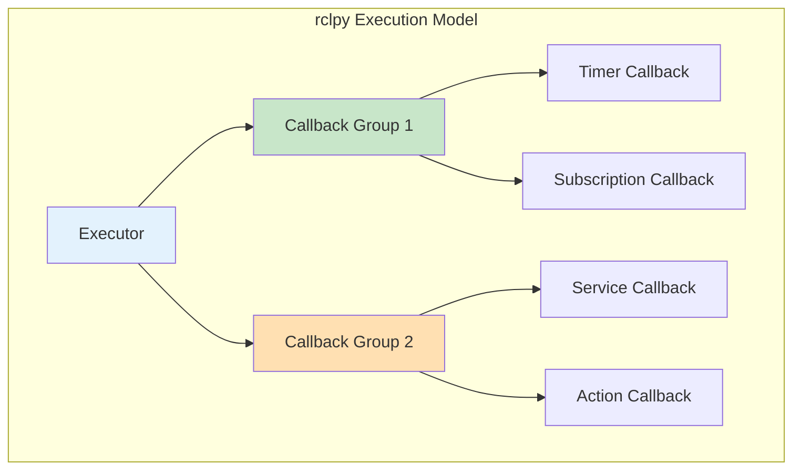
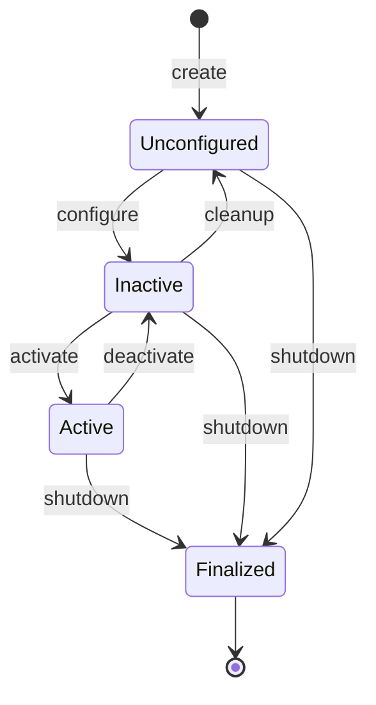

# Python Development with rclpy

## Learning Outcomes

By the end of this chapter, you will be able to:

1. **Configure** multi-threaded executors for concurrent node execution
2. **Implement** callback groups for controlling execution flow
3. **Create** lifecycle nodes for deterministic startup and shutdown
4. **Handle** parameters dynamically in running nodes
5. **Design** robust error handling patterns for robot systems

## Prerequisites

- Completed Chapter 2: Nodes, Topics, and Services
- Understanding of Python threading concepts
- Familiarity with context managers and decorators

## Advanced rclpy Concepts

The `rclpy` library provides Python bindings for ROS 2. While basic usage is straightforward, building production-ready humanoid robot software requires understanding advanced execution patterns.



## Executors and Callback Groups

### Understanding Executors

Executors determine how callbacks are processed. ROS 2 provides two main executors:

| Executor | Behavior | Use Case |
|----------|----------|----------|
| `SingleThreadedExecutor` | Sequential callback execution | Simple nodes, deterministic behavior |
| `MultiThreadedExecutor` | Parallel callback execution | High-frequency sensors, multiple services |

### Multi-Threaded Execution

For humanoid robots processing multiple sensor streams simultaneously:

```python
#!/usr/bin/env python3
"""Multi-threaded node for parallel sensor processing."""

import rclpy
from rclpy.node import Node
from rclpy.executors import MultiThreadedExecutor
from rclpy.callback_groups import MutuallyExclusiveCallbackGroup, ReentrantCallbackGroup
from sensor_msgs.msg import Imu, JointState, Image
from threading import Lock


class MultiSensorProcessor(Node):
    """Process multiple sensor streams concurrently."""

    def __init__(self):
        super().__init__('multi_sensor_processor')

        # Create callback groups
        # ReentrantCallbackGroup: Callbacks can run in parallel
        self.sensor_cb_group = ReentrantCallbackGroup()

        # MutuallyExclusiveCallbackGroup: Only one callback at a time
        self.state_cb_group = MutuallyExclusiveCallbackGroup()

        # Thread-safe data storage
        self._lock = Lock()
        self._latest_imu = None
        self._latest_joints = None

        # Subscriptions with callback groups
        self.imu_sub = self.create_subscription(
            Imu, '/imu/data', self.imu_callback, 10,
            callback_group=self.sensor_cb_group
        )

        self.joint_sub = self.create_subscription(
            JointState, '/joint_states', self.joint_callback, 10,
            callback_group=self.sensor_cb_group
        )

        self.image_sub = self.create_subscription(
            Image, '/camera/image_raw', self.image_callback, 10,
            callback_group=self.sensor_cb_group
        )

        # Timer for fusion (uses exclusive group to prevent data races)
        self.fusion_timer = self.create_timer(
            0.01, self.fusion_callback,  # 100 Hz fusion rate
            callback_group=self.state_cb_group
        )

        self.get_logger().info('Multi-sensor processor initialized')

    def imu_callback(self, msg: Imu):
        """Process IMU data - can run in parallel with other sensors."""
        with self._lock:
            self._latest_imu = msg
        self.get_logger().debug('IMU data received')

    def joint_callback(self, msg: JointState):
        """Process joint state data."""
        with self._lock:
            self._latest_joints = msg
        self.get_logger().debug('Joint state received')

    def image_callback(self, msg: Image):
        """Process camera image."""
        # Heavy computation - runs in parallel with other callbacks
        self.get_logger().debug(
            f'Image received: {msg.width}x{msg.height}'
        )

    def fusion_callback(self):
        """Fuse sensor data - exclusive execution."""
        with self._lock:
            if self._latest_imu and self._latest_joints:
                # Perform sensor fusion
                self.get_logger().debug('Fusing sensor data')


def main(args=None):
    rclpy.init(args=args)
    node = MultiSensorProcessor()

    # Use multi-threaded executor with 4 threads
    executor = MultiThreadedExecutor(num_threads=4)
    executor.add_node(node)

    try:
        executor.spin()
    except KeyboardInterrupt:
        pass
    finally:
        node.destroy_node()
        rclpy.shutdown()


if __name__ == '__main__':
    main()
```

## Lifecycle Nodes

Lifecycle (managed) nodes provide deterministic state transitions, essential for safety-critical humanoid robot systems.



### Implementing a Lifecycle Node

```python
#!/usr/bin/env python3
"""Lifecycle node for humanoid motor controller."""

import rclpy
from rclpy.lifecycle import Node as LifecycleNode
from rclpy.lifecycle import State, TransitionCallbackReturn
from sensor_msgs.msg import JointState
from std_msgs.msg import Float64MultiArray


class MotorControllerLifecycle(LifecycleNode):
    """Lifecycle-managed motor controller for humanoid robot."""

    def __init__(self, **kwargs):
        super().__init__('motor_controller', **kwargs)

        self._joint_command_sub = None
        self._joint_state_pub = None
        self._control_timer = None

        self.get_logger().info('Motor controller node created (unconfigured)')

    def on_configure(self, state: State) -> TransitionCallbackReturn:
        """Configure the node - initialize but don't activate."""
        self.get_logger().info('Configuring motor controller...')

        # Declare and get parameters
        self.declare_parameter('control_frequency', 1000.0)
        self.declare_parameter('motor_ids', [1, 2, 3, 4, 5, 6])

        self._control_freq = self.get_parameter('control_frequency').value
        self._motor_ids = self.get_parameter('motor_ids').value

        # Create publishers/subscribers (but don't enable yet)
        self._joint_state_pub = self.create_publisher(
            JointState, '/joint_states', 10
        )

        self._joint_command_sub = self.create_subscription(
            Float64MultiArray, '/joint_commands',
            self._command_callback, 10
        )

        self.get_logger().info(
            f'Configured: {len(self._motor_ids)} motors at {self._control_freq} Hz'
        )
        return TransitionCallbackReturn.SUCCESS

    def on_activate(self, state: State) -> TransitionCallbackReturn:
        """Activate the node - start control loop."""
        self.get_logger().info('Activating motor controller...')

        # Initialize hardware connection here
        if not self._initialize_hardware():
            self.get_logger().error('Hardware initialization failed!')
            return TransitionCallbackReturn.FAILURE

        # Start control timer
        period = 1.0 / self._control_freq
        self._control_timer = self.create_timer(period, self._control_loop)

        self.get_logger().info('Motor controller ACTIVE')
        return TransitionCallbackReturn.SUCCESS

    def on_deactivate(self, state: State) -> TransitionCallbackReturn:
        """Deactivate - stop control but keep configuration."""
        self.get_logger().info('Deactivating motor controller...')

        # Stop control timer
        if self._control_timer:
            self._control_timer.cancel()
            self._control_timer = None

        # Put motors in safe state
        self._safe_stop_motors()

        self.get_logger().info('Motor controller INACTIVE')
        return TransitionCallbackReturn.SUCCESS

    def on_cleanup(self, state: State) -> TransitionCallbackReturn:
        """Cleanup - release all resources."""
        self.get_logger().info('Cleaning up motor controller...')

        # Destroy publishers/subscribers
        if self._joint_state_pub:
            self.destroy_publisher(self._joint_state_pub)
        if self._joint_command_sub:
            self.destroy_subscription(self._joint_command_sub)

        self.get_logger().info('Motor controller cleaned up')
        return TransitionCallbackReturn.SUCCESS

    def on_shutdown(self, state: State) -> TransitionCallbackReturn:
        """Shutdown - final cleanup before destruction."""
        self.get_logger().info('Shutting down motor controller...')
        self._safe_stop_motors()
        return TransitionCallbackReturn.SUCCESS

    def on_error(self, state: State) -> TransitionCallbackReturn:
        """Handle errors - attempt recovery or fail gracefully."""
        self.get_logger().error(f'Error in state: {state.label}')
        self._safe_stop_motors()
        return TransitionCallbackReturn.SUCCESS

    def _initialize_hardware(self) -> bool:
        """Initialize motor hardware connection."""
        # Actual hardware init would go here
        self.get_logger().info('Hardware initialized (simulated)')
        return True

    def _safe_stop_motors(self):
        """Command all motors to safe stop position."""
        self.get_logger().info('Motors commanded to safe stop')

    def _command_callback(self, msg: Float64MultiArray):
        """Handle incoming joint commands."""
        if self._control_timer is None:
            self.get_logger().warn('Received command while inactive')
            return
        # Process commands...

    def _control_loop(self):
        """Main control loop - called at control frequency."""
        # Read sensors, compute control, write to actuators
        msg = JointState()
        msg.header.stamp = self.get_clock().now().to_msg()
        self._joint_state_pub.publish(msg)


def main(args=None):
    rclpy.init(args=args)
    node = MotorControllerLifecycle()

    try:
        rclpy.spin(node)
    except KeyboardInterrupt:
        pass
    finally:
        node.destroy_node()
        rclpy.shutdown()


if __name__ == '__main__':
    main()
```

### Managing Lifecycle Nodes

```bash
# List lifecycle nodes
ros2 lifecycle nodes

# Get current state
ros2 lifecycle get /motor_controller

# Trigger transitions
ros2 lifecycle set /motor_controller configure
ros2 lifecycle set /motor_controller activate
ros2 lifecycle set /motor_controller deactivate
ros2 lifecycle set /motor_controller cleanup
ros2 lifecycle set /motor_controller shutdown
```

## Dynamic Parameters

Parameters can be changed at runtime for tuning without restarting nodes:

```python
#!/usr/bin/env python3
"""Node with dynamic parameter handling."""

import rclpy
from rclpy.node import Node
from rcl_interfaces.msg import SetParametersResult


class DynamicParameterNode(Node):
    """Node that responds to parameter changes."""

    def __init__(self):
        super().__init__('dynamic_params')

        # Declare parameters with descriptors
        self.declare_parameter('kp', 100.0)
        self.declare_parameter('kd', 10.0)
        self.declare_parameter('ki', 1.0)

        # Get initial values
        self._kp = self.get_parameter('kp').value
        self._kd = self.get_parameter('kd').value
        self._ki = self.get_parameter('ki').value

        # Register parameter callback
        self.add_on_set_parameters_callback(self._parameter_callback)

        self.get_logger().info(
            f'PID gains: kp={self._kp}, kd={self._kd}, ki={self._ki}'
        )

    def _parameter_callback(self, params) -> SetParametersResult:
        """Handle parameter updates."""
        for param in params:
            if param.name == 'kp':
                if param.value < 0:
                    return SetParametersResult(
                        successful=False,
                        reason='kp must be non-negative'
                    )
                self._kp = param.value
                self.get_logger().info(f'Updated kp to {self._kp}')

            elif param.name == 'kd':
                if param.value < 0:
                    return SetParametersResult(
                        successful=False,
                        reason='kd must be non-negative'
                    )
                self._kd = param.value
                self.get_logger().info(f'Updated kd to {self._kd}')

            elif param.name == 'ki':
                self._ki = param.value
                self.get_logger().info(f'Updated ki to {self._ki}')

        return SetParametersResult(successful=True)


def main(args=None):
    rclpy.init(args=args)
    node = DynamicParameterNode()
    rclpy.spin(node)
    node.destroy_node()
    rclpy.shutdown()


if __name__ == '__main__':
    main()
```

```bash
# Set parameter at runtime
ros2 param set /dynamic_params kp 150.0

# Get current value
ros2 param get /dynamic_params kp

# List all parameters
ros2 param list /dynamic_params
```

## Exercises

### Exercise 1: Multi-Threaded Sensor Fusion

Create a node that:
1. Subscribes to IMU (1000 Hz), camera (30 Hz), and LiDAR (10 Hz)
2. Uses appropriate callback groups for concurrent processing
3. Fuses data when all sensors have new readings

### Exercise 2: Lifecycle Motor Controller

1. Extend the lifecycle motor controller to include actual state publishing
2. Add a watchdog timer that deactivates if no commands received for 1 second
3. Test all state transitions via CLI

### Exercise 3: Tunable Controller

1. Create a PID controller node with tunable gains
2. Implement parameter validation (all gains positive, reasonable ranges)
3. Add a service to reset the integral term

## Assessment Questions

1. **Why would you use a `MutuallyExclusiveCallbackGroup` versus a `ReentrantCallbackGroup`?**

2. **What are the benefits of lifecycle nodes for safety-critical robot systems?**

3. **How do you ensure thread safety when multiple callbacks access shared data?**

4. **Design the callback group architecture for a humanoid robot with 6 cameras, 2 IMUs, and 24 joint motors.**

## Summary

In this chapter, we explored advanced rclpy features:

- **Executors** control how callbacks are scheduled and executed
- **Callback groups** enable fine-grained control over concurrency
- **Lifecycle nodes** provide deterministic startup and shutdown behavior
- **Dynamic parameters** allow runtime tuning without node restarts

These patterns are essential for building robust, maintainable humanoid robot software. The next chapter covers URDF modeling for humanoid robots.

---

**Next**: [URDF for Humanoid Robots](./urdf-humanoids)
