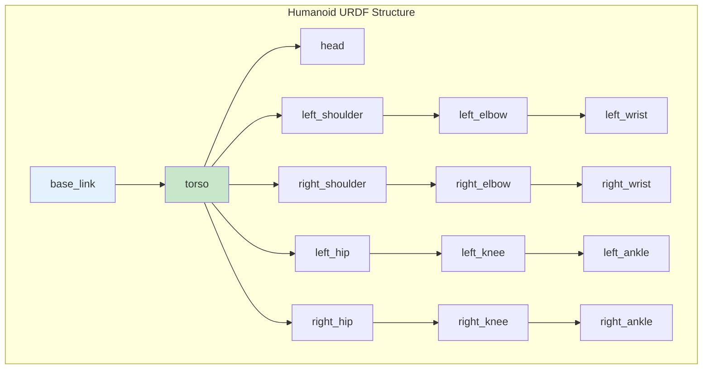

# URDF for Humanoid Robots

## Learning Outcomes

By the end of this chapter, you will be able to:

1. **Create** URDF models representing humanoid robot kinematics
2. **Use** Xacro macros for modular, maintainable robot descriptions
3. **Define** joints, links, and their physical properties
4. **Visualize** robot models in RViz and prepare them for simulation
5. **Integrate** URDF with ROS 2 for robot state publishing

## Prerequisites

- Completed Chapters 1-3 of Module 1
- Basic understanding of 3D coordinate systems
- Familiarity with XML syntax

## Introduction to URDF

The **Unified Robot Description Format (URDF)** is an XML specification for describing robot models. For humanoid robots, URDF defines:

- **Links**: Rigid body segments (torso, limbs, head)
- **Joints**: Connections between links with motion constraints
- **Inertials**: Mass and inertia properties for dynamics
- **Visuals**: 3D meshes for visualization
- **Collisions**: Simplified geometries for physics simulation



## Basic URDF Structure

### Minimal URDF Example

```xml
<?xml version="1.0"?>
<robot name="simple_humanoid">
  <!-- Base link (root of the kinematic tree) -->
  <link name="base_link">
    <visual>
      <geometry>
        <box size="0.1 0.1 0.05"/>
      </geometry>
      <material name="blue">
        <color rgba="0.0 0.0 0.8 1.0"/>
      </material>
    </visual>
    <collision>
      <geometry>
        <box size="0.1 0.1 0.05"/>
      </geometry>
    </collision>
    <inertial>
      <mass value="0.5"/>
      <inertia ixx="0.001" ixy="0" ixz="0"
               iyy="0.001" iyz="0" izz="0.001"/>
    </inertial>
  </link>

  <!-- Torso link -->
  <link name="torso">
    <visual>
      <geometry>
        <box size="0.3 0.2 0.4"/>
      </geometry>
      <material name="gray">
        <color rgba="0.5 0.5 0.5 1.0"/>
      </material>
    </visual>
    <collision>
      <geometry>
        <box size="0.3 0.2 0.4"/>
      </geometry>
    </collision>
    <inertial>
      <mass value="10.0"/>
      <origin xyz="0 0 0.2"/>
      <inertia ixx="0.1" ixy="0" ixz="0"
               iyy="0.1" iyz="0" izz="0.05"/>
    </inertial>
  </link>

  <!-- Joint connecting base to torso -->
  <joint name="base_to_torso" type="fixed">
    <parent link="base_link"/>
    <child link="torso"/>
    <origin xyz="0 0 0.025" rpy="0 0 0"/>
  </joint>
</robot>
```

### Joint Types

URDF supports several joint types for humanoid robots:

| Joint Type | DOF | Use Case |
|------------|-----|----------|
| `revolute` | 1 | Shoulder, elbow, knee (with limits) |
| `continuous` | 1 | Wheels, rotating sensors |
| `prismatic` | 1 | Linear actuators |
| `fixed` | 0 | Rigid attachments |
| `floating` | 6 | Free-floating base |
| `planar` | 3 | 2D motion (rarely used) |

### Revolute Joint Example

```xml
<!-- Left shoulder pitch joint -->
<joint name="left_shoulder_pitch" type="revolute">
  <parent link="torso"/>
  <child link="left_upper_arm"/>
  <origin xyz="0.15 0.12 0.35" rpy="0 0 0"/>
  <axis xyz="0 1 0"/>  <!-- Rotation around Y-axis -->
  <limit lower="-2.5" upper="2.5"
         effort="100.0" velocity="3.14"/>
  <dynamics damping="0.1" friction="0.0"/>
</joint>
```

## Xacro: Modular Robot Descriptions

**Xacro** (XML Macros) extends URDF with programming features:

- **Properties**: Variables for reuse
- **Macros**: Parameterized URDF snippets
- **Includes**: Split descriptions across files
- **Math expressions**: Computed values

### Converting URDF to Xacro

```xml
<?xml version="1.0"?>
<robot xmlns:xacro="http://www.ros.org/wiki/xacro" name="humanoid">
  <!-- Properties -->
  <xacro:property name="torso_mass" value="10.0"/>
  <xacro:property name="torso_width" value="0.3"/>
  <xacro:property name="torso_depth" value="0.2"/>
  <xacro:property name="torso_height" value="0.4"/>

  <!-- Macro for a limb segment -->
  <xacro:macro name="limb_segment" params="name length radius mass">
    <link name="${name}">
      <visual>
        <geometry>
          <cylinder length="${length}" radius="${radius}"/>
        </geometry>
        <origin xyz="0 0 ${length/2}" rpy="0 0 0"/>
        <material name="silver">
          <color rgba="0.75 0.75 0.75 1.0"/>
        </material>
      </visual>
      <collision>
        <geometry>
          <cylinder length="${length}" radius="${radius}"/>
        </geometry>
        <origin xyz="0 0 ${length/2}"/>
      </collision>
      <inertial>
        <mass value="${mass}"/>
        <origin xyz="0 0 ${length/2}"/>
        <inertia
          ixx="${mass * (3*radius*radius + length*length) / 12}"
          ixy="0" ixz="0"
          iyy="${mass * (3*radius*radius + length*length) / 12}"
          iyz="0"
          izz="${mass * radius * radius / 2}"/>
      </inertial>
    </link>
  </xacro:macro>

  <!-- Use the macro -->
  <xacro:limb_segment name="left_upper_arm" length="0.25" radius="0.04" mass="1.5"/>
  <xacro:limb_segment name="left_forearm" length="0.22" radius="0.035" mass="1.0"/>
</robot>
```

### Complete Humanoid Leg Macro

```xml
<?xml version="1.0"?>
<robot xmlns:xacro="http://www.ros.org/wiki/xacro" name="humanoid_leg">

  <!-- Leg parameters -->
  <xacro:property name="upper_leg_length" value="0.35"/>
  <xacro:property name="lower_leg_length" value="0.35"/>
  <xacro:property name="leg_radius" value="0.05"/>
  <xacro:property name="foot_length" value="0.20"/>
  <xacro:property name="foot_width" value="0.10"/>
  <xacro:property name="foot_height" value="0.05"/>

  <!-- Macro for complete leg assembly -->
  <xacro:macro name="humanoid_leg" params="prefix reflect">

    <!-- Hip yaw -->
    <joint name="${prefix}_hip_yaw" type="revolute">
      <parent link="pelvis"/>
      <child link="${prefix}_hip_yaw_link"/>
      <origin xyz="${reflect * 0.1} 0 0" rpy="0 0 0"/>
      <axis xyz="0 0 1"/>
      <limit lower="-0.5" upper="0.5" effort="200" velocity="5"/>
    </joint>

    <link name="${prefix}_hip_yaw_link">
      <inertial>
        <mass value="0.5"/>
        <inertia ixx="0.001" ixy="0" ixz="0"
                 iyy="0.001" iyz="0" izz="0.001"/>
      </inertial>
    </link>

    <!-- Hip roll -->
    <joint name="${prefix}_hip_roll" type="revolute">
      <parent link="${prefix}_hip_yaw_link"/>
      <child link="${prefix}_hip_roll_link"/>
      <origin xyz="0 0 0" rpy="0 0 0"/>
      <axis xyz="1 0 0"/>
      <limit lower="-0.5" upper="0.5" effort="200" velocity="5"/>
    </joint>

    <link name="${prefix}_hip_roll_link">
      <inertial>
        <mass value="0.5"/>
        <inertia ixx="0.001" ixy="0" ixz="0"
                 iyy="0.001" iyz="0" izz="0.001"/>
      </inertial>
    </link>

    <!-- Hip pitch -->
    <joint name="${prefix}_hip_pitch" type="revolute">
      <parent link="${prefix}_hip_roll_link"/>
      <child link="${prefix}_upper_leg"/>
      <origin xyz="0 0 0" rpy="0 0 0"/>
      <axis xyz="0 1 0"/>
      <limit lower="-1.5" upper="1.5" effort="200" velocity="5"/>
    </joint>

    <!-- Upper leg -->
    <link name="${prefix}_upper_leg">
      <visual>
        <geometry>
          <cylinder length="${upper_leg_length}" radius="${leg_radius}"/>
        </geometry>
        <origin xyz="0 0 ${-upper_leg_length/2}"/>
        <material name="dark_gray">
          <color rgba="0.3 0.3 0.3 1.0"/>
        </material>
      </visual>
      <collision>
        <geometry>
          <cylinder length="${upper_leg_length}" radius="${leg_radius}"/>
        </geometry>
        <origin xyz="0 0 ${-upper_leg_length/2}"/>
      </collision>
      <inertial>
        <mass value="3.0"/>
        <origin xyz="0 0 ${-upper_leg_length/2}"/>
        <inertia ixx="0.03" ixy="0" ixz="0"
                 iyy="0.03" iyz="0" izz="0.005"/>
      </inertial>
    </link>

    <!-- Knee -->
    <joint name="${prefix}_knee" type="revolute">
      <parent link="${prefix}_upper_leg"/>
      <child link="${prefix}_lower_leg"/>
      <origin xyz="0 0 ${-upper_leg_length}" rpy="0 0 0"/>
      <axis xyz="0 1 0"/>
      <limit lower="-2.5" upper="0.0" effort="200" velocity="5"/>
    </joint>

    <!-- Lower leg -->
    <link name="${prefix}_lower_leg">
      <visual>
        <geometry>
          <cylinder length="${lower_leg_length}" radius="${leg_radius * 0.9}"/>
        </geometry>
        <origin xyz="0 0 ${-lower_leg_length/2}"/>
        <material name="dark_gray"/>
      </visual>
      <collision>
        <geometry>
          <cylinder length="${lower_leg_length}" radius="${leg_radius * 0.9}"/>
        </geometry>
        <origin xyz="0 0 ${-lower_leg_length/2}"/>
      </collision>
      <inertial>
        <mass value="2.5"/>
        <origin xyz="0 0 ${-lower_leg_length/2}"/>
        <inertia ixx="0.025" ixy="0" ixz="0"
                 iyy="0.025" iyz="0" izz="0.004"/>
      </inertial>
    </link>

    <!-- Ankle pitch -->
    <joint name="${prefix}_ankle_pitch" type="revolute">
      <parent link="${prefix}_lower_leg"/>
      <child link="${prefix}_ankle_pitch_link"/>
      <origin xyz="0 0 ${-lower_leg_length}" rpy="0 0 0"/>
      <axis xyz="0 1 0"/>
      <limit lower="-0.8" upper="0.8" effort="100" velocity="5"/>
    </joint>

    <link name="${prefix}_ankle_pitch_link">
      <inertial>
        <mass value="0.3"/>
        <inertia ixx="0.0005" ixy="0" ixz="0"
                 iyy="0.0005" iyz="0" izz="0.0005"/>
      </inertial>
    </link>

    <!-- Ankle roll -->
    <joint name="${prefix}_ankle_roll" type="revolute">
      <parent link="${prefix}_ankle_pitch_link"/>
      <child link="${prefix}_foot"/>
      <origin xyz="0 0 0" rpy="0 0 0"/>
      <axis xyz="1 0 0"/>
      <limit lower="-0.5" upper="0.5" effort="100" velocity="5"/>
    </joint>

    <!-- Foot -->
    <link name="${prefix}_foot">
      <visual>
        <geometry>
          <box size="${foot_length} ${foot_width} ${foot_height}"/>
        </geometry>
        <origin xyz="${foot_length/4} 0 ${-foot_height/2}"/>
        <material name="black">
          <color rgba="0.1 0.1 0.1 1.0"/>
        </material>
      </visual>
      <collision>
        <geometry>
          <box size="${foot_length} ${foot_width} ${foot_height}"/>
        </geometry>
        <origin xyz="${foot_length/4} 0 ${-foot_height/2}"/>
      </collision>
      <inertial>
        <mass value="0.8"/>
        <origin xyz="${foot_length/4} 0 ${-foot_height/2}"/>
        <inertia ixx="0.002" ixy="0" ixz="0"
                 iyy="0.004" iyz="0" izz="0.003"/>
      </inertial>
    </link>

  </xacro:macro>

  <!-- Instantiate left and right legs -->
  <xacro:humanoid_leg prefix="left" reflect="1"/>
  <xacro:humanoid_leg prefix="right" reflect="-1"/>

</robot>
```

## ROS 2 Integration

### Robot State Publisher

The `robot_state_publisher` node broadcasts the robot's TF (transform) tree:

```python
#!/usr/bin/env python3
"""Launch file for humanoid robot visualization."""

from launch import LaunchDescription
from launch_ros.actions import Node
from launch.substitutions import Command
from ament_index_python.packages import get_package_share_directory
import os


def generate_launch_description():
    pkg_share = get_package_share_directory('humanoid_description')
    urdf_file = os.path.join(pkg_share, 'urdf', 'humanoid.urdf.xacro')

    return LaunchDescription([
        # Robot state publisher
        Node(
            package='robot_state_publisher',
            executable='robot_state_publisher',
            parameters=[{
                'robot_description': Command(['xacro ', urdf_file])
            }]
        ),

        # Joint state publisher GUI (for testing)
        Node(
            package='joint_state_publisher_gui',
            executable='joint_state_publisher_gui',
        ),

        # RViz for visualization
        Node(
            package='rviz2',
            executable='rviz2',
            arguments=['-d', os.path.join(pkg_share, 'rviz', 'view_robot.rviz')]
        ),
    ])
```

### Processing Xacro Files

```bash
# Generate URDF from Xacro
xacro humanoid.urdf.xacro > humanoid.urdf

# Check for errors
check_urdf humanoid.urdf

# Visualize in RViz
ros2 launch humanoid_description display.launch.py
```

## Exercises

### Exercise 1: Create a Simple Arm

1. Create a 3-DOF arm (shoulder pitch, elbow, wrist) using URDF
2. Define appropriate joint limits for humanoid motion
3. Visualize in RViz using joint_state_publisher_gui

### Exercise 2: Parameterize with Xacro

1. Convert your arm URDF to Xacro
2. Create a macro that can generate left and right arms
3. Use properties for link dimensions and masses

### Exercise 3: Complete Upper Body

1. Create a torso with neck and head
2. Add both arms using your macro
3. Ensure correct mass and inertia properties

## Assessment Questions

1. **Why are inertial properties important for humanoid robot simulation?**

2. **How does the `reflect` parameter in the leg macro enable symmetric limb generation?**

3. **What considerations apply when defining joint limits for a humanoid robot?**

4. **Explain the relationship between URDF, robot_state_publisher, and TF2.**

## Summary

In this chapter, we covered URDF modeling for humanoid robots:

- **URDF** defines robot kinematics through links, joints, and their properties
- **Xacro** adds programming features for modular, maintainable descriptions
- **Joint types** and limits constrain motion appropriately for humanoid kinematics
- **ROS 2 integration** through robot_state_publisher enables visualization and control

With a complete robot description, we're ready to move to Module 2, where we'll bring our humanoid model to life in simulation environments.

---

**Next Module**: [Simulation Environments](../module-2-simulation/gazebo-basics)
