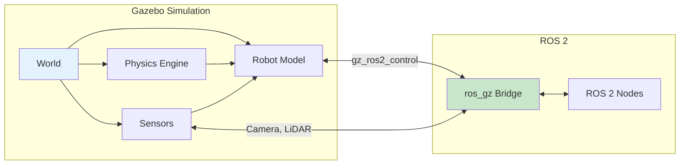

# Gazebo Basics

## Learning Outcomes

By the end of this chapter, you will be able to:

1. **Install and configure** Gazebo Harmonic for ROS 2 development
2. **Create** simulation worlds with terrain and objects
3. **Spawn** URDF robots into Gazebo simulations
4. **Configure** physics parameters for realistic humanoid simulation
5. **Interface** between Gazebo and ROS 2 using ros_gz bridges

## Prerequisites

- Completed Module 1: ROS 2 Fundamentals
- URDF model of a humanoid robot
- Ubuntu 24.04 with ROS 2 Jazzy

## Introduction to Gazebo

Gazebo is a powerful physics simulation environment widely used in robotics research and development. The latest generation, **Gazebo Harmonic** (formerly Ignition Gazebo), provides:

- **High-fidelity physics**: Multiple physics engines (DART, Bullet, ODE)
- **Sensor simulation**: Cameras, LiDAR, IMU, contact sensors
- **ROS 2 integration**: Native bridges for seamless communication
- **Scalability**: Distributed simulation across multiple machines



## Installation

### Installing Gazebo Harmonic

```bash
# Add Gazebo repository
sudo curl https://packages.osrfoundation.org/gazebo.gpg \
    --output /usr/share/keyrings/pkgs-osrf-archive-keyring.gpg

echo "deb [arch=$(dpkg --print-architecture) signed-by=/usr/share/keyrings/pkgs-osrf-archive-keyring.gpg] http://packages.osrfoundation.org/gazebo/ubuntu-stable $(lsb_release -cs) main" \
    | sudo tee /etc/apt/sources.list.d/gazebo-stable.list > /dev/null

# Install Gazebo Harmonic
sudo apt update
sudo apt install gz-harmonic

# Install ROS 2 Gazebo packages
sudo apt install ros-jazzy-ros-gz
```

### Verify Installation

```bash
# Launch empty Gazebo world
gz sim empty.sdf

# Check ROS-Gazebo bridge
ros2 run ros_gz_bridge parameter_bridge --help
```

## Creating Simulation Worlds

### SDF World Format

Gazebo uses **Simulation Description Format (SDF)** for world definitions:

```xml
<?xml version="1.0" ?>
<sdf version="1.8">
  <world name="humanoid_world">
    <!-- Physics configuration -->
    <physics name="1ms" type="dart">
      <max_step_size>0.001</max_step_size>
      <real_time_factor>1.0</real_time_factor>
      <real_time_update_rate>1000</real_time_update_rate>
    </physics>

    <!-- Lighting -->
    <light type="directional" name="sun">
      <cast_shadows>true</cast_shadows>
      <pose>0 0 10 0 0 0</pose>
      <diffuse>0.8 0.8 0.8 1</diffuse>
      <specular>0.2 0.2 0.2 1</specular>
      <direction>-0.5 0.1 -0.9</direction>
    </light>

    <!-- Ground plane -->
    <model name="ground_plane">
      <static>true</static>
      <link name="link">
        <collision name="collision">
          <geometry>
            <plane>
              <normal>0 0 1</normal>
              <size>100 100</size>
            </plane>
          </geometry>
          <surface>
            <friction>
              <ode>
                <mu>1.0</mu>
                <mu2>1.0</mu2>
              </ode>
            </friction>
          </surface>
        </collision>
        <visual name="visual">
          <geometry>
            <plane>
              <normal>0 0 1</normal>
              <size>100 100</size>
            </plane>
          </geometry>
          <material>
            <ambient>0.8 0.8 0.8 1</ambient>
            <diffuse>0.8 0.8 0.8 1</diffuse>
          </material>
        </visual>
      </link>
    </model>

    <!-- Obstacles for navigation -->
    <model name="box_obstacle">
      <pose>3 0 0.5 0 0 0</pose>
      <static>true</static>
      <link name="link">
        <collision name="collision">
          <geometry>
            <box><size>1 1 1</size></box>
          </geometry>
        </collision>
        <visual name="visual">
          <geometry>
            <box><size>1 1 1</size></box>
          </geometry>
          <material>
            <ambient>0.8 0.2 0.2 1</ambient>
          </material>
        </visual>
      </link>
    </model>

  </world>
</sdf>
```

### Physics Engine Configuration

For humanoid simulation, physics parameters are critical:

| Parameter | Value | Purpose |
|-----------|-------|---------|
| `max_step_size` | 0.001 | 1ms steps for stable contact |
| `real_time_factor` | 1.0 | Real-time simulation |
| `solver_iterations` | 50 | Contact accuracy |
| `contact_surface_layer` | 0.001 | Penetration tolerance |

```xml
<physics name="humanoid_physics" type="dart">
  <max_step_size>0.001</max_step_size>
  <real_time_factor>1.0</real_time_factor>
  <dart>
    <solver>
      <solver_type>dantzig</solver_type>
    </solver>
    <collision_detector>bullet</collision_detector>
  </dart>
</physics>
```

## Spawning Robots

### Converting URDF for Gazebo

Gazebo requires additional tags for simulation. Add Gazebo-specific elements:

```xml
<!-- Add to URDF for Gazebo compatibility -->
<gazebo reference="torso">
  <material>Gazebo/Grey</material>
  <mu1>0.8</mu1>
  <mu2>0.8</mu2>
</gazebo>

<gazebo reference="left_foot">
  <material>Gazebo/Black</material>
  <mu1>1.0</mu1>  <!-- High friction for feet -->
  <mu2>1.0</mu2>
  <kp>1000000.0</kp>
  <kd>100.0</kd>
</gazebo>

<!-- IMU sensor -->
<gazebo reference="imu_link">
  <sensor name="imu_sensor" type="imu">
    <always_on>true</always_on>
    <update_rate>1000</update_rate>
    <imu>
      <angular_velocity>
        <x><noise type="gaussian"><mean>0.0</mean><stddev>0.0002</stddev></noise></x>
        <y><noise type="gaussian"><mean>0.0</mean><stddev>0.0002</stddev></noise></y>
        <z><noise type="gaussian"><mean>0.0</mean><stddev>0.0002</stddev></noise></z>
      </angular_velocity>
      <linear_acceleration>
        <x><noise type="gaussian"><mean>0.0</mean><stddev>0.017</stddev></noise></x>
        <y><noise type="gaussian"><mean>0.0</mean><stddev>0.017</stddev></noise></y>
        <z><noise type="gaussian"><mean>0.0</mean><stddev>0.017</stddev></noise></z>
      </linear_acceleration>
    </imu>
  </sensor>
</gazebo>
```

### Launch File for Simulation

```python
#!/usr/bin/env python3
"""Launch Gazebo simulation with humanoid robot."""

from launch import LaunchDescription
from launch.actions import DeclareLaunchArgument, IncludeLaunchDescription
from launch.launch_description_sources import PythonLaunchDescriptionSource
from launch.substitutions import LaunchConfiguration, Command, PathJoinSubstitution
from launch_ros.actions import Node
from launch_ros.substitutions import FindPackageShare


def generate_launch_description():
    pkg_humanoid = FindPackageShare('humanoid_description')
    pkg_ros_gz_sim = FindPackageShare('ros_gz_sim')

    # Paths
    urdf_file = PathJoinSubstitution([pkg_humanoid, 'urdf', 'humanoid.urdf.xacro'])
    world_file = PathJoinSubstitution([pkg_humanoid, 'worlds', 'humanoid_world.sdf'])

    # Robot description
    robot_description = Command(['xacro ', urdf_file])

    return LaunchDescription([
        # Launch Gazebo
        IncludeLaunchDescription(
            PythonLaunchDescriptionSource([
                PathJoinSubstitution([pkg_ros_gz_sim, 'launch', 'gz_sim.launch.py'])
            ]),
            launch_arguments={'gz_args': ['-r ', world_file]}.items()
        ),

        # Robot state publisher
        Node(
            package='robot_state_publisher',
            executable='robot_state_publisher',
            parameters=[{'robot_description': robot_description}]
        ),

        # Spawn robot in Gazebo
        Node(
            package='ros_gz_sim',
            executable='create',
            arguments=[
                '-name', 'humanoid',
                '-topic', 'robot_description',
                '-z', '1.0'  # Spawn 1m above ground
            ],
            output='screen'
        ),

        # Bridge for joint states
        Node(
            package='ros_gz_bridge',
            executable='parameter_bridge',
            arguments=[
                '/world/humanoid_world/model/humanoid/joint_state@sensor_msgs/msg/JointState@gz.msgs.Model',
                '/imu@sensor_msgs/msg/Imu@gz.msgs.IMU',
            ],
            output='screen'
        ),
    ])
```

## ROS 2 - Gazebo Communication

### Parameter Bridge

The `ros_gz_bridge` connects ROS 2 topics with Gazebo transport:

```bash
# Bridge syntax: /topic@ros_type@gz_type
ros2 run ros_gz_bridge parameter_bridge \
  /cmd_vel@geometry_msgs/msg/Twist@gz.msgs.Twist \
  /joint_states@sensor_msgs/msg/JointState@gz.msgs.Model \
  /camera/image@sensor_msgs/msg/Image@gz.msgs.Image
```

### gz_ros2_control

For joint control, use `gz_ros2_control`:

```xml
<!-- Add to URDF -->
<ros2_control name="GazeboSystem" type="system">
  <hardware>
    <plugin>gz_ros2_control/GazeboSimSystem</plugin>
  </hardware>

  <joint name="left_hip_pitch">
    <command_interface name="effort">
      <param name="min">-200</param>
      <param name="max">200</param>
    </command_interface>
    <state_interface name="position"/>
    <state_interface name="velocity"/>
    <state_interface name="effort"/>
  </joint>
  <!-- Repeat for other joints -->
</ros2_control>

<gazebo>
  <plugin filename="gz_ros2_control-system"
          name="gz_ros2_control::GazeboSimROS2ControlPlugin">
    <parameters>$(find humanoid_control)/config/controllers.yaml</parameters>
  </plugin>
</gazebo>
```

## Exercises

### Exercise 1: Create a Walking Environment

1. Create an SDF world with a flat ground and raised platforms
2. Add stairs with 0.15m rise and 0.30m run
3. Include visual markers for navigation waypoints

### Exercise 2: Spawn and Control Robot

1. Launch Gazebo with your humanoid URDF
2. Create a bridge for `/cmd_vel` commands
3. Verify joint states are published via `ros2 topic echo`

### Exercise 3: Add Sensors

1. Add a camera sensor to the robot's head
2. Bridge the camera topic to ROS 2
3. Visualize the camera feed in RViz

## Assessment Questions

1. **Why is a 1ms physics step size important for humanoid contact simulation?**

2. **What is the role of friction coefficients (`mu1`, `mu2`) for foot-ground contact?**

3. **Explain the difference between Gazebo transport and ROS 2 topics.**

4. **How would you configure Gazebo for faster-than-real-time simulation during training?**

## Summary

In this chapter, we covered Gazebo simulation basics:

- **Gazebo Harmonic** provides high-fidelity physics simulation
- **SDF worlds** define environments with physics, lighting, and objects
- **URDF extensions** add simulation-specific properties like friction and sensors
- **ros_gz_bridge** enables communication between Gazebo and ROS 2

Next, we'll explore Unity integration for advanced rendering and machine learning scenarios.

---

**Next**: [Unity Integration](./unity-integration)
