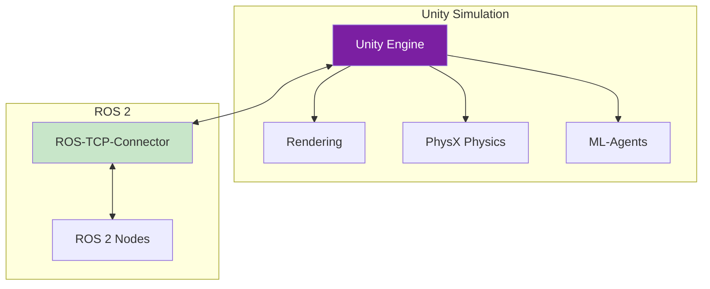

# Unity Integration

## Learning Outcomes

By the end of this chapter, you will be able to:

1. **Configure** Unity with ROS 2 using the Unity Robotics Hub
2. **Import** URDF robots into Unity scenes
3. **Implement** ROS 2 communication from Unity using ROS-TCP-Connector
4. **Create** photorealistic environments for perception testing
5. **Design** domain randomization pipelines for sim-to-real transfer

## Prerequisites

- Completed Chapter 1: Gazebo Basics
- Unity 2022.3 LTS or later installed
- Basic familiarity with Unity Editor

## Why Unity for Robotics?

While Gazebo excels at physics simulation, Unity offers unique advantages:

| Feature | Gazebo | Unity |
|---------|--------|-------|
| Physics accuracy | ★★★★★ | ★★★☆☆ |
| Visual fidelity | ★★★☆☆ | ★★★★★ |
| ML integration | ★★☆☆☆ | ★★★★★ |
| Custom environments | ★★★☆☆ | ★★★★★ |
| VR/AR support | ★☆☆☆☆ | ★★★★★ |



## Setting Up Unity for ROS 2

### Installing Required Packages

1. Open Unity Package Manager (Window → Package Manager)
2. Add packages from git URL:
   - `https://github.com/Unity-Technologies/ROS-TCP-Connector.git?path=/com.unity.robotics.ros-tcp-connector`
   - `https://github.com/Unity-Technologies/URDF-Importer.git?path=/com.unity.robotics.urdf-importer`

### ROS-TCP-Endpoint Setup

```bash
# Install ROS 2 side of the connection
cd ~/ros2_ws/src
git clone https://github.com/Unity-Technologies/ROS-TCP-Endpoint.git -b ROS2v0.7.0

cd ~/ros2_ws
colcon build --packages-select ros_tcp_endpoint
source install/setup.bash

# Run the endpoint
ros2 run ros_tcp_endpoint default_server_endpoint --ros-args -p ROS_IP:=0.0.0.0
```

### Unity Configuration

```csharp
// In Unity: Robotics → ROS Settings
// Set ROS IP Address: 127.0.0.1 (or your ROS machine IP)
// Set ROS Port: 10000
// Protocol: ROS2
```

## Importing URDF Robots

### URDF Import Process

1. Place URDF and mesh files in `Assets/URDF/`
2. Right-click the `.urdf` file → Import Robot from URDF
3. Configure import settings:

```csharp
// Import settings in Unity
public class URDFImportSettings
{
    public bool useUrdfInertiaData = true;
    public bool useGravity = true;
    public bool useCollision = true;
    public ImportPipelineType pipelineType = ImportPipelineType.ArticulationBody;
}
```

### Articulation Body Configuration

Unity's `ArticulationBody` component provides stable physics for robotic chains:

```csharp
using UnityEngine;

public class HumanoidController : MonoBehaviour
{
    private ArticulationBody[] joints;

    void Start()
    {
        // Get all articulation bodies (joints)
        joints = GetComponentsInChildren<ArticulationBody>();

        foreach (var joint in joints)
        {
            if (joint.jointType == ArticulationJointType.RevoluteJoint)
            {
                // Configure joint drive
                var drive = joint.xDrive;
                drive.stiffness = 10000f;  // Position gain
                drive.damping = 1000f;      // Velocity damping
                drive.forceLimit = 200f;    // Max torque (Nm)
                joint.xDrive = drive;
            }
        }
    }

    public void SetJointTarget(string jointName, float targetRadians)
    {
        foreach (var joint in joints)
        {
            if (joint.name == jointName)
            {
                var drive = joint.xDrive;
                drive.target = targetRadians * Mathf.Rad2Deg;
                joint.xDrive = drive;
                break;
            }
        }
    }
}
```

## ROS 2 Communication

### Publishing Joint States

```csharp
using UnityEngine;
using Unity.Robotics.ROSTCPConnector;
using RosMessageTypes.Sensor;
using RosMessageTypes.Std;

public class JointStatePublisher : MonoBehaviour
{
    private ROSConnection ros;
    private string topicName = "/joint_states";
    private ArticulationBody[] joints;
    private float publishRate = 100f; // Hz
    private float timeElapsed;

    void Start()
    {
        ros = ROSConnection.GetOrCreateInstance();
        ros.RegisterPublisher<JointStateMsg>(topicName);

        joints = GetComponentsInChildren<ArticulationBody>();
    }

    void FixedUpdate()
    {
        timeElapsed += Time.fixedDeltaTime;

        if (timeElapsed >= 1f / publishRate)
        {
            PublishJointStates();
            timeElapsed = 0f;
        }
    }

    void PublishJointStates()
    {
        var msg = new JointStateMsg();
        msg.header = new HeaderMsg();
        msg.header.stamp = new RosMessageTypes.BuiltinInterfaces.TimeMsg
        {
            sec = (int)Time.time,
            nanosec = (uint)((Time.time % 1) * 1e9)
        };

        var names = new System.Collections.Generic.List<string>();
        var positions = new System.Collections.Generic.List<double>();
        var velocities = new System.Collections.Generic.List<double>();
        var efforts = new System.Collections.Generic.List<double>();

        foreach (var joint in joints)
        {
            if (joint.jointType != ArticulationJointType.FixedJoint)
            {
                names.Add(joint.name);
                positions.Add(joint.jointPosition[0] * Mathf.Deg2Rad);
                velocities.Add(joint.jointVelocity[0] * Mathf.Deg2Rad);
                efforts.Add(joint.jointForce[0]);
            }
        }

        msg.name = names.ToArray();
        msg.position = positions.ToArray();
        msg.velocity = velocities.ToArray();
        msg.effort = efforts.ToArray();

        ros.Publish(topicName, msg);
    }
}
```

### Subscribing to Commands

```csharp
using UnityEngine;
using Unity.Robotics.ROSTCPConnector;
using RosMessageTypes.Std;

public class JointCommandSubscriber : MonoBehaviour
{
    private ROSConnection ros;
    private HumanoidController controller;

    void Start()
    {
        ros = ROSConnection.GetOrCreateInstance();
        controller = GetComponent<HumanoidController>();

        ros.Subscribe<Float64MultiArrayMsg>("/joint_commands", CommandCallback);
    }

    void CommandCallback(Float64MultiArrayMsg msg)
    {
        // Apply joint commands
        string[] jointNames = { "left_hip_pitch", "left_knee", "left_ankle_pitch",
                               "right_hip_pitch", "right_knee", "right_ankle_pitch" };

        for (int i = 0; i < Mathf.Min(msg.data.Length, jointNames.Length); i++)
        {
            controller.SetJointTarget(jointNames[i], (float)msg.data[i]);
        }
    }
}
```

## Photorealistic Environments

### High-Definition Render Pipeline (HDRP)

For perception testing, use Unity's HDRP:

```csharp
// Camera simulation with realistic effects
using UnityEngine;
using UnityEngine.Rendering.HighDefinition;

public class SimulatedCamera : MonoBehaviour
{
    [Header("Camera Parameters")]
    public float focalLength = 35f;
    public float aperture = 2.8f;
    public Vector2Int resolution = new Vector2Int(1920, 1080);

    private Camera cam;
    private HDAdditionalCameraData hdCam;

    void Start()
    {
        cam = GetComponent<Camera>();
        hdCam = GetComponent<HDAdditionalCameraData>();

        // Configure lens simulation
        var physicalParams = hdCam.physicalParameters;
        physicalParams.focalLength = focalLength;
        physicalParams.aperture = aperture;

        // Add motion blur for realism
        hdCam.antialiasing = HDAdditionalCameraData.AntialiasingMode.TemporalAntialiasing;
    }
}
```

### Domain Randomization

Critical for sim-to-real transfer:

```csharp
using UnityEngine;

public class DomainRandomizer : MonoBehaviour
{
    [Header("Visual Randomization")]
    public Material[] floorMaterials;
    public Color[] lightColors;

    [Header("Physics Randomization")]
    public Vector2 frictionRange = new Vector2(0.3f, 1.0f);
    public Vector2 massScaleRange = new Vector2(0.8f, 1.2f);

    [Header("Randomization Frequency")]
    public float randomizeEverySeconds = 10f;

    private float timer;

    void Update()
    {
        timer += Time.deltaTime;
        if (timer >= randomizeEverySeconds)
        {
            Randomize();
            timer = 0f;
        }
    }

    public void Randomize()
    {
        RandomizeVisuals();
        RandomizePhysics();
        RandomizeLighting();
    }

    void RandomizeVisuals()
    {
        // Randomize floor material
        var floor = GameObject.Find("Floor");
        if (floor && floorMaterials.Length > 0)
        {
            var renderer = floor.GetComponent<Renderer>();
            renderer.material = floorMaterials[Random.Range(0, floorMaterials.Length)];
        }
    }

    void RandomizePhysics()
    {
        // Randomize friction
        var colliders = FindObjectsOfType<Collider>();
        foreach (var col in colliders)
        {
            if (col.material != null)
            {
                col.material.dynamicFriction = Random.Range(frictionRange.x, frictionRange.y);
                col.material.staticFriction = col.material.dynamicFriction * 1.2f;
            }
        }

        // Randomize robot mass
        var bodies = GetComponentsInChildren<ArticulationBody>();
        float massScale = Random.Range(massScaleRange.x, massScaleRange.y);
        foreach (var body in bodies)
        {
            body.mass *= massScale;
        }
    }

    void RandomizeLighting()
    {
        var lights = FindObjectsOfType<Light>();
        foreach (var light in lights)
        {
            if (light.type == LightType.Directional)
            {
                light.color = lightColors[Random.Range(0, lightColors.Length)];
                light.intensity = Random.Range(0.8f, 1.5f);
            }
        }
    }
}
```

## Exercises

### Exercise 1: Import and Control Robot

1. Import your humanoid URDF into Unity
2. Configure ArticulationBody drives for stable simulation
3. Create a simple keyboard controller for joint movement

### Exercise 2: ROS 2 Integration

1. Set up ROS-TCP-Connector and Endpoint
2. Publish joint states at 100 Hz
3. Subscribe to velocity commands and move the robot

### Exercise 3: Perception Pipeline

1. Add a camera to the robot's head
2. Publish camera images to ROS 2
3. Implement domain randomization for lighting and textures

## Assessment Questions

1. **What are the trade-offs between Gazebo and Unity for humanoid simulation?**

2. **Why is ArticulationBody preferred over Rigidbody chains for robotic simulation in Unity?**

3. **How does domain randomization improve sim-to-real transfer?**

4. **Describe the communication flow between Unity and ROS 2 nodes.**

## Summary

This chapter covered Unity integration for robotics:

- **Unity Robotics Hub** provides tools for ROS 2 integration
- **URDF Importer** brings robot models into Unity scenes
- **ROS-TCP-Connector** enables bidirectional communication
- **Domain randomization** improves model generalization for real-world deployment

Next, we'll explore sensor simulation in depth across both Gazebo and Unity.

---

**Next**: [Sensor Simulation](./sensor-simulation)
