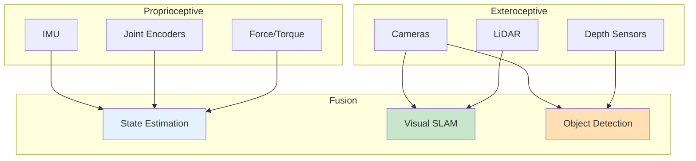

# Sensor Simulation

## Learning Outcomes

By the end of this chapter, you will be able to:

1. **Configure** camera sensors with realistic noise models
2. **Simulate** LiDAR and depth sensors for perception
3. **Model** IMU sensors with appropriate noise characteristics
4. **Implement** force/torque sensors for contact detection
5. **Calibrate** simulated sensors to match real hardware

## Prerequisites

- Completed Chapters 1-2 of Module 2
- Understanding of sensor noise models
- Basic signal processing knowledge

## Sensor Types for Humanoid Robots

Humanoid robots rely on multiple sensor modalities:



## Camera Simulation

### Gazebo Camera Configuration

```xml
<gazebo reference="head_camera_link">
  <sensor name="head_camera" type="camera">
    <always_on>true</always_on>
    <update_rate>30</update_rate>
    <visualize>true</visualize>

    <camera name="head_camera">
      <horizontal_fov>1.047</horizontal_fov>  <!-- 60 degrees -->
      <image>
        <width>1280</width>
        <height>720</height>
        <format>R8G8B8</format>
      </image>
      <clip>
        <near>0.1</near>
        <far>100</far>
      </clip>

      <!-- Noise model -->
      <noise>
        <type>gaussian</type>
        <mean>0.0</mean>
        <stddev>0.007</stddev>
      </noise>

      <!-- Lens distortion -->
      <distortion>
        <k1>-0.25</k1>
        <k2>0.12</k2>
        <k3>0.0</k3>
        <p1>-0.00028</p1>
        <p2>-0.00005</p2>
        <center>0.5 0.5</center>
      </distortion>
    </camera>
  </sensor>
</gazebo>
```

### Depth Camera (RGB-D)

```xml
<gazebo reference="depth_camera_link">
  <sensor name="depth_camera" type="depth_camera">
    <always_on>true</always_on>
    <update_rate>30</update_rate>

    <camera name="depth_camera">
      <horizontal_fov>1.22</horizontal_fov>  <!-- 70 degrees -->
      <image>
        <width>640</width>
        <height>480</height>
        <format>R_FLOAT32</format>
      </image>
      <clip>
        <near>0.3</near>
        <far>10.0</far>
      </clip>

      <noise>
        <type>gaussian</type>
        <mean>0.0</mean>
        <stddev>0.01</stddev>  <!-- 1cm depth noise -->
      </noise>
    </camera>

    <plugin filename="libgazebo_ros_depth_camera.so" name="depth_camera_plugin">
      <ros>
        <namespace>/humanoid</namespace>
        <remapping>~/depth/image_raw:=depth/image</remapping>
        <remapping>~/depth/camera_info:=depth/camera_info</remapping>
        <remapping>~/points:=depth/points</remapping>
      </ros>
      <camera_name>depth_camera</camera_name>
      <frame_name>depth_camera_optical_frame</frame_name>
      <min_depth>0.3</min_depth>
      <max_depth>10.0</max_depth>
    </plugin>
  </sensor>
</gazebo>
```

### Camera Noise Models in Python

```python
#!/usr/bin/env python3
"""Realistic camera noise simulation."""

import numpy as np
import cv2
from dataclasses import dataclass


@dataclass
class CameraNoiseParams:
    """Parameters for camera noise simulation."""
    gaussian_sigma: float = 5.0      # Gaussian noise std dev
    salt_pepper_prob: float = 0.001  # Salt and pepper probability
    motion_blur_kernel: int = 0      # Motion blur kernel size (0 = disabled)
    exposure_variation: float = 0.1  # Random exposure variation


class CameraNoiseSimulator:
    """Simulate realistic camera noise."""

    def __init__(self, params: CameraNoiseParams):
        self.params = params

    def add_gaussian_noise(self, image: np.ndarray) -> np.ndarray:
        """Add Gaussian noise to image."""
        noise = np.random.normal(0, self.params.gaussian_sigma, image.shape)
        noisy = image.astype(np.float32) + noise
        return np.clip(noisy, 0, 255).astype(np.uint8)

    def add_salt_pepper(self, image: np.ndarray) -> np.ndarray:
        """Add salt and pepper noise."""
        noisy = image.copy()
        # Salt
        salt_mask = np.random.random(image.shape[:2]) < self.params.salt_pepper_prob / 2
        noisy[salt_mask] = 255
        # Pepper
        pepper_mask = np.random.random(image.shape[:2]) < self.params.salt_pepper_prob / 2
        noisy[pepper_mask] = 0
        return noisy

    def add_motion_blur(self, image: np.ndarray) -> np.ndarray:
        """Add motion blur effect."""
        if self.params.motion_blur_kernel == 0:
            return image

        kernel_size = self.params.motion_blur_kernel
        kernel = np.zeros((kernel_size, kernel_size))
        kernel[int((kernel_size-1)/2), :] = np.ones(kernel_size) / kernel_size
        return cv2.filter2D(image, -1, kernel)

    def vary_exposure(self, image: np.ndarray) -> np.ndarray:
        """Simulate exposure variation."""
        factor = 1.0 + np.random.uniform(
            -self.params.exposure_variation,
            self.params.exposure_variation
        )
        adjusted = image.astype(np.float32) * factor
        return np.clip(adjusted, 0, 255).astype(np.uint8)

    def apply_all(self, image: np.ndarray) -> np.ndarray:
        """Apply all noise effects."""
        result = self.vary_exposure(image)
        result = self.add_gaussian_noise(result)
        result = self.add_salt_pepper(result)
        result = self.add_motion_blur(result)
        return result
```

## LiDAR Simulation

### 2D LiDAR Configuration

```xml
<gazebo reference="lidar_link">
  <sensor name="lidar" type="ray">
    <always_on>true</always_on>
    <update_rate>20</update_rate>
    <visualize>true</visualize>

    <ray>
      <scan>
        <horizontal>
          <samples>720</samples>
          <resolution>1</resolution>
          <min_angle>-2.35619</min_angle>  <!-- -135 degrees -->
          <max_angle>2.35619</max_angle>   <!-- 135 degrees -->
        </horizontal>
      </scan>
      <range>
        <min>0.1</min>
        <max>30.0</max>
        <resolution>0.01</resolution>
      </range>
      <noise>
        <type>gaussian</type>
        <mean>0.0</mean>
        <stddev>0.01</stddev>
      </noise>
    </ray>

    <plugin filename="libgazebo_ros_ray_sensor.so" name="lidar_plugin">
      <ros>
        <namespace>/humanoid</namespace>
        <remapping>~/out:=scan</remapping>
      </ros>
      <output_type>sensor_msgs/LaserScan</output_type>
      <frame_name>lidar_link</frame_name>
    </plugin>
  </sensor>
</gazebo>
```

### 3D LiDAR (Velodyne-style)

```xml
<gazebo reference="velodyne_link">
  <sensor name="velodyne" type="gpu_lidar">
    <always_on>true</always_on>
    <update_rate>10</update_rate>
    <visualize>true</visualize>

    <lidar>
      <scan>
        <horizontal>
          <samples>1800</samples>
          <resolution>1</resolution>
          <min_angle>-3.14159</min_angle>
          <max_angle>3.14159</max_angle>
        </horizontal>
        <vertical>
          <samples>16</samples>
          <resolution>1</resolution>
          <min_angle>-0.261799</min_angle>  <!-- -15 degrees -->
          <max_angle>0.261799</max_angle>   <!-- 15 degrees -->
        </vertical>
      </scan>
      <range>
        <min>0.5</min>
        <max>100.0</max>
        <resolution>0.01</resolution>
      </range>
      <noise>
        <type>gaussian</type>
        <mean>0.0</mean>
        <stddev>0.02</stddev>
      </noise>
    </lidar>
  </sensor>
</gazebo>
```

## IMU Simulation

### IMU Configuration

```xml
<gazebo reference="imu_link">
  <sensor name="imu_sensor" type="imu">
    <always_on>true</always_on>
    <update_rate>1000</update_rate>

    <imu>
      <!-- Angular velocity (gyroscope) -->
      <angular_velocity>
        <x>
          <noise type="gaussian">
            <mean>0.0</mean>
            <stddev>0.0002</stddev>  <!-- rad/s -->
            <bias_mean>0.0000075</bias_mean>
            <bias_stddev>0.0000008</bias_stddev>
          </noise>
        </x>
        <y>
          <noise type="gaussian">
            <mean>0.0</mean>
            <stddev>0.0002</stddev>
            <bias_mean>0.0000075</bias_mean>
            <bias_stddev>0.0000008</bias_stddev>
          </noise>
        </y>
        <z>
          <noise type="gaussian">
            <mean>0.0</mean>
            <stddev>0.0002</stddev>
            <bias_mean>0.0000075</bias_mean>
            <bias_stddev>0.0000008</bias_stddev>
          </noise>
        </z>
      </angular_velocity>

      <!-- Linear acceleration (accelerometer) -->
      <linear_acceleration>
        <x>
          <noise type="gaussian">
            <mean>0.0</mean>
            <stddev>0.017</stddev>  <!-- m/s^2 -->
            <bias_mean>0.1</bias_mean>
            <bias_stddev>0.001</bias_stddev>
          </noise>
        </x>
        <y>
          <noise type="gaussian">
            <mean>0.0</mean>
            <stddev>0.017</stddev>
            <bias_mean>0.1</bias_mean>
            <bias_stddev>0.001</bias_stddev>
          </noise>
        </y>
        <z>
          <noise type="gaussian">
            <mean>0.0</mean>
            <stddev>0.017</stddev>
            <bias_mean>0.1</bias_mean>
            <bias_stddev>0.001</bias_stddev>
          </noise>
        </z>
      </linear_acceleration>
    </imu>

    <plugin filename="libgazebo_ros_imu_sensor.so" name="imu_plugin">
      <ros>
        <namespace>/humanoid</namespace>
        <remapping>~/out:=imu/data</remapping>
      </ros>
      <frame_name>imu_link</frame_name>
    </plugin>
  </sensor>
</gazebo>
```

### IMU Noise Model

```python
#!/usr/bin/env python3
"""IMU noise simulation with bias drift."""

import numpy as np
from dataclasses import dataclass


@dataclass
class IMUNoiseParams:
    """IMU noise parameters (typical MEMS IMU)."""
    # Gyroscope
    gyro_noise_density: float = 0.0002      # rad/s/sqrt(Hz)
    gyro_random_walk: float = 0.0000022     # rad/s^2/sqrt(Hz)
    gyro_bias_init: float = 0.0001          # rad/s

    # Accelerometer
    accel_noise_density: float = 0.002      # m/s^2/sqrt(Hz)
    accel_random_walk: float = 0.00002      # m/s^3/sqrt(Hz)
    accel_bias_init: float = 0.01           # m/s^2


class IMUSimulator:
    """Simulate IMU with realistic noise characteristics."""

    def __init__(self, params: IMUNoiseParams, dt: float = 0.001):
        self.params = params
        self.dt = dt
        self.sqrt_dt = np.sqrt(dt)

        # Initialize biases
        self.gyro_bias = np.random.normal(0, params.gyro_bias_init, 3)
        self.accel_bias = np.random.normal(0, params.accel_bias_init, 3)

    def update_biases(self):
        """Update bias random walk."""
        self.gyro_bias += np.random.normal(
            0, self.params.gyro_random_walk * self.sqrt_dt, 3
        )
        self.accel_bias += np.random.normal(
            0, self.params.accel_random_walk * self.sqrt_dt, 3
        )

    def add_noise(self, true_gyro: np.ndarray, true_accel: np.ndarray):
        """Add noise to true IMU readings."""
        self.update_biases()

        # Gyroscope noise
        gyro_noise = np.random.normal(
            0, self.params.gyro_noise_density / self.sqrt_dt, 3
        )
        noisy_gyro = true_gyro + self.gyro_bias + gyro_noise

        # Accelerometer noise
        accel_noise = np.random.normal(
            0, self.params.accel_noise_density / self.sqrt_dt, 3
        )
        noisy_accel = true_accel + self.accel_bias + accel_noise

        return noisy_gyro, noisy_accel
```

## Force/Torque Sensors

### Contact Sensors

```xml
<!-- Foot contact sensor -->
<gazebo reference="left_foot">
  <sensor name="left_foot_contact" type="contact">
    <always_on>true</always_on>
    <update_rate>1000</update_rate>

    <contact>
      <collision>left_foot_collision</collision>
    </contact>

    <plugin filename="libgazebo_ros_ft_sensor.so" name="ft_sensor">
      <ros>
        <namespace>/humanoid</namespace>
        <remapping>~/wrench:=left_foot/wrench</remapping>
      </ros>
      <body_name>left_foot</body_name>
      <frame_name>left_foot</frame_name>
      <update_rate>1000</update_rate>
    </plugin>
  </sensor>
</gazebo>
```

### Force/Torque Sensor

```xml
<!-- 6-axis F/T sensor at wrist -->
<gazebo reference="left_wrist_ft_link">
  <sensor name="left_wrist_ft" type="force_torque">
    <always_on>true</always_on>
    <update_rate>1000</update_rate>

    <force_torque>
      <frame>parent</frame>
      <measure_direction>child_to_parent</measure_direction>
    </force_torque>

    <plugin filename="libgazebo_ros_ft_sensor.so" name="ft_sensor">
      <ros>
        <namespace>/humanoid</namespace>
        <remapping>~/wrench:=left_wrist/wrench</remapping>
      </ros>
      <joint_name>left_wrist_ft_joint</joint_name>
    </plugin>
  </sensor>
</gazebo>
```

## Exercises

### Exercise 1: Camera Calibration

1. Create a checkerboard pattern in simulation
2. Capture images from multiple viewpoints
3. Use OpenCV to calibrate the camera and compare with ground truth

### Exercise 2: IMU Allan Variance

1. Record static IMU data for 1 hour (simulated)
2. Compute Allan variance plots
3. Extract noise parameters and compare with configuration

### Exercise 3: Contact Detection

1. Add contact sensors to both feet
2. Implement a gait phase detector based on contact states
3. Visualize contact forces during a walking motion

## Assessment Questions

1. **Why is bias modeling important for IMU simulation?**

2. **How do you choose appropriate noise parameters for sensor simulation?**

3. **What is the difference between contact sensors and force/torque sensors?**

4. **How does sensor update rate affect the fidelity of simulation?**

## Summary

This chapter covered sensor simulation for humanoid robots:

- **Cameras** require noise, distortion, and exposure modeling
- **LiDAR** sensors need appropriate range and angular resolution
- **IMU** simulation must include bias drift for realistic state estimation
- **Force/torque** sensors are critical for balance and manipulation

Next, we'll explore digital twin concepts that bring all these elements together.

---

**Next**: [Digital Twins](./digital-twins)
