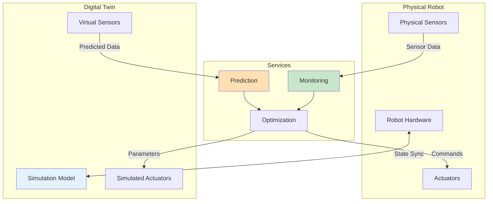

# Digital Twins

## Learning Outcomes

By the end of this chapter, you will be able to:

1. **Define** digital twin architectures for humanoid robots
2. **Implement** bidirectional synchronization between physical and virtual robots
3. **Design** monitoring dashboards for robot health and performance
4. **Create** predictive maintenance systems using simulation
5. **Validate** control algorithms using digital twin verification

## Prerequisites

- Completed Chapters 1-3 of Module 2
- Understanding of ROS 2 communication patterns
- Familiarity with state estimation concepts

## What is a Digital Twin?

A **digital twin** is a virtual representation of a physical robot that mirrors its state, behavior, and environment in real-time. Unlike simple simulation, digital twins maintain continuous synchronization with their physical counterparts.



## Digital Twin Architecture

### System Components

| Component | Physical Side | Digital Side |
|-----------|--------------|--------------|
| State | Joint positions, velocities | Simulated joint states |
| Sensors | IMU, cameras, F/T | Simulated sensors |
| Environment | Real world | Reconstructed scene |
| Commands | Actuator inputs | Simulated inputs |

### ROS 2 Architecture

```python
#!/usr/bin/env python3
"""Digital twin synchronization node."""

import rclpy
from rclpy.node import Node
from rclpy.qos import QoSProfile, ReliabilityPolicy
from sensor_msgs.msg import JointState, Imu
from geometry_msgs.msg import WrenchStamped
from std_msgs.msg import Float64MultiArray
import numpy as np


class DigitalTwinSync(Node):
    """Synchronize physical robot with digital twin."""

    def __init__(self):
        super().__init__('digital_twin_sync')

        # QoS for real-time data
        realtime_qos = QoSProfile(
            reliability=ReliabilityPolicy.BEST_EFFORT,
            depth=1
        )

        # Physical robot subscriptions
        self.physical_joint_sub = self.create_subscription(
            JointState, '/physical/joint_states',
            self.physical_joint_callback, realtime_qos
        )

        self.physical_imu_sub = self.create_subscription(
            Imu, '/physical/imu/data',
            self.physical_imu_callback, realtime_qos
        )

        # Digital twin publishers (to simulation)
        self.twin_joint_pub = self.create_publisher(
            Float64MultiArray, '/twin/joint_commands', 10
        )

        # Synchronization state
        self.sync_enabled = True
        self.last_physical_state = None
        self.state_error_threshold = 0.1  # radians

        # Monitoring publishers
        self.sync_error_pub = self.create_publisher(
            Float64MultiArray, '/twin/sync_error', 10
        )

        # Sync timer
        self.create_timer(0.001, self.sync_loop)  # 1 kHz

        self.get_logger().info('Digital twin synchronization initialized')

    def physical_joint_callback(self, msg: JointState):
        """Receive physical robot joint states."""
        self.last_physical_state = msg

    def physical_imu_callback(self, msg: Imu):
        """Receive physical robot IMU data."""
        # Could use for additional synchronization verification
        pass

    def sync_loop(self):
        """Main synchronization loop."""
        if not self.sync_enabled or self.last_physical_state is None:
            return

        # Send physical state to digital twin
        cmd = Float64MultiArray()
        cmd.data = list(self.last_physical_state.position)
        self.twin_joint_pub.publish(cmd)

    def compute_sync_error(self, physical: JointState, digital: JointState):
        """Compute synchronization error between physical and digital."""
        if len(physical.position) != len(digital.position):
            self.get_logger().warn('Joint count mismatch')
            return None

        errors = np.array(physical.position) - np.array(digital.position)
        return errors


def main(args=None):
    rclpy.init(args=args)
    node = DigitalTwinSync()
    rclpy.spin(node)
    node.destroy_node()
    rclpy.shutdown()


if __name__ == '__main__':
    main()
```

## Bidirectional Synchronization

### Physical-to-Digital (Monitoring Mode)

```python
class PhysicalToDigitalSync:
    """Sync physical robot state to digital twin for monitoring."""

    def __init__(self, node: Node):
        self.node = node

        # State estimation
        self.physical_state = None
        self.digital_state = None

        # Create command publisher for twin
        self.twin_position_cmd = node.create_publisher(
            Float64MultiArray, '/twin/position_commands', 10
        )

        # Subscribe to physical robot
        node.create_subscription(
            JointState, '/physical/joint_states',
            self.on_physical_state, 10
        )

        # Subscribe to twin state (for verification)
        node.create_subscription(
            JointState, '/twin/joint_states',
            self.on_digital_state, 10
        )

    def on_physical_state(self, msg: JointState):
        """Update twin to match physical robot."""
        self.physical_state = msg

        # Command digital twin to follow
        cmd = Float64MultiArray()
        cmd.data = list(msg.position)
        self.twin_position_cmd.publish(cmd)

    def on_digital_state(self, msg: JointState):
        """Verify twin state matches physical."""
        self.digital_state = msg
        self.verify_sync()

    def verify_sync(self):
        """Check synchronization accuracy."""
        if self.physical_state is None or self.digital_state is None:
            return

        max_error = max(abs(p - d) for p, d in zip(
            self.physical_state.position,
            self.digital_state.position
        ))

        if max_error > 0.05:  # 0.05 rad threshold
            self.node.get_logger().warn(
                f'Twin sync error: {max_error:.4f} rad'
            )
```

### Digital-to-Physical (Control Mode)

```python
class DigitalToPhysicalSync:
    """Use digital twin for planning, execute on physical robot."""

    def __init__(self, node: Node):
        self.node = node

        # Safety limits
        self.max_velocity = 2.0  # rad/s
        self.max_acceleration = 10.0  # rad/s^2

        # Publishers
        self.physical_cmd_pub = node.create_publisher(
            Float64MultiArray, '/physical/joint_commands', 10
        )

        # Subscribe to twin planned trajectory
        node.create_subscription(
            Float64MultiArray, '/twin/planned_trajectory',
            self.on_twin_plan, 10
        )

    def on_twin_plan(self, msg: Float64MultiArray):
        """Receive plan from twin and execute safely on physical."""
        # Validate commands against safety limits
        if not self.validate_command(msg.data):
            self.node.get_logger().error('Unsafe command rejected')
            return

        # Forward to physical robot
        self.physical_cmd_pub.publish(msg)

    def validate_command(self, positions: list) -> bool:
        """Validate command is within safe limits."""
        # Add velocity/acceleration checking
        return all(abs(p) < 3.14 for p in positions)  # Simple position limit
```

## Monitoring and Analytics

### Health Dashboard

```python
#!/usr/bin/env python3
"""Robot health monitoring using digital twin comparison."""

import rclpy
from rclpy.node import Node
from sensor_msgs.msg import JointState
from std_msgs.msg import Float64
from dataclasses import dataclass
from typing import Dict, List
import numpy as np


@dataclass
class JointHealth:
    """Health metrics for a single joint."""
    name: str
    position_error: float = 0.0
    velocity_error: float = 0.0
    effort_ratio: float = 1.0  # actual/expected effort
    temperature: float = 25.0


class HealthMonitor(Node):
    """Monitor robot health by comparing physical and digital twin."""

    def __init__(self):
        super().__init__('health_monitor')

        self.physical_state: JointState = None
        self.digital_state: JointState = None
        self.joint_health: Dict[str, JointHealth] = {}

        # Subscriptions
        self.create_subscription(
            JointState, '/physical/joint_states',
            self.physical_callback, 10
        )
        self.create_subscription(
            JointState, '/twin/joint_states',
            self.digital_callback, 10
        )

        # Health publishers
        self.health_score_pub = self.create_publisher(
            Float64, '/health/overall_score', 10
        )

        # Analysis timer (10 Hz)
        self.create_timer(0.1, self.analyze_health)

        # Alert thresholds
        self.position_error_threshold = 0.1  # rad
        self.effort_ratio_threshold = 1.5    # 50% more effort than expected

    def physical_callback(self, msg: JointState):
        self.physical_state = msg

    def digital_callback(self, msg: JointState):
        self.digital_state = msg

    def analyze_health(self):
        """Compare physical and digital states to assess health."""
        if self.physical_state is None or self.digital_state is None:
            return

        health_scores = []

        for i, name in enumerate(self.physical_state.name):
            if name not in self.joint_health:
                self.joint_health[name] = JointHealth(name=name)

            health = self.joint_health[name]

            # Position tracking error
            if i < len(self.digital_state.position):
                health.position_error = abs(
                    self.physical_state.position[i] -
                    self.digital_state.position[i]
                )

            # Effort ratio (actual vs expected)
            if (i < len(self.physical_state.effort) and
                i < len(self.digital_state.effort) and
                abs(self.digital_state.effort[i]) > 0.1):
                health.effort_ratio = (
                    abs(self.physical_state.effort[i]) /
                    abs(self.digital_state.effort[i])
                )

            # Compute joint health score (0-100)
            position_score = max(0, 100 - health.position_error * 1000)
            effort_score = max(0, 100 - abs(health.effort_ratio - 1.0) * 100)
            joint_score = (position_score + effort_score) / 2
            health_scores.append(joint_score)

            # Log warnings
            if health.position_error > self.position_error_threshold:
                self.get_logger().warn(
                    f'Joint {name}: high position error {health.position_error:.3f} rad'
                )

            if health.effort_ratio > self.effort_ratio_threshold:
                self.get_logger().warn(
                    f'Joint {name}: high effort ratio {health.effort_ratio:.2f}'
                )

        # Publish overall health score
        overall_score = Float64()
        overall_score.data = np.mean(health_scores) if health_scores else 0.0
        self.health_score_pub.publish(overall_score)


def main(args=None):
    rclpy.init(args=args)
    node = HealthMonitor()
    rclpy.spin(node)
    node.destroy_node()
    rclpy.shutdown()


if __name__ == '__main__':
    main()
```

## Predictive Maintenance

### Wear Model Simulation

```python
class WearPredictor:
    """Predict component wear using digital twin data."""

    def __init__(self):
        # Wear coefficients per joint (empirically determined)
        self.wear_coefficients = {
            'hip_pitch': 1e-9,
            'knee': 1.5e-9,
            'ankle_pitch': 1e-9,
        }

        # Accumulated wear (starts at 0)
        self.accumulated_wear = {}

        # Wear threshold for maintenance alert
        self.maintenance_threshold = 0.01  # 1% wear

    def update_wear(self, joint_name: str, effort: float, velocity: float, dt: float):
        """Update wear estimate based on load and motion."""
        if joint_name not in self.accumulated_wear:
            self.accumulated_wear[joint_name] = 0.0

        # Simple wear model: wear = k * |effort| * |velocity| * dt
        coeff = self.wear_coefficients.get(joint_name, 1e-9)
        wear_increment = coeff * abs(effort) * abs(velocity) * dt

        self.accumulated_wear[joint_name] += wear_increment

        return self.accumulated_wear[joint_name]

    def predict_remaining_life(self, joint_name: str, avg_effort: float,
                               avg_velocity: float) -> float:
        """Predict remaining useful life in hours."""
        if joint_name not in self.accumulated_wear:
            return float('inf')

        current_wear = self.accumulated_wear[joint_name]
        remaining_wear = self.maintenance_threshold - current_wear

        if remaining_wear <= 0:
            return 0.0

        coeff = self.wear_coefficients.get(joint_name, 1e-9)
        wear_rate = coeff * abs(avg_effort) * abs(avg_velocity)

        if wear_rate <= 0:
            return float('inf')

        return remaining_wear / wear_rate / 3600  # Convert seconds to hours

    def get_maintenance_alerts(self) -> List[str]:
        """Get list of joints needing maintenance."""
        alerts = []
        for joint, wear in self.accumulated_wear.items():
            if wear > self.maintenance_threshold * 0.8:  # 80% of threshold
                alerts.append(
                    f'{joint}: {wear/self.maintenance_threshold*100:.1f}% wear'
                )
        return alerts
```

## Exercises

### Exercise 1: Basic Digital Twin

1. Set up a Gazebo simulation with your humanoid URDF
2. Create synchronization nodes to mirror joint states
3. Verify sync accuracy by comparing physical and digital states

### Exercise 2: Health Monitoring

1. Implement the health monitor node
2. Create a simple visualization (RViz or web dashboard)
3. Inject artificial faults and verify detection

### Exercise 3: Predictive Maintenance

1. Implement the wear predictor
2. Run a simulated walking motion for 1000 cycles
3. Generate maintenance predictions for each joint

## Assessment Questions

1. **What are the key differences between simulation and digital twins?**

2. **Why is bidirectional synchronization important for digital twins?**

3. **How can digital twins improve robot maintenance?**

4. **What are the challenges of maintaining accurate synchronization?**

## Summary

This chapter covered digital twin concepts:

- **Digital twins** maintain synchronized virtual representations of physical robots
- **Bidirectional sync** enables monitoring and predictive control
- **Health monitoring** compares physical and expected behavior
- **Predictive maintenance** uses simulation to estimate component wear

This completes Module 2 on Simulation. Next, we'll explore the NVIDIA Isaac platform for production-ready robotics AI.

---

**Next Module**: [NVIDIA Isaac Platform](../module-3-isaac/isaac-sim-overview)
