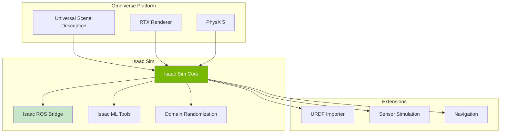

# Isaac Sim Overview

## Learning Outcomes

By the end of this chapter, you will be able to:

1. **Install and configure** NVIDIA Isaac Sim for robotics development
2. **Navigate** the Isaac Sim interface and understand its components
3. **Import** robot models and create simulation scenes
4. **Configure** physics and rendering for humanoid robots
5. **Understand** the Omniverse ecosystem and its benefits

## Prerequisites

- NVIDIA RTX GPU (RTX 2070 or better recommended)
- Ubuntu 22.04 LTS
- NVIDIA Driver 525.60+
- Completed Module 2: Simulation Environments

## Introduction to NVIDIA Isaac Sim

NVIDIA Isaac Sim is a robotics simulation platform built on Omniverse, providing:

- **Photorealistic rendering**: RTX ray-tracing for realistic perception
- **High-fidelity physics**: PhysX 5 for accurate contact dynamics
- **Domain randomization**: Built-in tools for sim-to-real transfer
- **ROS 2 integration**: Native support for ROS 2 communication
- **Synthetic data generation**: Automated dataset creation for ML



## Installation

### System Requirements

| Component | Minimum | Recommended |
|-----------|---------|-------------|
| GPU | RTX 2070 | RTX 3080+ |
| VRAM | 8 GB | 16+ GB |
| RAM | 32 GB | 64 GB |
| Storage | 50 GB SSD | 100 GB NVMe |
| Driver | 525.60 | 535+ |

### Installing Isaac Sim

```bash
# Download Omniverse Launcher
wget https://install.launcher.omniverse.nvidia.com/installers/omniverse-launcher-linux.AppImage
chmod +x omniverse-launcher-linux.AppImage

# Run the launcher
./omniverse-launcher-linux.AppImage

# From the launcher:
# 1. Go to Exchange tab
# 2. Search for "Isaac Sim"
# 3. Click Install (version 4.x recommended)
```

### First Launch

```bash
# Launch Isaac Sim from terminal (useful for debugging)
~/.local/share/ov/pkg/isaac-sim-4.0.0/isaac-sim.sh

# Or with specific ROS 2 environment
source /opt/ros/jazzy/setup.bash
~/.local/share/ov/pkg/isaac-sim-4.0.0/isaac-sim.sh
```

## Isaac Sim Interface

### Main Components

1. **Viewport**: 3D scene view with multiple camera options
2. **Stage**: Hierarchical scene graph (USD-based)
3. **Property Panel**: Edit object properties
4. **Content Browser**: Access assets and extensions
5. **Timeline**: Animation and simulation control

### Navigation Controls

| Action | Control |
|--------|---------|
| Orbit | Alt + Left Click + Drag |
| Pan | Alt + Middle Click + Drag |
| Zoom | Alt + Right Click + Drag / Scroll |
| Focus on Object | F |
| Reset View | Shift + F |

## Importing Humanoid Robots

### URDF Import

Isaac Sim provides a powerful URDF importer:

```python
# Python script to import URDF in Isaac Sim
from omni.isaac.kit import SimulationApp

# Start simulation app
simulation_app = SimulationApp({"headless": False})

from omni.isaac.core import World
from omni.isaac.core.utils.extensions import enable_extension
from omni.isaac.urdf import _urdf

# Enable URDF extension
enable_extension("omni.isaac.urdf")

# Create world
world = World()

# Import URDF
urdf_interface = _urdf.acquire_urdf_interface()
import_config = _urdf.ImportConfig()

# Configure import settings
import_config.merge_fixed_joints = False
import_config.fix_base = False  # Humanoid should be floating
import_config.import_inertia_tensor = True
import_config.default_drive_type = _urdf.UrdfJointTargetType.JOINT_DRIVE_POSITION
import_config.default_drive_strength = 10000.0
import_config.default_position_drive_damping = 1000.0

# Import the robot
result = urdf_interface.parse_urdf(
    "/path/to/humanoid.urdf",
    import_config
)

# Add to stage
robot_prim_path = urdf_interface.import_robot(
    "/path/to/humanoid.urdf",
    result,
    import_config,
    "/World/Humanoid"
)

print(f"Robot imported at: {robot_prim_path}")
```

### Articulation Configuration

```python
from omni.isaac.core.articulations import Articulation
from omni.isaac.core.utils.types import ArticulationAction
import numpy as np

class HumanoidRobot:
    """Isaac Sim humanoid robot interface."""

    def __init__(self, prim_path: str):
        self.articulation = Articulation(prim_path)
        self.articulation.initialize()

        # Get joint information
        self.num_dof = self.articulation.num_dof
        self.joint_names = self.articulation.dof_names

        print(f"Loaded humanoid with {self.num_dof} DOF")
        print(f"Joints: {self.joint_names}")

    def get_joint_positions(self) -> np.ndarray:
        """Get current joint positions."""
        return self.articulation.get_joint_positions()

    def get_joint_velocities(self) -> np.ndarray:
        """Get current joint velocities."""
        return self.articulation.get_joint_velocities()

    def set_joint_positions(self, positions: np.ndarray):
        """Set target joint positions."""
        action = ArticulationAction(joint_positions=positions)
        self.articulation.apply_action(action)

    def set_joint_efforts(self, efforts: np.ndarray):
        """Set joint efforts (torques)."""
        action = ArticulationAction(joint_efforts=efforts)
        self.articulation.apply_action(action)

    def get_world_pose(self):
        """Get robot base pose in world frame."""
        return self.articulation.get_world_pose()
```

## Physics Configuration

### PhysX 5 Settings

```python
from omni.isaac.core.physics_context import PhysicsContext

# Configure physics
physics_context = PhysicsContext()

# High-fidelity settings for humanoid
physics_context.set_physics_dt(1.0 / 1000.0)  # 1000 Hz
physics_context.set_solver_type("TGS")  # Temporal Gauss-Seidel
physics_context.set_broadphase_type("GPU")
physics_context.enable_gpu_dynamics(True)
physics_context.enable_stablization(True)

# Contact settings
physics_context.set_bounce_threshold_velocity(0.2)
physics_context.set_friction_offset_threshold(0.01)
physics_context.set_friction_correlation_distance(0.025)
```

### Ground Plane with Friction

```python
from omni.isaac.core.objects import GroundPlane
from pxr import PhysxSchema

# Create ground
ground = GroundPlane("/World/Ground", size=100, color=np.array([0.5, 0.5, 0.5]))

# Configure friction for humanoid walking
ground_prim = ground.prim
physx_material = PhysxSchema.PhysxMaterialAPI.Apply(ground_prim)
physx_material.CreateStaticFrictionAttr().Set(1.0)
physx_material.CreateDynamicFrictionAttr().Set(0.8)
physx_material.CreateRestitutionAttr().Set(0.0)
```

## Creating Simulation Scenes

### Complete Scene Setup

```python
from omni.isaac.core import World
from omni.isaac.core.objects import DynamicCuboid, GroundPlane
from omni.isaac.core.prims import XFormPrim
import numpy as np


def create_humanoid_scene():
    """Create a complete simulation scene for humanoid testing."""

    # Initialize world
    world = World(stage_units_in_meters=1.0)
    world.scene.add_default_ground_plane()

    # Lighting
    from omni.isaac.core.utils.prims import create_prim
    create_prim(
        "/World/Light",
        "DistantLight",
        attributes={
            "inputs:intensity": 3000,
            "inputs:angle": 0.53,
            "inputs:color": (1.0, 0.98, 0.95)
        }
    )

    # Add obstacles for navigation testing
    obstacles = [
        {"name": "box1", "pos": [3.0, 0.0, 0.5], "size": [1.0, 1.0, 1.0]},
        {"name": "box2", "pos": [5.0, 2.0, 0.25], "size": [0.5, 0.5, 0.5]},
        {"name": "box3", "pos": [4.0, -1.5, 0.75], "size": [0.75, 0.75, 1.5]},
    ]

    for obs in obstacles:
        DynamicCuboid(
            f"/World/Obstacles/{obs['name']}",
            position=np.array(obs["pos"]),
            size=np.array(obs["size"]),
            color=np.array([0.8, 0.2, 0.2])
        )

    # Add stairs for locomotion testing
    stair_rise = 0.15
    stair_run = 0.30
    num_stairs = 5

    for i in range(num_stairs):
        DynamicCuboid(
            f"/World/Stairs/step_{i}",
            position=np.array([8.0 + i * stair_run, 0.0, (i + 0.5) * stair_rise]),
            size=np.array([stair_run, 2.0, stair_rise]),
            color=np.array([0.6, 0.6, 0.6])
        )

    return world


# Create and run
world = create_humanoid_scene()
world.reset()
```

## Exercises

### Exercise 1: Install and Explore

1. Install Isaac Sim via Omniverse Launcher
2. Launch and explore the interface
3. Load a sample scene from the Content Browser
4. Practice navigation controls

### Exercise 2: Import Your Robot

1. Import your humanoid URDF into Isaac Sim
2. Configure joint drives for position control
3. Test joint movement using the Property panel
4. Verify physics simulation behavior

### Exercise 3: Create a Test Environment

1. Create a scene with ground plane and lighting
2. Add obstacles at various positions
3. Import your humanoid robot
4. Verify the robot can interact with obstacles

## Assessment Questions

1. **What are the advantages of Isaac Sim over Gazebo for humanoid robots?**

2. **Why is PhysX 5 important for contact-rich humanoid simulation?**

3. **How does the USD scene format benefit robotics workflows?**

4. **What physics settings are critical for stable bipedal simulation?**

## Summary

This chapter introduced NVIDIA Isaac Sim:

- **Isaac Sim** provides photorealistic simulation with RTX rendering
- **PhysX 5** enables accurate contact dynamics for humanoid robots
- **URDF import** brings robot models into the Omniverse ecosystem
- **Scene creation** tools allow rapid environment setup

Next, we'll explore Isaac ROS integration for connecting Isaac Sim with ROS 2.

---

**Next**: [Isaac ROS Integration](./isaac-ros)
