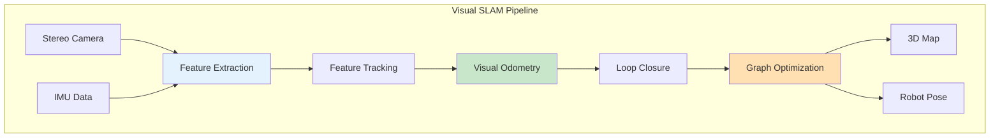

# Visual SLAM

## Learning Outcomes

By the end of this chapter, you will be able to:

1. **Explain** the principles of Visual SLAM and its importance for humanoid navigation
2. **Configure** Isaac ROS Visual SLAM for humanoid robots
3. **Integrate** stereo cameras and IMU for robust localization
4. **Evaluate** SLAM performance metrics and tuning strategies
5. **Handle** challenging scenarios like dynamic environments

## Prerequisites

- Completed Chapters 1-2 of Module 3
- Understanding of camera geometry and transforms
- Familiarity with coordinate frames and TF

## Introduction to Visual SLAM

**Visual SLAM** (Simultaneous Localization and Mapping) enables robots to build a map of their environment while simultaneously tracking their position within it—using only visual sensors.



### Why Visual SLAM for Humanoids?

| Challenge | Visual SLAM Solution |
|-----------|---------------------|
| Dynamic terrain | Real-time pose correction |
| GPS-denied areas | Camera-based localization |
| Footstep planning | Accurate height estimation |
| Whole-body control | 6-DOF pose tracking |

## Isaac ROS Visual SLAM

NVIDIA provides **Isaac ROS Visual SLAM**, a GPU-accelerated implementation optimized for real-time performance.

### Installation

```bash
# Clone Isaac ROS repository
cd ~/ros2_ws/src
git clone https://github.com/NVIDIA-ISAAC-ROS/isaac_ros_common.git
git clone https://github.com/NVIDIA-ISAAC-ROS/isaac_ros_visual_slam.git

# Install dependencies
cd ~/ros2_ws
rosdep install --from-paths src --ignore-src -y

# Build
colcon build --packages-select isaac_ros_visual_slam
source install/setup.bash
```

### Launch Configuration

```python
#!/usr/bin/env python3
"""Launch file for Isaac ROS Visual SLAM."""

from launch import LaunchDescription
from launch_ros.actions import Node
from launch.actions import DeclareLaunchArgument
from launch.substitutions import LaunchConfiguration


def generate_launch_description():
    return LaunchDescription([
        # Arguments
        DeclareLaunchArgument('rectified_images', default_value='false'),
        DeclareLaunchArgument('enable_imu_fusion', default_value='true'),
        DeclareLaunchArgument('enable_slam_visualization', default_value='true'),

        # Visual SLAM node
        Node(
            package='isaac_ros_visual_slam',
            executable='isaac_ros_visual_slam_node',
            name='visual_slam_node',
            parameters=[{
                'denoise_input_images': True,
                'rectified_images': LaunchConfiguration('rectified_images'),
                'enable_imu_fusion': LaunchConfiguration('enable_imu_fusion'),
                'enable_slam_visualization': LaunchConfiguration('enable_slam_visualization'),
                'enable_observations_view': True,
                'enable_landmarks_view': True,

                # Camera parameters
                'image_jitter_threshold_ms': 35.0,
                'sync_matching_threshold_ms': 10.0,

                # IMU parameters
                'imu_jitter_threshold_ms': 10.0,
                'gyro_noise_density': 0.000244,
                'gyro_random_walk': 0.000019393,
                'accel_noise_density': 0.001862,
                'accel_random_walk': 0.003,

                # Tracking parameters
                'publish_odom_to_base_tf': True,
                'publish_map_to_odom_tf': True,
                'map_frame': 'map',
                'odom_frame': 'odom',
                'base_frame': 'base_link',
            }],
            remappings=[
                ('stereo_camera/left/image', '/camera/left/image_rect'),
                ('stereo_camera/left/camera_info', '/camera/left/camera_info'),
                ('stereo_camera/right/image', '/camera/right/image_rect'),
                ('stereo_camera/right/camera_info', '/camera/right/camera_info'),
                ('visual_slam/imu', '/imu/data'),
            ],
        ),
    ])
```

## Stereo Camera Setup

### Camera Configuration

For humanoid robots, stereo cameras are typically mounted on the head:

```python
#!/usr/bin/env python3
"""Stereo camera configuration for humanoid Visual SLAM."""

import rclpy
from rclpy.node import Node
from sensor_msgs.msg import CameraInfo
import numpy as np


class StereoCameraConfig(Node):
    """Configure stereo camera for VSLAM."""

    def __init__(self):
        super().__init__('stereo_camera_config')

        # Camera intrinsics (typical values for 720p stereo)
        self.image_width = 1280
        self.image_height = 720
        self.focal_length = 600.0  # pixels
        self.baseline = 0.12  # 12cm between cameras

        # Publishers for camera info
        self.left_info_pub = self.create_publisher(
            CameraInfo, '/camera/left/camera_info', 10
        )
        self.right_info_pub = self.create_publisher(
            CameraInfo, '/camera/right/camera_info', 10
        )

        # Publish at 30 Hz
        self.timer = self.create_timer(1/30.0, self.publish_camera_info)

    def publish_camera_info(self):
        """Publish stereo camera calibration."""
        timestamp = self.get_clock().now().to_msg()

        # Left camera
        left_info = self._create_camera_info('left_camera_optical_frame')
        left_info.header.stamp = timestamp
        self.left_info_pub.publish(left_info)

        # Right camera
        right_info = self._create_camera_info('right_camera_optical_frame')
        right_info.header.stamp = timestamp
        # Add baseline offset in projection matrix
        right_info.p[3] = -self.focal_length * self.baseline
        self.right_info_pub.publish(right_info)

    def _create_camera_info(self, frame_id: str) -> CameraInfo:
        """Create CameraInfo message."""
        msg = CameraInfo()
        msg.header.frame_id = frame_id
        msg.width = self.image_width
        msg.height = self.image_height

        # Intrinsic matrix K
        cx = self.image_width / 2.0
        cy = self.image_height / 2.0
        msg.k = [
            self.focal_length, 0.0, cx,
            0.0, self.focal_length, cy,
            0.0, 0.0, 1.0
        ]

        # No distortion (rectified images)
        msg.d = [0.0, 0.0, 0.0, 0.0, 0.0]
        msg.distortion_model = 'plumb_bob'

        # Rectification matrix (identity for rectified)
        msg.r = [1.0, 0.0, 0.0, 0.0, 1.0, 0.0, 0.0, 0.0, 1.0]

        # Projection matrix P
        msg.p = [
            self.focal_length, 0.0, cx, 0.0,
            0.0, self.focal_length, cy, 0.0,
            0.0, 0.0, 1.0, 0.0
        ]

        return msg


def main(args=None):
    rclpy.init(args=args)
    node = StereoCameraConfig()
    rclpy.spin(node)
    node.destroy_node()
    rclpy.shutdown()


if __name__ == '__main__':
    main()
```

### TF Configuration

```python
#!/usr/bin/env python3
"""Static TF broadcaster for camera frames."""

import rclpy
from rclpy.node import Node
from tf2_ros import StaticTransformBroadcaster
from geometry_msgs.msg import TransformStamped
import math


class CameraFrameBroadcaster(Node):
    """Broadcast camera TF frames for VSLAM."""

    def __init__(self):
        super().__init__('camera_frame_broadcaster')
        self.tf_broadcaster = StaticTransformBroadcaster(self)
        self.broadcast_transforms()

    def broadcast_transforms(self):
        """Broadcast all camera-related transforms."""
        transforms = []

        # Head to left camera
        t = TransformStamped()
        t.header.stamp = self.get_clock().now().to_msg()
        t.header.frame_id = 'head_link'
        t.child_frame_id = 'left_camera_link'
        t.transform.translation.x = 0.05
        t.transform.translation.y = 0.06  # Half baseline
        t.transform.translation.z = 0.0
        t.transform.rotation.w = 1.0
        transforms.append(t)

        # Left camera to left optical frame
        t = TransformStamped()
        t.header.stamp = self.get_clock().now().to_msg()
        t.header.frame_id = 'left_camera_link'
        t.child_frame_id = 'left_camera_optical_frame'
        # Rotate to optical frame (Z forward, X right, Y down)
        t.transform.rotation.x = -0.5
        t.transform.rotation.y = 0.5
        t.transform.rotation.z = -0.5
        t.transform.rotation.w = 0.5
        transforms.append(t)

        # Head to right camera
        t = TransformStamped()
        t.header.stamp = self.get_clock().now().to_msg()
        t.header.frame_id = 'head_link'
        t.child_frame_id = 'right_camera_link'
        t.transform.translation.x = 0.05
        t.transform.translation.y = -0.06  # Half baseline
        t.transform.translation.z = 0.0
        t.transform.rotation.w = 1.0
        transforms.append(t)

        # Right camera to right optical frame
        t = TransformStamped()
        t.header.stamp = self.get_clock().now().to_msg()
        t.header.frame_id = 'right_camera_link'
        t.child_frame_id = 'right_camera_optical_frame'
        t.transform.rotation.x = -0.5
        t.transform.rotation.y = 0.5
        t.transform.rotation.z = -0.5
        t.transform.rotation.w = 0.5
        transforms.append(t)

        self.tf_broadcaster.sendTransform(transforms)
        self.get_logger().info('Camera TF frames broadcasted')


def main(args=None):
    rclpy.init(args=args)
    node = CameraFrameBroadcaster()
    rclpy.spin(node)
    node.destroy_node()
    rclpy.shutdown()


if __name__ == '__main__':
    main()
```

## IMU Fusion

### Visual-Inertial Odometry

Combining visual and inertial data improves robustness:

```python
#!/usr/bin/env python3
"""IMU preprocessing for Visual SLAM."""

import rclpy
from rclpy.node import Node
from sensor_msgs.msg import Imu
import numpy as np
from collections import deque


class IMUPreprocessor(Node):
    """Preprocess IMU data for VSLAM fusion."""

    def __init__(self):
        super().__init__('imu_preprocessor')

        # IMU noise parameters
        self.gyro_noise_density = 0.000244  # rad/s/sqrt(Hz)
        self.accel_noise_density = 0.001862  # m/s^2/sqrt(Hz)

        # Bias estimation
        self.gyro_bias = np.zeros(3)
        self.accel_bias = np.zeros(3)
        self.calibrated = False
        self.calibration_samples = deque(maxlen=1000)

        # Subscriber and publisher
        self.imu_sub = self.create_subscription(
            Imu, '/imu/raw', self.imu_callback, 10
        )
        self.imu_pub = self.create_publisher(
            Imu, '/imu/data', 10
        )

        self.get_logger().info('IMU preprocessor initialized')

    def imu_callback(self, msg: Imu):
        """Process raw IMU data."""
        # Collect calibration samples if robot is stationary
        if not self.calibrated:
            self.calibration_samples.append({
                'gyro': np.array([
                    msg.angular_velocity.x,
                    msg.angular_velocity.y,
                    msg.angular_velocity.z
                ]),
                'accel': np.array([
                    msg.linear_acceleration.x,
                    msg.linear_acceleration.y,
                    msg.linear_acceleration.z
                ])
            })

            if len(self.calibration_samples) >= 1000:
                self._estimate_bias()
                self.calibrated = True

            return

        # Apply bias correction
        corrected_msg = Imu()
        corrected_msg.header = msg.header

        corrected_msg.angular_velocity.x = msg.angular_velocity.x - self.gyro_bias[0]
        corrected_msg.angular_velocity.y = msg.angular_velocity.y - self.gyro_bias[1]
        corrected_msg.angular_velocity.z = msg.angular_velocity.z - self.gyro_bias[2]

        corrected_msg.linear_acceleration.x = msg.linear_acceleration.x - self.accel_bias[0]
        corrected_msg.linear_acceleration.y = msg.linear_acceleration.y - self.accel_bias[1]
        corrected_msg.linear_acceleration.z = msg.linear_acceleration.z - self.accel_bias[2]

        # Copy orientation if available
        corrected_msg.orientation = msg.orientation

        # Set covariance matrices
        gyro_cov = self.gyro_noise_density ** 2
        accel_cov = self.accel_noise_density ** 2

        corrected_msg.angular_velocity_covariance = [
            gyro_cov, 0, 0, 0, gyro_cov, 0, 0, 0, gyro_cov
        ]
        corrected_msg.linear_acceleration_covariance = [
            accel_cov, 0, 0, 0, accel_cov, 0, 0, 0, accel_cov
        ]

        self.imu_pub.publish(corrected_msg)

    def _estimate_bias(self):
        """Estimate IMU biases from stationary data."""
        gyro_samples = np.array([s['gyro'] for s in self.calibration_samples])
        accel_samples = np.array([s['accel'] for s in self.calibration_samples])

        self.gyro_bias = np.mean(gyro_samples, axis=0)

        # Accel bias (assuming Z-up, subtract gravity)
        accel_mean = np.mean(accel_samples, axis=0)
        self.accel_bias = accel_mean - np.array([0, 0, 9.81])

        self.get_logger().info(f'Gyro bias: {self.gyro_bias}')
        self.get_logger().info(f'Accel bias: {self.accel_bias}')


def main(args=None):
    rclpy.init(args=args)
    node = IMUPreprocessor()
    rclpy.spin(node)
    node.destroy_node()
    rclpy.shutdown()


if __name__ == '__main__':
    main()
```

## Performance Evaluation

### SLAM Metrics

```python
#!/usr/bin/env python3
"""Visual SLAM performance evaluation."""

import rclpy
from rclpy.node import Node
from nav_msgs.msg import Odometry
from geometry_msgs.msg import PoseStamped
import numpy as np
from dataclasses import dataclass
from typing import List


@dataclass
class PoseError:
    """Pose estimation error metrics."""
    position_error: float  # meters
    orientation_error: float  # radians
    timestamp: float


class SLAMEvaluator(Node):
    """Evaluate SLAM performance against ground truth."""

    def __init__(self):
        super().__init__('slam_evaluator')

        self.ground_truth_poses: List[PoseStamped] = []
        self.estimated_poses: List[PoseStamped] = []
        self.errors: List[PoseError] = []

        # Subscribers
        self.gt_sub = self.create_subscription(
            PoseStamped, '/ground_truth/pose',
            self.gt_callback, 10
        )
        self.slam_sub = self.create_subscription(
            Odometry, '/visual_slam/odom',
            self.slam_callback, 10
        )

        # Evaluation timer (1 Hz)
        self.timer = self.create_timer(1.0, self.evaluate)

    def gt_callback(self, msg: PoseStamped):
        """Store ground truth pose."""
        self.ground_truth_poses.append(msg)
        # Keep last 1000 poses
        if len(self.ground_truth_poses) > 1000:
            self.ground_truth_poses.pop(0)

    def slam_callback(self, msg: Odometry):
        """Store SLAM estimated pose."""
        pose = PoseStamped()
        pose.header = msg.header
        pose.pose = msg.pose.pose
        self.estimated_poses.append(pose)
        if len(self.estimated_poses) > 1000:
            self.estimated_poses.pop(0)

    def evaluate(self):
        """Compute error metrics."""
        if len(self.ground_truth_poses) < 10 or len(self.estimated_poses) < 10:
            return

        # Find closest timestamp pairs
        errors = []
        for est in self.estimated_poses[-100:]:
            closest_gt = min(
                self.ground_truth_poses,
                key=lambda gt: abs(
                    gt.header.stamp.sec + gt.header.stamp.nanosec * 1e-9 -
                    est.header.stamp.sec - est.header.stamp.nanosec * 1e-9
                )
            )

            # Position error
            pos_error = np.sqrt(
                (est.pose.position.x - closest_gt.pose.position.x) ** 2 +
                (est.pose.position.y - closest_gt.pose.position.y) ** 2 +
                (est.pose.position.z - closest_gt.pose.position.z) ** 2
            )

            errors.append(pos_error)

        if errors:
            mean_error = np.mean(errors)
            max_error = np.max(errors)
            self.get_logger().info(
                f'SLAM Error - Mean: {mean_error:.3f}m, Max: {max_error:.3f}m'
            )


def main(args=None):
    rclpy.init(args=args)
    node = SLAMEvaluator()
    rclpy.spin(node)
    node.destroy_node()
    rclpy.shutdown()


if __name__ == '__main__':
    main()
```

## Exercises

### Exercise 1: Basic VSLAM Setup

1. Configure stereo camera in Isaac Sim
2. Launch Isaac ROS Visual SLAM
3. Visualize trajectory in RViz

### Exercise 2: IMU Fusion

1. Add IMU sensor to your robot
2. Configure IMU preprocessing
3. Compare VSLAM with and without IMU fusion

### Exercise 3: Performance Evaluation

1. Record ground truth from simulation
2. Run SLAM evaluator during navigation
3. Analyze error statistics

## Assessment Questions

1. **Why is stereo vision preferred over monocular for humanoid SLAM?**

2. **How does IMU fusion improve Visual SLAM robustness?**

3. **What are the failure modes of Visual SLAM and how can they be mitigated?**

4. **How would you tune VSLAM parameters for a fast-moving humanoid?**

## Summary

This chapter covered Visual SLAM for humanoid robots:

- **Visual SLAM** enables localization without GPS using cameras
- **Stereo cameras** provide depth information for accurate mapping
- **IMU fusion** improves robustness during fast motion
- **Performance evaluation** validates SLAM accuracy

Next, we'll explore Nav2 adaptation for bipedal locomotion.

---

**Next**: [Nav2 for Bipedal Robots](./nav2-bipedal)
