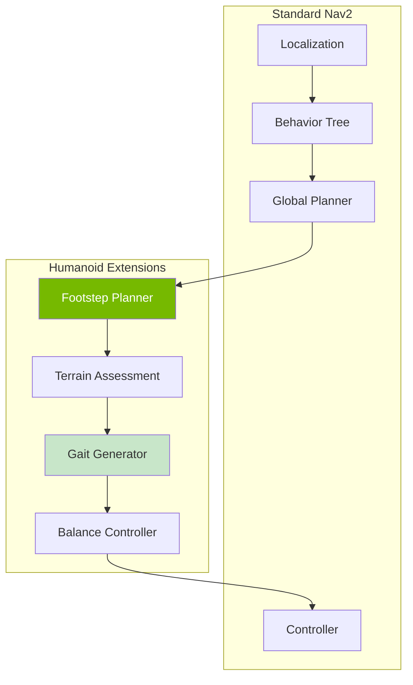

# Nav2 for Bipedal Robots

## Learning Outcomes

By the end of this chapter, you will be able to:

1. **Configure** Nav2 for bipedal locomotion constraints
2. **Implement** custom motion planners for humanoid robots
3. **Design** footstep planning integration with Nav2
4. **Handle** terrain assessment for safe walking
5. **Create** behavior trees for complex navigation tasks

## Prerequisites

- Completed Chapters 1-3 of Module 3
- Understanding of Nav2 architecture
- Familiarity with path planning concepts

## Nav2 Architecture for Humanoids

The ROS 2 Navigation Stack (Nav2) requires adaptation for bipedal robots due to their unique locomotion constraints.



### Key Differences from Wheeled Robots

| Aspect | Wheeled | Bipedal |
|--------|---------|---------|
| Motion model | Continuous | Discrete footsteps |
| Stability | Static | Dynamic balance |
| Terrain | Flat surfaces | Steps, slopes, obstacles |
| Speed | Fast | Slower, deliberate |
| Recovery | Simple | Complex fall recovery |

## Nav2 Configuration

### Custom Parameters for Bipedal

```yaml
# nav2_params.yaml
nav2_bt_navigator:
  ros__parameters:
    use_sim_time: true
    global_frame: map
    robot_base_frame: base_link
    odom_topic: /odom
    # Longer timeouts for slower humanoid motion
    bt_loop_duration: 20
    default_server_timeout: 30
    plugin_lib_names:
      - nav2_compute_path_to_pose_action_bt_node
      - nav2_follow_path_action_bt_node
      - nav2_humanoid_footstep_planner_bt_node  # Custom

global_costmap:
  global_costmap:
    ros__parameters:
      update_frequency: 1.0
      publish_frequency: 1.0
      global_frame: map
      robot_base_frame: base_link
      robot_radius: 0.3  # Humanoid footprint
      resolution: 0.05
      track_unknown_space: true
      plugins: ["static_layer", "obstacle_layer", "terrain_layer", "inflation_layer"]

      terrain_layer:
        plugin: "humanoid_nav2/TerrainAssessmentLayer"
        enabled: true
        max_step_height: 0.15  # 15cm max step
        max_slope_angle: 15.0  # 15 degree max slope
        min_foothold_size: 0.1  # 10cm minimum foothold

      inflation_layer:
        plugin: "nav2_costmap_2d::InflationLayer"
        cost_scaling_factor: 5.0
        inflation_radius: 0.5

local_costmap:
  local_costmap:
    ros__parameters:
      update_frequency: 5.0
      publish_frequency: 2.0
      global_frame: odom
      robot_base_frame: base_link
      rolling_window: true
      width: 3
      height: 3
      resolution: 0.025
      robot_radius: 0.3

controller_server:
  ros__parameters:
    use_sim_time: true
    controller_frequency: 20.0  # Lower for bipedal
    min_x_velocity_threshold: 0.001
    min_y_velocity_threshold: 0.001
    min_theta_velocity_threshold: 0.001
    controller_plugins: ["HumanoidController"]

    HumanoidController:
      plugin: "humanoid_nav2::BipedalController"
      max_vel_x: 0.3  # Slower than wheeled
      max_vel_theta: 0.5
      footstep_duration: 0.8
      double_support_ratio: 0.2

planner_server:
  ros__parameters:
    expected_planner_frequency: 1.0  # Slower planning
    planner_plugins: ["GridBased", "FootstepPlanner"]

    GridBased:
      plugin: "nav2_navfn_planner/NavfnPlanner"
      tolerance: 0.5
      use_astar: true

    FootstepPlanner:
      plugin: "humanoid_nav2::FootstepPlanner"
      step_length: 0.25
      step_width: 0.1
      turning_step_angle: 0.2
      max_step_height: 0.15
```

## Footstep Planning

### Footstep Planner Implementation

```python
#!/usr/bin/env python3
"""Custom footstep planner for humanoid navigation."""

import rclpy
from rclpy.node import Node
from rclpy.action import ActionServer
from nav2_msgs.action import ComputePathToPose
from geometry_msgs.msg import PoseStamped, Pose
from visualization_msgs.msg import MarkerArray, Marker
import numpy as np
from dataclasses import dataclass
from typing import List, Tuple
from enum import Enum


class FootSide(Enum):
    LEFT = 0
    RIGHT = 1


@dataclass
class Footstep:
    """Single footstep specification."""
    pose: Pose
    side: FootSide
    duration: float = 0.8
    step_height: float = 0.05


class FootstepPlanner(Node):
    """Plan footsteps along a path."""

    def __init__(self):
        super().__init__('footstep_planner')

        # Parameters
        self.declare_parameter('step_length', 0.25)
        self.declare_parameter('step_width', 0.20)
        self.declare_parameter('turning_step_angle', 0.2)
        self.declare_parameter('default_step_height', 0.05)

        self.step_length = self.get_parameter('step_length').value
        self.step_width = self.get_parameter('step_width').value
        self.turning_angle = self.get_parameter('turning_step_angle').value
        self.step_height = self.get_parameter('default_step_height').value

        # Current foot (alternates)
        self.current_foot = FootSide.LEFT

        # Footstep publisher for visualization
        self.footstep_pub = self.create_publisher(
            MarkerArray, '/footstep_plan', 10
        )

        # Action server
        self._action_server = ActionServer(
            self,
            ComputePathToPose,
            'compute_footsteps',
            self.execute_callback
        )

        self.get_logger().info('Footstep planner initialized')

    def execute_callback(self, goal_handle):
        """Plan footsteps from current pose to goal."""
        request = goal_handle.request

        start_pose = request.start
        goal_pose = request.goal

        # Generate footstep sequence
        footsteps = self.plan_footsteps(start_pose, goal_pose)

        # Visualize
        self.publish_footstep_markers(footsteps)

        # Return result
        result = ComputePathToPose.Result()
        # Convert footsteps to path (simplified)
        result.path.header.frame_id = 'map'
        result.path.header.stamp = self.get_clock().now().to_msg()

        for fs in footsteps:
            pose_stamped = PoseStamped()
            pose_stamped.pose = fs.pose
            result.path.poses.append(pose_stamped)

        goal_handle.succeed()
        return result

    def plan_footsteps(self, start: PoseStamped, goal: PoseStamped) -> List[Footstep]:
        """Generate footstep sequence from start to goal."""
        footsteps = []

        # Extract positions
        start_pos = np.array([start.pose.position.x, start.pose.position.y])
        goal_pos = np.array([goal.pose.position.x, goal.pose.position.y])

        # Direction to goal
        direction = goal_pos - start_pos
        distance = np.linalg.norm(direction)

        if distance < 0.01:
            return footsteps

        direction_normalized = direction / distance
        heading = np.arctan2(direction_normalized[1], direction_normalized[0])

        # Generate footsteps along path
        current_pos = start_pos.copy()
        current_heading = self._get_yaw(start.pose.orientation)
        current_foot = FootSide.LEFT

        while np.linalg.norm(goal_pos - current_pos) > self.step_length:
            # Calculate target heading
            to_goal = goal_pos - current_pos
            target_heading = np.arctan2(to_goal[1], to_goal[0])

            # Turn if needed
            heading_error = self._normalize_angle(target_heading - current_heading)

            if abs(heading_error) > self.turning_angle:
                # Turning step
                turn_amount = np.sign(heading_error) * min(abs(heading_error), self.turning_angle)
                current_heading += turn_amount
            else:
                # Walking step
                step_direction = np.array([np.cos(current_heading), np.sin(current_heading)])
                current_pos += step_direction * self.step_length

            # Create footstep
            footstep = self._create_footstep(
                current_pos, current_heading, current_foot
            )
            footsteps.append(footstep)

            # Alternate feet
            current_foot = FootSide.RIGHT if current_foot == FootSide.LEFT else FootSide.LEFT

        # Final step to goal
        final_footstep = self._create_footstep(
            goal_pos,
            self._get_yaw(goal.pose.orientation),
            current_foot
        )
        footsteps.append(final_footstep)

        self.get_logger().info(f'Generated {len(footsteps)} footsteps')
        return footsteps

    def _create_footstep(self, position: np.ndarray, heading: float,
                         side: FootSide) -> Footstep:
        """Create a footstep at given position."""
        # Offset based on foot side
        lateral_offset = self.step_width / 2
        if side == FootSide.LEFT:
            lateral_offset = -lateral_offset

        # Calculate foot position with offset
        offset = np.array([
            -np.sin(heading) * lateral_offset,
            np.cos(heading) * lateral_offset
        ])

        foot_pos = position + offset

        pose = Pose()
        pose.position.x = float(foot_pos[0])
        pose.position.y = float(foot_pos[1])
        pose.position.z = 0.0

        # Quaternion from heading
        pose.orientation.z = np.sin(heading / 2)
        pose.orientation.w = np.cos(heading / 2)

        return Footstep(pose=pose, side=side, step_height=self.step_height)

    def _get_yaw(self, q) -> float:
        """Extract yaw from quaternion."""
        siny_cosp = 2 * (q.w * q.z + q.x * q.y)
        cosy_cosp = 1 - 2 * (q.y * q.y + q.z * q.z)
        return np.arctan2(siny_cosp, cosy_cosp)

    def _normalize_angle(self, angle: float) -> float:
        """Normalize angle to [-pi, pi]."""
        while angle > np.pi:
            angle -= 2 * np.pi
        while angle < -np.pi:
            angle += 2 * np.pi
        return angle

    def publish_footstep_markers(self, footsteps: List[Footstep]):
        """Publish footstep visualization markers."""
        markers = MarkerArray()

        for i, fs in enumerate(footsteps):
            marker = Marker()
            marker.header.frame_id = 'map'
            marker.header.stamp = self.get_clock().now().to_msg()
            marker.ns = 'footsteps'
            marker.id = i
            marker.type = Marker.CUBE
            marker.action = Marker.ADD

            marker.pose = fs.pose
            marker.pose.position.z = 0.01  # Slightly above ground

            # Foot dimensions
            marker.scale.x = 0.2   # Length
            marker.scale.y = 0.1   # Width
            marker.scale.z = 0.02  # Height

            # Color based on foot side
            if fs.side == FootSide.LEFT:
                marker.color.r = 0.2
                marker.color.g = 0.6
                marker.color.b = 1.0
            else:
                marker.color.r = 1.0
                marker.color.g = 0.4
                marker.color.b = 0.2
            marker.color.a = 0.8

            markers.markers.append(marker)

        self.footstep_pub.publish(markers)


def main(args=None):
    rclpy.init(args=args)
    node = FootstepPlanner()
    rclpy.spin(node)
    node.destroy_node()
    rclpy.shutdown()


if __name__ == '__main__':
    main()
```

## Terrain Assessment

### Terrain Layer Plugin

```python
#!/usr/bin/env python3
"""Terrain assessment layer for humanoid navigation costmap."""

import rclpy
from rclpy.node import Node
from sensor_msgs.msg import PointCloud2
from nav_msgs.msg import OccupancyGrid
import numpy as np
from dataclasses import dataclass


@dataclass
class TerrainCell:
    """Terrain properties for a single cell."""
    height: float
    slope: float
    roughness: float
    is_traversable: bool


class TerrainAssessment(Node):
    """Assess terrain traversability for humanoid walking."""

    def __init__(self):
        super().__init__('terrain_assessment')

        # Parameters
        self.declare_parameter('max_step_height', 0.15)
        self.declare_parameter('max_slope_degrees', 15.0)
        self.declare_parameter('min_foothold_size', 0.1)
        self.declare_parameter('resolution', 0.05)

        self.max_step = self.get_parameter('max_step_height').value
        self.max_slope = np.radians(self.get_parameter('max_slope_degrees').value)
        self.min_foothold = self.get_parameter('min_foothold_size').value
        self.resolution = self.get_parameter('resolution').value

        # Subscribers
        self.pointcloud_sub = self.create_subscription(
            PointCloud2, '/terrain/points',
            self.pointcloud_callback, 10
        )

        # Publishers
        self.terrain_cost_pub = self.create_publisher(
            OccupancyGrid, '/terrain_costmap', 10
        )

        # Terrain grid
        self.grid_size = 200  # 10m x 10m at 0.05m resolution
        self.height_map = np.zeros((self.grid_size, self.grid_size))
        self.traversability = np.ones((self.grid_size, self.grid_size)) * 100

        self.get_logger().info('Terrain assessment initialized')

    def pointcloud_callback(self, msg: PointCloud2):
        """Process terrain pointcloud."""
        # Convert pointcloud to numpy (simplified)
        points = self._pointcloud_to_numpy(msg)

        if points is None or len(points) == 0:
            return

        # Update height map
        self._update_height_map(points)

        # Compute traversability
        self._compute_traversability()

        # Publish costmap
        self._publish_costmap()

    def _pointcloud_to_numpy(self, msg: PointCloud2) -> np.ndarray:
        """Convert PointCloud2 to numpy array."""
        # Simplified conversion - in practice use ros2_numpy
        # This is a placeholder
        return None

    def _update_height_map(self, points: np.ndarray):
        """Update height map from points."""
        for point in points:
            x, y, z = point[:3]

            # Convert to grid indices
            i = int((x + self.grid_size * self.resolution / 2) / self.resolution)
            j = int((y + self.grid_size * self.resolution / 2) / self.resolution)

            if 0 <= i < self.grid_size and 0 <= j < self.grid_size:
                self.height_map[i, j] = z

    def _compute_traversability(self):
        """Compute traversability cost from height map."""
        for i in range(1, self.grid_size - 1):
            for j in range(1, self.grid_size - 1):
                # Compute local slope
                dzdx = (self.height_map[i+1, j] - self.height_map[i-1, j]) / (2 * self.resolution)
                dzdy = (self.height_map[i, j+1] - self.height_map[i, j-1]) / (2 * self.resolution)
                slope = np.arctan(np.sqrt(dzdx**2 + dzdy**2))

                # Compute step height (max height difference to neighbors)
                neighbors = self.height_map[i-1:i+2, j-1:j+2]
                step_height = np.max(np.abs(neighbors - self.height_map[i, j]))

                # Compute cost
                cost = 0

                # Slope cost
                if slope > self.max_slope:
                    cost = 100  # Impassable
                else:
                    cost += int(50 * slope / self.max_slope)

                # Step height cost
                if step_height > self.max_step:
                    cost = 100  # Impassable
                else:
                    cost += int(50 * step_height / self.max_step)

                self.traversability[i, j] = min(cost, 100)

    def _publish_costmap(self):
        """Publish terrain costmap."""
        msg = OccupancyGrid()
        msg.header.frame_id = 'map'
        msg.header.stamp = self.get_clock().now().to_msg()

        msg.info.resolution = self.resolution
        msg.info.width = self.grid_size
        msg.info.height = self.grid_size
        msg.info.origin.position.x = -self.grid_size * self.resolution / 2
        msg.info.origin.position.y = -self.grid_size * self.resolution / 2

        msg.data = self.traversability.flatten().astype(np.int8).tolist()

        self.terrain_cost_pub.publish(msg)


def main(args=None):
    rclpy.init(args=args)
    node = TerrainAssessment()
    rclpy.spin(node)
    node.destroy_node()
    rclpy.shutdown()


if __name__ == '__main__':
    main()
```

## Exercises

### Exercise 1: Configure Nav2 for Humanoid

1. Modify Nav2 parameters for your humanoid robot
2. Test path planning with slower velocities
3. Verify footprint and inflation settings

### Exercise 2: Implement Footstep Planner

1. Complete the footstep planner implementation
2. Add terrain-aware step height adjustment
3. Visualize footsteps in RViz

### Exercise 3: Terrain Assessment

1. Create a terrain assessment node
2. Generate costmaps from depth camera data
3. Test navigation over uneven terrain

## Assessment Questions

1. **What are the key differences in path planning for bipedal vs wheeled robots?**

2. **How does terrain assessment affect footstep placement?**

3. **Why is footstep planning discrete rather than continuous?**

4. **What safety considerations are important for humanoid navigation?**

## Summary

This chapter covered Nav2 adaptation for humanoids:

- **Nav2 configuration** requires adjustments for bipedal constraints
- **Footstep planning** discretizes paths into individual steps
- **Terrain assessment** validates traversability for walking
- **Behavior trees** coordinate complex navigation behaviors

This completes Module 3 on NVIDIA Isaac Platform. Next, we'll explore Vision-Language-Action models.

---

**Next Module**: [Vision-Language-Action Models](../module-4-vla/voice-to-action)
