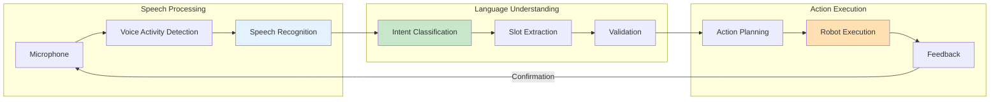

# Voice-to-Action Pipelines

## Learning Outcomes

By the end of this chapter, you will be able to:

1. **Design** speech recognition pipelines for robot command input
2. **Implement** natural language understanding for robot actions
3. **Map** spoken commands to executable robot behaviors
4. **Handle** ambiguity and confirmation in voice interfaces
5. **Integrate** speech systems with ROS 2 robot control

## Prerequisites

- Completed Modules 1-3
- Basic understanding of NLP concepts
- Python audio processing libraries

## Voice-to-Action Architecture

A voice-to-action pipeline converts spoken natural language commands into robot actions:



### Pipeline Components

| Component | Function | Example Tools |
|-----------|----------|---------------|
| VAD | Detect speech segments | WebRTC VAD, Silero |
| ASR | Transcribe audio | Whisper, Vosk |
| NLU | Extract intent | Rasa, spaCy |
| Slot Filling | Extract parameters | Named Entity Recognition |
| Planning | Generate actions | Behavior Trees |

## Speech Recognition

### Whisper-based ASR

```python
#!/usr/bin/env python3
"""Speech recognition node using Whisper."""

import rclpy
from rclpy.node import Node
from std_msgs.msg import String
from audio_common_msgs.msg import AudioData
import numpy as np
import whisper
import queue
import threading


class SpeechRecognitionNode(Node):
    """ROS 2 node for speech recognition."""

    def __init__(self):
        super().__init__('speech_recognition')

        # Parameters
        self.declare_parameter('model_size', 'base')
        self.declare_parameter('language', 'en')
        self.declare_parameter('sample_rate', 16000)

        model_size = self.get_parameter('model_size').value
        self.language = self.get_parameter('language').value
        self.sample_rate = self.get_parameter('sample_rate').value

        # Load Whisper model
        self.get_logger().info(f'Loading Whisper {model_size} model...')
        self.model = whisper.load_model(model_size)
        self.get_logger().info('Model loaded')

        # Audio buffer
        self.audio_buffer = queue.Queue()
        self.buffer_duration = 5.0  # seconds
        self.buffer_samples = int(self.buffer_duration * self.sample_rate)
        self.current_buffer = np.array([], dtype=np.float32)

        # Subscribers and publishers
        self.audio_sub = self.create_subscription(
            AudioData, '/audio/input',
            self.audio_callback, 10
        )
        self.transcript_pub = self.create_publisher(
            String, '/speech/transcript', 10
        )

        # Processing thread
        self.processing_thread = threading.Thread(target=self._process_loop)
        self.processing_thread.daemon = True
        self.processing_thread.start()

        self.get_logger().info('Speech recognition node ready')

    def audio_callback(self, msg: AudioData):
        """Receive audio data."""
        # Convert bytes to float32
        audio_np = np.frombuffer(msg.data, dtype=np.int16).astype(np.float32) / 32768.0
        self.audio_buffer.put(audio_np)

    def _process_loop(self):
        """Process audio and generate transcripts."""
        while rclpy.ok():
            # Collect audio chunks
            while not self.audio_buffer.empty():
                chunk = self.audio_buffer.get()
                self.current_buffer = np.concatenate([self.current_buffer, chunk])

            # Process when we have enough audio
            if len(self.current_buffer) >= self.buffer_samples:
                audio_segment = self.current_buffer[:self.buffer_samples]
                self.current_buffer = self.current_buffer[self.buffer_samples // 2:]  # 50% overlap

                # Run transcription
                result = self.model.transcribe(
                    audio_segment,
                    language=self.language,
                    fp16=False
                )

                transcript = result['text'].strip()
                if transcript:
                    msg = String()
                    msg.data = transcript
                    self.transcript_pub.publish(msg)
                    self.get_logger().info(f'Transcript: {transcript}')

    def destroy_node(self):
        super().destroy_node()


def main(args=None):
    rclpy.init(args=args)
    node = SpeechRecognitionNode()
    rclpy.spin(node)
    node.destroy_node()
    rclpy.shutdown()


if __name__ == '__main__':
    main()
```

## Natural Language Understanding

### Intent Classification

```python
#!/usr/bin/env python3
"""Intent classification for robot commands."""

import rclpy
from rclpy.node import Node
from std_msgs.msg import String
from dataclasses import dataclass
from typing import Dict, List, Optional
import re


@dataclass
class Intent:
    """Parsed intent from natural language."""
    action: str
    confidence: float
    slots: Dict[str, str]


class IntentClassifier(Node):
    """Classify spoken commands into robot intents."""

    def __init__(self):
        super().__init__('intent_classifier')

        # Define intents with patterns
        self.intent_patterns = {
            'navigate': {
                'patterns': [
                    r'go to (?P<location>\w+)',
                    r'walk to (?P<location>\w+)',
                    r'move to (?P<location>\w+)',
                    r'navigate to (?P<location>\w+)',
                ],
                'action': 'navigate_to_location'
            },
            'pick_up': {
                'patterns': [
                    r'pick up (?:the )?(?P<object>\w+)',
                    r'grab (?:the )?(?P<object>\w+)',
                    r'get (?:the )?(?P<object>\w+)',
                ],
                'action': 'pick_object'
            },
            'place': {
                'patterns': [
                    r'put (?:the )?(?P<object>\w+) on (?:the )?(?P<surface>\w+)',
                    r'place (?:the )?(?P<object>\w+) on (?:the )?(?P<surface>\w+)',
                ],
                'action': 'place_object'
            },
            'wave': {
                'patterns': [
                    r'wave',
                    r'say hello',
                    r'greet',
                ],
                'action': 'wave_gesture'
            },
            'stop': {
                'patterns': [
                    r'stop',
                    r'halt',
                    r'freeze',
                    r'emergency stop',
                ],
                'action': 'emergency_stop'
            },
            'follow': {
                'patterns': [
                    r'follow me',
                    r'come with me',
                    r'follow (?P<person>\w+)',
                ],
                'action': 'follow_person'
            }
        }

        # Compile patterns
        self.compiled_patterns = {}
        for intent, data in self.intent_patterns.items():
            self.compiled_patterns[intent] = {
                'patterns': [re.compile(p, re.IGNORECASE) for p in data['patterns']],
                'action': data['action']
            }

        # Subscribers and publishers
        self.transcript_sub = self.create_subscription(
            String, '/speech/transcript',
            self.transcript_callback, 10
        )
        self.intent_pub = self.create_publisher(
            String, '/speech/intent', 10
        )

        self.get_logger().info('Intent classifier ready')

    def transcript_callback(self, msg: String):
        """Process transcript and extract intent."""
        text = msg.data.lower().strip()

        intent = self.classify(text)

        if intent:
            # Publish intent as JSON string
            import json
            intent_msg = String()
            intent_msg.data = json.dumps({
                'action': intent.action,
                'confidence': intent.confidence,
                'slots': intent.slots,
                'original_text': text
            })
            self.intent_pub.publish(intent_msg)

            self.get_logger().info(
                f'Intent: {intent.action}, Slots: {intent.slots}'
            )
        else:
            self.get_logger().warn(f'No intent matched for: "{text}"')

    def classify(self, text: str) -> Optional[Intent]:
        """Classify text into an intent."""
        best_match = None
        best_confidence = 0.0

        for intent_name, data in self.compiled_patterns.items():
            for pattern in data['patterns']:
                match = pattern.search(text)
                if match:
                    # Calculate simple confidence based on match coverage
                    matched_length = match.end() - match.start()
                    confidence = matched_length / len(text)

                    if confidence > best_confidence:
                        best_confidence = confidence
                        slots = match.groupdict()
                        best_match = Intent(
                            action=data['action'],
                            confidence=confidence,
                            slots=slots
                        )

        return best_match


def main(args=None):
    rclpy.init(args=args)
    node = IntentClassifier()
    rclpy.spin(node)
    node.destroy_node()
    rclpy.shutdown()


if __name__ == '__main__':
    main()
```

## Action Execution

### Command Executor

```python
#!/usr/bin/env python3
"""Execute robot actions from parsed intents."""

import rclpy
from rclpy.node import Node
from rclpy.action import ActionClient
from std_msgs.msg import String
from geometry_msgs.msg import PoseStamped
from nav2_msgs.action import NavigateToPose
import json
from typing import Dict, Callable


class ActionExecutor(Node):
    """Execute robot actions based on voice commands."""

    def __init__(self):
        super().__init__('action_executor')

        # Known locations
        self.locations = {
            'kitchen': {'x': 5.0, 'y': 2.0, 'theta': 0.0},
            'living_room': {'x': 0.0, 'y': 0.0, 'theta': 0.0},
            'bedroom': {'x': -3.0, 'y': 4.0, 'theta': 1.57},
            'office': {'x': 2.0, 'y': -3.0, 'theta': -1.57},
        }

        # Action handlers
        self.action_handlers: Dict[str, Callable] = {
            'navigate_to_location': self.handle_navigate,
            'pick_object': self.handle_pick,
            'place_object': self.handle_place,
            'wave_gesture': self.handle_wave,
            'emergency_stop': self.handle_stop,
            'follow_person': self.handle_follow,
        }

        # Subscribers
        self.intent_sub = self.create_subscription(
            String, '/speech/intent',
            self.intent_callback, 10
        )

        # Feedback publisher
        self.feedback_pub = self.create_publisher(
            String, '/speech/feedback', 10
        )

        # Action clients
        self.nav_client = ActionClient(self, NavigateToPose, 'navigate_to_pose')

        self.get_logger().info('Action executor ready')

    def intent_callback(self, msg: String):
        """Handle incoming intent."""
        try:
            intent = json.loads(msg.data)
            action = intent['action']
            slots = intent['slots']

            if action in self.action_handlers:
                self.action_handlers[action](slots)
            else:
                self.get_logger().warn(f'Unknown action: {action}')
                self.speak_feedback(f"I don't know how to {action}")

        except json.JSONDecodeError:
            self.get_logger().error('Invalid intent JSON')

    def handle_navigate(self, slots: Dict):
        """Handle navigation command."""
        location = slots.get('location', '').lower()

        if location in self.locations:
            loc = self.locations[location]
            self.speak_feedback(f"Navigating to {location}")

            # Create navigation goal
            goal = NavigateToPose.Goal()
            goal.pose.header.frame_id = 'map'
            goal.pose.header.stamp = self.get_clock().now().to_msg()
            goal.pose.pose.position.x = loc['x']
            goal.pose.pose.position.y = loc['y']
            goal.pose.pose.orientation.z = np.sin(loc['theta'] / 2)
            goal.pose.pose.orientation.w = np.cos(loc['theta'] / 2)

            # Send goal
            self.nav_client.wait_for_server()
            future = self.nav_client.send_goal_async(goal)
            future.add_done_callback(self.nav_response_callback)

        else:
            self.speak_feedback(f"I don't know where {location} is")
            self.get_logger().warn(f'Unknown location: {location}')

    def handle_pick(self, slots: Dict):
        """Handle pick up command."""
        obj = slots.get('object', 'object')
        self.speak_feedback(f"Attempting to pick up {obj}")
        # TODO: Implement manipulation
        self.get_logger().info(f'Pick object: {obj}')

    def handle_place(self, slots: Dict):
        """Handle place command."""
        obj = slots.get('object', 'object')
        surface = slots.get('surface', 'surface')
        self.speak_feedback(f"Placing {obj} on {surface}")
        # TODO: Implement placement
        self.get_logger().info(f'Place {obj} on {surface}')

    def handle_wave(self, slots: Dict):
        """Handle wave gesture."""
        self.speak_feedback("Waving hello!")
        # TODO: Trigger wave animation
        self.get_logger().info('Wave gesture')

    def handle_stop(self, slots: Dict):
        """Handle emergency stop."""
        self.speak_feedback("Stopping all motion")
        # Cancel ongoing actions
        # TODO: Implement emergency stop
        self.get_logger().warn('EMERGENCY STOP')

    def handle_follow(self, slots: Dict):
        """Handle follow command."""
        person = slots.get('person', 'you')
        self.speak_feedback(f"Following {person}")
        # TODO: Implement person following
        self.get_logger().info(f'Follow: {person}')

    def nav_response_callback(self, future):
        """Handle navigation response."""
        goal_handle = future.result()
        if not goal_handle.accepted:
            self.speak_feedback("Navigation goal was rejected")
            return

        result_future = goal_handle.get_result_async()
        result_future.add_done_callback(self.nav_result_callback)

    def nav_result_callback(self, future):
        """Handle navigation result."""
        result = future.result().result
        self.speak_feedback("Arrived at destination")

    def speak_feedback(self, text: str):
        """Publish feedback for text-to-speech."""
        msg = String()
        msg.data = text
        self.feedback_pub.publish(msg)
        self.get_logger().info(f'Feedback: {text}')


# Import numpy for quaternion calculation
import numpy as np


def main(args=None):
    rclpy.init(args=args)
    node = ActionExecutor()
    rclpy.spin(node)
    node.destroy_node()
    rclpy.shutdown()


if __name__ == '__main__':
    main()
```

## Text-to-Speech Feedback

```python
#!/usr/bin/env python3
"""Text-to-speech node for robot feedback."""

import rclpy
from rclpy.node import Node
from std_msgs.msg import String
import pyttsx3
import threading


class TextToSpeechNode(Node):
    """Convert text feedback to speech."""

    def __init__(self):
        super().__init__('text_to_speech')

        # Initialize TTS engine
        self.engine = pyttsx3.init()
        self.engine.setProperty('rate', 150)  # Speed
        self.engine.setProperty('volume', 0.9)

        # Speech queue
        self.speech_queue = []
        self.speaking = False

        # Subscriber
        self.feedback_sub = self.create_subscription(
            String, '/speech/feedback',
            self.feedback_callback, 10
        )

        self.get_logger().info('Text-to-speech ready')

    def feedback_callback(self, msg: String):
        """Handle feedback text."""
        text = msg.data

        # Run in separate thread to avoid blocking
        thread = threading.Thread(target=self._speak, args=(text,))
        thread.start()

    def _speak(self, text: str):
        """Speak the text."""
        self.engine.say(text)
        self.engine.runAndWait()


def main(args=None):
    rclpy.init(args=args)
    node = TextToSpeechNode()
    rclpy.spin(node)
    node.destroy_node()
    rclpy.shutdown()


if __name__ == '__main__':
    main()
```

## Exercises

### Exercise 1: Basic Voice Interface

1. Set up audio capture from microphone
2. Implement speech recognition with Whisper
3. Test with simple commands like "stop" and "wave"

### Exercise 2: Custom Intents

1. Add 3 new intents relevant to your application
2. Define slot extraction patterns
3. Implement action handlers for each

### Exercise 3: Confirmation Dialog

1. Add confirmation for critical actions (navigation)
2. Implement "yes/no" response handling
3. Test the complete dialog flow

## Assessment Questions

1. **What are the trade-offs between on-device and cloud-based speech recognition?**

2. **How do you handle ambiguous commands in a voice interface?**

3. **What safety measures should be in place for voice-controlled robots?**

4. **How would you implement multi-turn conversations for complex tasks?**

## Summary

This chapter covered voice-to-action pipelines:

- **Speech recognition** converts audio to text using models like Whisper
- **Intent classification** extracts actions and parameters from text
- **Action execution** maps intents to robot behaviors
- **Feedback** provides confirmation through text-to-speech

Next, we'll explore LLM-based cognitive planning for more complex reasoning.

---

**Next**: [LLM Cognitive Planning](./llm-planning)
