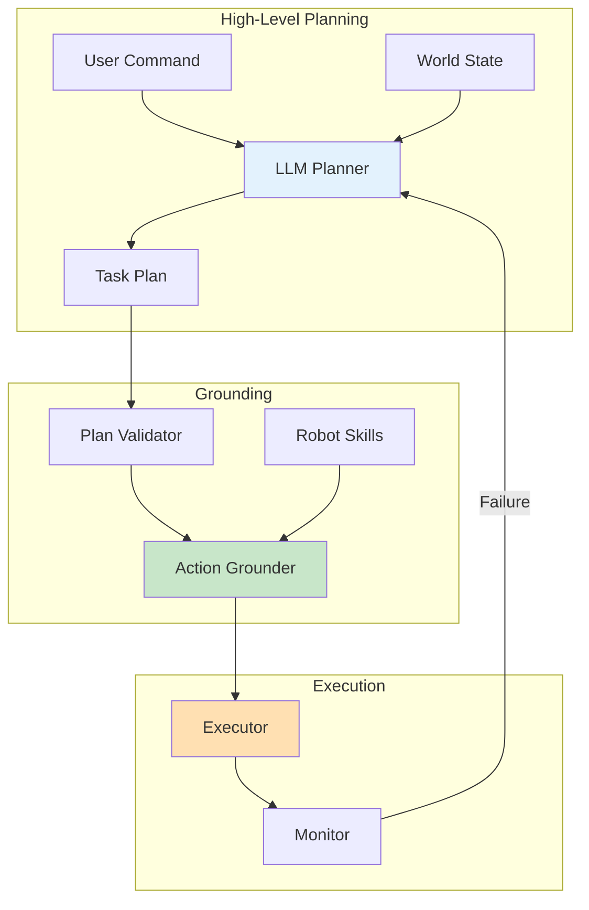

# LLM Cognitive Planning

## Learning Outcomes

By the end of this chapter, you will be able to:

1. **Design** LLM-based planning systems for humanoid robots
2. **Implement** task decomposition using language models
3. **Ground** LLM outputs in robot-executable actions
4. **Handle** planning failures and replanning strategies
5. **Evaluate** safety constraints in LLM-generated plans

## Prerequisites

- Completed Chapter 1: Voice-to-Action Pipelines
- Understanding of transformer architectures
- API access to an LLM (OpenAI, Claude, or local model)

## LLM Planning Architecture

LLMs enable robots to reason about complex tasks through natural language:



### Why LLMs for Robot Planning?

| Capability | Traditional Planning | LLM Planning |
|------------|---------------------|--------------|
| Language understanding | Limited vocabulary | Natural language |
| Common sense | Explicit encoding | Emergent |
| Generalization | Domain-specific | Cross-domain |
| Adaptation | Requires reprogramming | Few-shot learning |

## Task Decomposition

### LLM Planner Implementation

```python
#!/usr/bin/env python3
"""LLM-based task planner for humanoid robot."""

import rclpy
from rclpy.node import Node
from std_msgs.msg import String
import json
from dataclasses import dataclass
from typing import List, Dict, Optional
import os


@dataclass
class PlanStep:
    """Single step in a task plan."""
    action: str
    parameters: Dict
    preconditions: List[str]
    effects: List[str]
    description: str


@dataclass
class TaskPlan:
    """Complete task plan."""
    goal: str
    steps: List[PlanStep]
    estimated_duration: float


class LLMPlanner(Node):
    """Use LLM for high-level task planning."""

    def __init__(self):
        super().__init__('llm_planner')

        # Robot skills (actions the robot can perform)
        self.available_skills = {
            'navigate_to': {
                'params': ['location'],
                'preconditions': ['robot_is_standing'],
                'effects': ['robot_at(location)'],
                'description': 'Navigate to a location'
            },
            'pick_object': {
                'params': ['object'],
                'preconditions': ['robot_near(object)', 'gripper_empty'],
                'effects': ['holding(object)'],
                'description': 'Pick up an object'
            },
            'place_object': {
                'params': ['object', 'surface'],
                'preconditions': ['holding(object)', 'robot_near(surface)'],
                'effects': ['object_on(object, surface)', 'gripper_empty'],
                'description': 'Place held object on surface'
            },
            'open_door': {
                'params': ['door'],
                'preconditions': ['robot_near(door)', 'gripper_empty'],
                'effects': ['door_open(door)'],
                'description': 'Open a door'
            },
            'say': {
                'params': ['message'],
                'preconditions': [],
                'effects': [],
                'description': 'Speak a message'
            },
            'wait': {
                'params': ['duration'],
                'preconditions': [],
                'effects': [],
                'description': 'Wait for specified seconds'
            }
        }

        # World state
        self.world_state = {
            'robot_location': 'living_room',
            'robot_is_standing': True,
            'gripper_empty': True,
            'known_objects': ['cup', 'book', 'remote'],
            'known_locations': ['kitchen', 'living_room', 'bedroom'],
            'doors': {'kitchen_door': 'closed'}
        }

        # Subscribers and publishers
        self.command_sub = self.create_subscription(
            String, '/speech/intent',
            self.command_callback, 10
        )
        self.plan_pub = self.create_publisher(
            String, '/planner/plan', 10
        )

        self.get_logger().info('LLM planner initialized')

    def command_callback(self, msg: String):
        """Handle incoming command."""
        try:
            intent = json.loads(msg.data)
            command = intent.get('original_text', '')

            # Generate plan using LLM
            plan = self.generate_plan(command)

            if plan:
                # Publish plan
                plan_msg = String()
                plan_msg.data = json.dumps({
                    'goal': plan.goal,
                    'steps': [
                        {
                            'action': s.action,
                            'parameters': s.parameters,
                            'description': s.description
                        }
                        for s in plan.steps
                    ]
                })
                self.plan_pub.publish(plan_msg)

        except json.JSONDecodeError:
            self.get_logger().error('Invalid JSON in command')

    def generate_plan(self, command: str) -> Optional[TaskPlan]:
        """Generate a plan using LLM."""
        # Build prompt
        prompt = self._build_prompt(command)

        # Call LLM (using local implementation for this example)
        response = self._call_llm(prompt)

        # Parse response into plan
        plan = self._parse_plan(response, command)

        return plan

    def _build_prompt(self, command: str) -> str:
        """Build prompt for LLM."""
        skills_desc = "\n".join([
            f"- {name}({', '.join(data['params'])}): {data['description']}"
            for name, data in self.available_skills.items()
        ])

        state_desc = json.dumps(self.world_state, indent=2)

        prompt = f"""You are a task planner for a humanoid robot. Given a user command, generate a step-by-step plan using available skills.

Available Skills:
{skills_desc}

Current World State:
{state_desc}

Rules:
1. Only use available skills
2. Ensure preconditions are met before each action
3. Consider the current world state
4. Break complex tasks into simple steps
5. Output a JSON array of steps

User Command: "{command}"

Generate a plan as a JSON array where each step has:
- "action": skill name
- "parameters": dict of parameter values
- "description": human-readable description

Plan:"""

        return prompt

    def _call_llm(self, prompt: str) -> str:
        """Call LLM API."""
        # For this example, use a simple rule-based fallback
        # In production, use OpenAI, Claude, or local LLM

        # Simple pattern matching for demonstration
        if 'bring' in prompt.lower() and 'cup' in prompt.lower():
            return """[
                {"action": "navigate_to", "parameters": {"location": "kitchen"}, "description": "Go to kitchen"},
                {"action": "pick_object", "parameters": {"object": "cup"}, "description": "Pick up the cup"},
                {"action": "navigate_to", "parameters": {"location": "living_room"}, "description": "Return to living room"},
                {"action": "say", "parameters": {"message": "Here is your cup"}, "description": "Announce completion"}
            ]"""

        elif 'clean' in prompt.lower() or 'tidy' in prompt.lower():
            return """[
                {"action": "say", "parameters": {"message": "Starting cleanup"}, "description": "Announce start"},
                {"action": "navigate_to", "parameters": {"location": "living_room"}, "description": "Go to living room"},
                {"action": "pick_object", "parameters": {"object": "remote"}, "description": "Pick up remote"},
                {"action": "place_object", "parameters": {"object": "remote", "surface": "coffee_table"}, "description": "Place remote on table"},
                {"action": "say", "parameters": {"message": "Cleanup complete"}, "description": "Announce completion"}
            ]"""

        else:
            return """[
                {"action": "say", "parameters": {"message": "I understood your request but need more specific instructions"}, "description": "Request clarification"}
            ]"""

    def _parse_plan(self, response: str, goal: str) -> Optional[TaskPlan]:
        """Parse LLM response into TaskPlan."""
        try:
            steps_data = json.loads(response)
            steps = []

            for step_data in steps_data:
                action = step_data['action']

                # Validate action exists
                if action not in self.available_skills:
                    self.get_logger().warn(f'Unknown action: {action}')
                    continue

                skill = self.available_skills[action]

                step = PlanStep(
                    action=action,
                    parameters=step_data.get('parameters', {}),
                    preconditions=skill['preconditions'],
                    effects=skill['effects'],
                    description=step_data.get('description', '')
                )
                steps.append(step)

            return TaskPlan(
                goal=goal,
                steps=steps,
                estimated_duration=len(steps) * 10.0  # Rough estimate
            )

        except json.JSONDecodeError:
            self.get_logger().error('Failed to parse LLM response')
            return None


def main(args=None):
    rclpy.init(args=args)
    node = LLMPlanner()
    rclpy.spin(node)
    node.destroy_node()
    rclpy.shutdown()


if __name__ == '__main__':
    main()
```

## Action Grounding

### Grounding LLM Plans to Robot Actions

```python
#!/usr/bin/env python3
"""Ground LLM plans to executable robot actions."""

import rclpy
from rclpy.node import Node
from rclpy.action import ActionClient
from std_msgs.msg import String
from geometry_msgs.msg import PoseStamped
from nav2_msgs.action import NavigateToPose
import json
from typing import Dict, Any, Callable


class ActionGrounder(Node):
    """Ground high-level actions to robot primitives."""

    def __init__(self):
        super().__init__('action_grounder')

        # Location coordinates
        self.locations = {
            'kitchen': {'x': 5.0, 'y': 2.0, 'yaw': 0.0},
            'living_room': {'x': 0.0, 'y': 0.0, 'yaw': 0.0},
            'bedroom': {'x': -3.0, 'y': 4.0, 'yaw': 1.57},
        }

        # Object locations (where objects typically are)
        self.object_locations = {
            'cup': 'kitchen',
            'book': 'bedroom',
            'remote': 'living_room',
        }

        # Action grounders
        self.grounders: Dict[str, Callable] = {
            'navigate_to': self.ground_navigate,
            'pick_object': self.ground_pick,
            'place_object': self.ground_place,
            'say': self.ground_say,
            'wait': self.ground_wait,
        }

        # Current plan execution
        self.current_plan = None
        self.current_step = 0

        # Subscribers
        self.plan_sub = self.create_subscription(
            String, '/planner/plan',
            self.plan_callback, 10
        )

        # Publishers
        self.feedback_pub = self.create_publisher(
            String, '/speech/feedback', 10
        )

        # Action clients
        self.nav_client = ActionClient(self, NavigateToPose, 'navigate_to_pose')

        self.get_logger().info('Action grounder initialized')

    def plan_callback(self, msg: String):
        """Handle incoming plan."""
        try:
            plan = json.loads(msg.data)
            self.current_plan = plan['steps']
            self.current_step = 0

            self.get_logger().info(f"Executing plan with {len(self.current_plan)} steps")
            self.execute_next_step()

        except json.JSONDecodeError:
            self.get_logger().error('Invalid plan JSON')

    def execute_next_step(self):
        """Execute the next step in the plan."""
        if self.current_step >= len(self.current_plan):
            self.get_logger().info('Plan execution complete')
            self.publish_feedback('Task completed successfully')
            return

        step = self.current_plan[self.current_step]
        action = step['action']
        params = step['parameters']

        self.get_logger().info(f"Step {self.current_step + 1}: {step['description']}")

        if action in self.grounders:
            self.grounders[action](params)
        else:
            self.get_logger().warn(f'No grounder for action: {action}')
            self.advance_step()

    def advance_step(self):
        """Move to next step."""
        self.current_step += 1
        self.execute_next_step()

    def ground_navigate(self, params: Dict):
        """Ground navigation action."""
        location = params.get('location')

        if location not in self.locations:
            self.get_logger().error(f'Unknown location: {location}')
            self.advance_step()
            return

        loc = self.locations[location]

        # Create navigation goal
        goal = NavigateToPose.Goal()
        goal.pose.header.frame_id = 'map'
        goal.pose.header.stamp = self.get_clock().now().to_msg()
        goal.pose.pose.position.x = loc['x']
        goal.pose.pose.position.y = loc['y']

        import numpy as np
        goal.pose.pose.orientation.z = np.sin(loc['yaw'] / 2)
        goal.pose.pose.orientation.w = np.cos(loc['yaw'] / 2)

        self.publish_feedback(f'Navigating to {location}')

        # Send goal
        self.nav_client.wait_for_server()
        future = self.nav_client.send_goal_async(goal)
        future.add_done_callback(self.nav_done_callback)

    def nav_done_callback(self, future):
        """Handle navigation completion."""
        goal_handle = future.result()
        if goal_handle.accepted:
            result_future = goal_handle.get_result_async()
            result_future.add_done_callback(lambda f: self.advance_step())
        else:
            self.get_logger().error('Navigation goal rejected')
            self.advance_step()

    def ground_pick(self, params: Dict):
        """Ground pick action."""
        obj = params.get('object')
        self.publish_feedback(f'Picking up {obj}')
        # TODO: Implement actual manipulation
        # For now, simulate with delay
        self.create_timer(2.0, lambda: self.advance_step(), oneshot=True)

    def ground_place(self, params: Dict):
        """Ground place action."""
        obj = params.get('object')
        surface = params.get('surface')
        self.publish_feedback(f'Placing {obj} on {surface}')
        # TODO: Implement actual placement
        self.create_timer(2.0, lambda: self.advance_step(), oneshot=True)

    def ground_say(self, params: Dict):
        """Ground speech action."""
        message = params.get('message', '')
        self.publish_feedback(message)
        self.advance_step()

    def ground_wait(self, params: Dict):
        """Ground wait action."""
        duration = float(params.get('duration', 1.0))
        self.create_timer(duration, lambda: self.advance_step(), oneshot=True)

    def publish_feedback(self, text: str):
        """Publish feedback message."""
        msg = String()
        msg.data = text
        self.feedback_pub.publish(msg)


def main(args=None):
    rclpy.init(args=args)
    node = ActionGrounder()
    rclpy.spin(node)
    node.destroy_node()
    rclpy.shutdown()


if __name__ == '__main__':
    main()
```

## Exercises

### Exercise 1: Implement LLM API Call

1. Connect to OpenAI or Claude API
2. Replace the rule-based fallback with actual LLM calls
3. Test with various natural language commands

### Exercise 2: Add Plan Validation

1. Implement precondition checking
2. Validate that plans are executable given world state
3. Handle invalid plans gracefully

### Exercise 3: Implement Replanning

1. Monitor execution for failures
2. Trigger replanning when actions fail
3. Update world state based on execution results

## Assessment Questions

1. **What are the risks of using LLMs for robot control and how can they be mitigated?**

2. **How do you ensure LLM-generated plans are safe and executable?**

3. **What is action grounding and why is it necessary?**

4. **How would you handle LLM hallucinations in robot planning?**

## Summary

This chapter covered LLM cognitive planning:

- **Task decomposition** breaks complex commands into steps
- **Action grounding** maps abstract actions to robot primitives
- **Plan validation** ensures safety and executability
- **Replanning** handles execution failures

Next, we'll explore multi-modal perception integration.

---

**Next**: [Multi-Modal Perception](./multimodal-perception)
