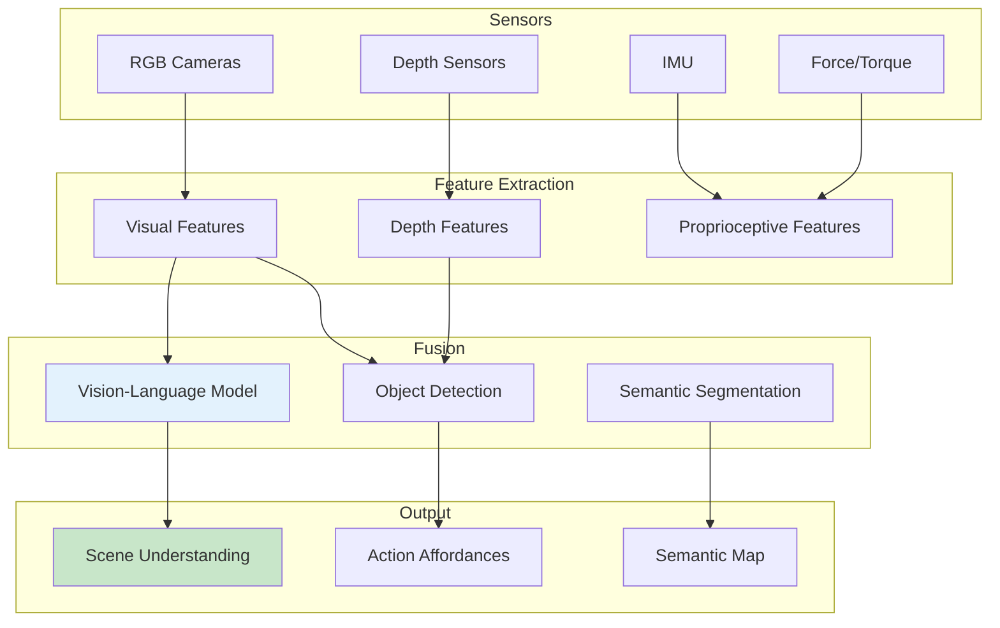

# Multi-Modal Perception

## Learning Outcomes

By the end of this chapter, you will be able to:

1. **Implement** vision-language models for scene understanding
2. **Fuse** multiple sensor modalities for robust perception
3. **Design** object detection and tracking for manipulation
4. **Create** semantic maps for robot navigation
5. **Integrate** perception outputs with planning systems

## Prerequisites

- Completed Chapters 1-2 of Module 4
- Understanding of computer vision concepts
- Familiarity with deep learning frameworks

## Multi-Modal Perception Architecture

Humanoid robots require integration of multiple perceptual modalities:



### Sensor Modalities

| Modality | Sensors | Information |
|----------|---------|-------------|
| Vision | RGB cameras | Appearance, texture, objects |
| Depth | Stereo, ToF, LiDAR | 3D structure, distances |
| Proprioception | IMU, encoders | Robot state, motion |
| Tactile | Force sensors | Contact, manipulation |

## Vision-Language Models

### Scene Description with VLM

```python
#!/usr/bin/env python3
"""Vision-Language Model for scene understanding."""

import rclpy
from rclpy.node import Node
from sensor_msgs.msg import Image
from std_msgs.msg import String
from cv_bridge import CvBridge
import numpy as np
from dataclasses import dataclass
from typing import List, Dict


@dataclass
class SceneDescription:
    """Structured scene understanding output."""
    objects: List[Dict]
    spatial_relations: List[str]
    scene_type: str
    suggested_actions: List[str]


class VisionLanguageNode(Node):
    """Process images with vision-language models."""

    def __init__(self):
        super().__init__('vision_language')

        self.bridge = CvBridge()

        # Model (placeholder - in practice use CLIP, BLIP, LLaVA, etc.)
        self.model = None
        self._load_model()

        # Subscribers
        self.image_sub = self.create_subscription(
            Image, '/camera/image_raw',
            self.image_callback, 10
        )

        # Publishers
        self.description_pub = self.create_publisher(
            String, '/perception/scene_description', 10
        )

        # Query from planner
        self.query_sub = self.create_subscription(
            String, '/perception/query',
            self.query_callback, 10
        )
        self.answer_pub = self.create_publisher(
            String, '/perception/answer', 10
        )

        # Latest image
        self.latest_image = None

        self.get_logger().info('Vision-Language node initialized')

    def _load_model(self):
        """Load vision-language model."""
        # Placeholder for actual model loading
        # In practice: CLIP, BLIP-2, LLaVA, etc.
        self.get_logger().info('Loading VLM (placeholder)')

    def image_callback(self, msg: Image):
        """Process incoming image."""
        try:
            cv_image = self.bridge.imgmsg_to_cv2(msg, 'rgb8')
            self.latest_image = cv_image

            # Generate scene description
            description = self.describe_scene(cv_image)

            # Publish
            desc_msg = String()
            desc_msg.data = self._format_description(description)
            self.description_pub.publish(desc_msg)

        except Exception as e:
            self.get_logger().error(f'Error processing image: {e}')

    def query_callback(self, msg: String):
        """Answer a query about the current scene."""
        if self.latest_image is None:
            return

        query = msg.data
        answer = self.answer_query(self.latest_image, query)

        answer_msg = String()
        answer_msg.data = answer
        self.answer_pub.publish(answer_msg)

    def describe_scene(self, image: np.ndarray) -> SceneDescription:
        """Generate scene description from image."""
        # Placeholder implementation
        # In practice, use VLM to generate this

        # Simulated detection results
        objects = [
            {'name': 'table', 'confidence': 0.95, 'bbox': [100, 200, 300, 400]},
            {'name': 'cup', 'confidence': 0.87, 'bbox': [150, 250, 50, 50]},
            {'name': 'chair', 'confidence': 0.92, 'bbox': [400, 300, 150, 200]},
        ]

        spatial_relations = [
            'cup is on table',
            'chair is near table',
        ]

        return SceneDescription(
            objects=objects,
            spatial_relations=spatial_relations,
            scene_type='living_room',
            suggested_actions=['pick up cup', 'sit on chair']
        )

    def answer_query(self, image: np.ndarray, query: str) -> str:
        """Answer a question about the image."""
        # Placeholder - use VLM for actual Q&A
        query_lower = query.lower()

        if 'cup' in query_lower:
            return "I see a cup on the table in the center of the image."
        elif 'where' in query_lower:
            return "The objects are arranged on a table in what appears to be a living room."
        else:
            return "I can see a table with a cup and a chair nearby."

    def _format_description(self, desc: SceneDescription) -> str:
        """Format description as JSON string."""
        import json
        return json.dumps({
            'objects': desc.objects,
            'spatial_relations': desc.spatial_relations,
            'scene_type': desc.scene_type,
            'suggested_actions': desc.suggested_actions
        })


def main(args=None):
    rclpy.init(args=args)
    node = VisionLanguageNode()
    rclpy.spin(node)
    node.destroy_node()
    rclpy.shutdown()


if __name__ == '__main__':
    main()
```

## Object Detection and Tracking

### YOLO-based Object Detection

```python
#!/usr/bin/env python3
"""Object detection node for humanoid manipulation."""

import rclpy
from rclpy.node import Node
from sensor_msgs.msg import Image, CameraInfo
from vision_msgs.msg import Detection2DArray, Detection2D, ObjectHypothesisWithPose
from geometry_msgs.msg import PoseStamped
from cv_bridge import CvBridge
import numpy as np
from typing import List, Tuple


class ObjectDetector(Node):
    """Detect and track objects for manipulation."""

    def __init__(self):
        super().__init__('object_detector')

        self.bridge = CvBridge()

        # Camera intrinsics
        self.camera_matrix = None
        self.depth_scale = 0.001  # mm to m

        # Object classes relevant for manipulation
        self.target_classes = [
            'cup', 'bottle', 'book', 'remote', 'phone',
            'bowl', 'plate', 'spoon', 'fork', 'knife'
        ]

        # Subscribers
        self.image_sub = self.create_subscription(
            Image, '/camera/color/image_raw',
            self.image_callback, 10
        )
        self.depth_sub = self.create_subscription(
            Image, '/camera/depth/image_raw',
            self.depth_callback, 10
        )
        self.camera_info_sub = self.create_subscription(
            CameraInfo, '/camera/color/camera_info',
            self.camera_info_callback, 10
        )

        # Publishers
        self.detection_pub = self.create_publisher(
            Detection2DArray, '/perception/detections', 10
        )
        self.pose_pub = self.create_publisher(
            PoseStamped, '/perception/object_pose', 10
        )

        # Latest data
        self.latest_depth = None

        self.get_logger().info('Object detector initialized')

    def camera_info_callback(self, msg: CameraInfo):
        """Store camera intrinsics."""
        self.camera_matrix = np.array(msg.k).reshape(3, 3)

    def depth_callback(self, msg: Image):
        """Store latest depth image."""
        self.latest_depth = self.bridge.imgmsg_to_cv2(msg)

    def image_callback(self, msg: Image):
        """Process image for object detection."""
        if self.camera_matrix is None:
            return

        cv_image = self.bridge.imgmsg_to_cv2(msg, 'rgb8')

        # Run detection (placeholder)
        detections = self.detect_objects(cv_image)

        # Publish detections
        det_msg = Detection2DArray()
        det_msg.header = msg.header

        for det in detections:
            det_msg.detections.append(det)

        self.detection_pub.publish(det_msg)

        # Estimate 3D pose for first detection
        if detections and self.latest_depth is not None:
            pose = self.estimate_3d_pose(detections[0], self.latest_depth)
            if pose:
                pose.header = msg.header
                self.pose_pub.publish(pose)

    def detect_objects(self, image: np.ndarray) -> List[Detection2D]:
        """Run object detection on image."""
        # Placeholder - use YOLO, Detectron2, etc.
        detections = []

        # Simulated detection
        det = Detection2D()
        det.bbox.center.position.x = 320.0
        det.bbox.center.position.y = 240.0
        det.bbox.size_x = 100.0
        det.bbox.size_y = 100.0

        hyp = ObjectHypothesisWithPose()
        hyp.hypothesis.class_id = 'cup'
        hyp.hypothesis.score = 0.92
        det.results.append(hyp)

        detections.append(det)

        return detections

    def estimate_3d_pose(self, detection: Detection2D,
                         depth_image: np.ndarray) -> PoseStamped:
        """Estimate 3D pose from detection and depth."""
        # Get center pixel
        cx = int(detection.bbox.center.position.x)
        cy = int(detection.bbox.center.position.y)

        # Get depth at center
        if 0 <= cx < depth_image.shape[1] and 0 <= cy < depth_image.shape[0]:
            depth = depth_image[cy, cx] * self.depth_scale
        else:
            return None

        if depth <= 0 or depth > 10:
            return None

        # Back-project to 3D
        fx = self.camera_matrix[0, 0]
        fy = self.camera_matrix[1, 1]
        cx_cam = self.camera_matrix[0, 2]
        cy_cam = self.camera_matrix[1, 2]

        x = (cx - cx_cam) * depth / fx
        y = (cy - cy_cam) * depth / fy
        z = depth

        pose = PoseStamped()
        pose.pose.position.x = x
        pose.pose.position.y = y
        pose.pose.position.z = z
        pose.pose.orientation.w = 1.0

        return pose


def main(args=None):
    rclpy.init(args=args)
    node = ObjectDetector()
    rclpy.spin(node)
    node.destroy_node()
    rclpy.shutdown()


if __name__ == '__main__':
    main()
```

## Sensor Fusion

### Multi-Modal Fusion Node

```python
#!/usr/bin/env python3
"""Fuse multi-modal perception for robust understanding."""

import rclpy
from rclpy.node import Node
from sensor_msgs.msg import Image, Imu, JointState
from vision_msgs.msg import Detection2DArray
from std_msgs.msg import String
import json
from dataclasses import dataclass, asdict
from typing import Dict, List, Optional
import numpy as np


@dataclass
class FusedPerception:
    """Fused multi-modal perception output."""
    timestamp: float
    detected_objects: List[Dict]
    robot_state: Dict
    scene_context: str
    confidence: float


class PerceptionFusion(Node):
    """Fuse visual, depth, and proprioceptive information."""

    def __init__(self):
        super().__init__('perception_fusion')

        # Latest sensor data
        self.latest_detections: Optional[Detection2DArray] = None
        self.latest_imu: Optional[Imu] = None
        self.latest_joints: Optional[JointState] = None
        self.latest_scene: Optional[str] = None

        # Subscribers
        self.detection_sub = self.create_subscription(
            Detection2DArray, '/perception/detections',
            self.detection_callback, 10
        )
        self.imu_sub = self.create_subscription(
            Imu, '/imu/data',
            self.imu_callback, 10
        )
        self.joint_sub = self.create_subscription(
            JointState, '/joint_states',
            self.joint_callback, 10
        )
        self.scene_sub = self.create_subscription(
            String, '/perception/scene_description',
            self.scene_callback, 10
        )

        # Publisher
        self.fused_pub = self.create_publisher(
            String, '/perception/fused', 10
        )

        # Fusion timer (10 Hz)
        self.timer = self.create_timer(0.1, self.fuse_perception)

        self.get_logger().info('Perception fusion initialized')

    def detection_callback(self, msg: Detection2DArray):
        self.latest_detections = msg

    def imu_callback(self, msg: Imu):
        self.latest_imu = msg

    def joint_callback(self, msg: JointState):
        self.latest_joints = msg

    def scene_callback(self, msg: String):
        self.latest_scene = msg.data

    def fuse_perception(self):
        """Fuse all perception modalities."""
        # Extract object detections
        objects = []
        if self.latest_detections:
            for det in self.latest_detections.detections:
                if det.results:
                    obj = {
                        'class': det.results[0].hypothesis.class_id,
                        'confidence': det.results[0].hypothesis.score,
                        'bbox': {
                            'x': det.bbox.center.position.x,
                            'y': det.bbox.center.position.y,
                            'w': det.bbox.size_x,
                            'h': det.bbox.size_y
                        }
                    }
                    objects.append(obj)

        # Extract robot state
        robot_state = {}
        if self.latest_imu:
            robot_state['orientation'] = {
                'x': self.latest_imu.orientation.x,
                'y': self.latest_imu.orientation.y,
                'z': self.latest_imu.orientation.z,
                'w': self.latest_imu.orientation.w
            }
            robot_state['angular_velocity'] = {
                'x': self.latest_imu.angular_velocity.x,
                'y': self.latest_imu.angular_velocity.y,
                'z': self.latest_imu.angular_velocity.z
            }

        if self.latest_joints:
            robot_state['joints'] = dict(zip(
                self.latest_joints.name,
                self.latest_joints.position
            ))

        # Parse scene context
        scene_context = "unknown"
        if self.latest_scene:
            try:
                scene_data = json.loads(self.latest_scene)
                scene_context = scene_data.get('scene_type', 'unknown')
            except json.JSONDecodeError:
                pass

        # Compute fusion confidence
        confidence = self._compute_confidence(objects, robot_state)

        # Create fused output
        fused = FusedPerception(
            timestamp=self.get_clock().now().nanoseconds / 1e9,
            detected_objects=objects,
            robot_state=robot_state,
            scene_context=scene_context,
            confidence=confidence
        )

        # Publish
        msg = String()
        msg.data = json.dumps(asdict(fused))
        self.fused_pub.publish(msg)

    def _compute_confidence(self, objects: List[Dict],
                           robot_state: Dict) -> float:
        """Compute overall perception confidence."""
        confidence_factors = []

        # Object detection confidence
        if objects:
            avg_det_conf = np.mean([o['confidence'] for o in objects])
            confidence_factors.append(avg_det_conf)

        # Robot state availability
        state_completeness = 0.0
        if 'orientation' in robot_state:
            state_completeness += 0.5
        if 'joints' in robot_state:
            state_completeness += 0.5
        confidence_factors.append(state_completeness)

        if confidence_factors:
            return float(np.mean(confidence_factors))
        return 0.0


def main(args=None):
    rclpy.init(args=args)
    node = PerceptionFusion()
    rclpy.spin(node)
    node.destroy_node()
    rclpy.shutdown()


if __name__ == '__main__':
    main()
```

## Exercises

### Exercise 1: Implement VLM Integration

1. Integrate CLIP or BLIP-2 for image understanding
2. Test scene description generation
3. Evaluate accuracy on test images

### Exercise 2: Object Tracking

1. Add multi-object tracking to the detector
2. Maintain object IDs across frames
3. Handle occlusions gracefully

### Exercise 3: Semantic Mapping

1. Build a semantic map from fused perception
2. Store object locations in world coordinates
3. Query the map for planning

## Assessment Questions

1. **What are the benefits of multi-modal perception over single-modality systems?**

2. **How do vision-language models improve robot understanding of environments?**

3. **What challenges arise when fusing sensors with different update rates?**

4. **How would you handle conflicting information from different sensors?**

## Summary

This chapter covered multi-modal perception:

- **Vision-language models** enable natural language scene understanding
- **Object detection** identifies manipulation targets
- **Sensor fusion** combines modalities for robust perception
- **Integration** connects perception to planning systems

Next, we'll explore end-to-end VLA architectures.

---

**Next**: [End-to-End VLA](./end-to-end-vla)
