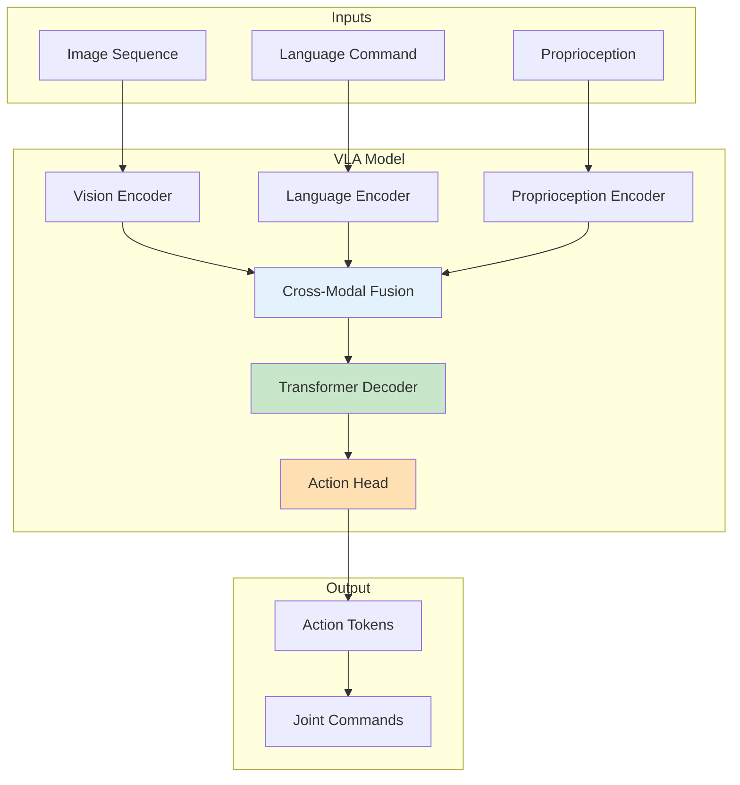

# End-to-End VLA Architectures

## Learning Outcomes

By the end of this chapter, you will be able to:

1. **Design** end-to-end VLA architectures for humanoid robots
2. **Implement** action prediction from visual and language inputs
3. **Train** VLA models using demonstration data
4. **Deploy** VLA models on robot hardware
5. **Evaluate** VLA performance and safety

## Prerequisites

- Completed Chapters 1-3 of Module 4
- Deep learning framework experience (PyTorch)
- Understanding of transformer architectures

## VLA Architecture Overview

Vision-Language-Action (VLA) models directly map perceptual inputs and language commands to robot actions:



### Key Components

| Component | Function | Architecture |
|-----------|----------|--------------|
| Vision Encoder | Extract visual features | ViT, ResNet |
| Language Encoder | Encode commands | BERT, T5 |
| Cross-Modal Fusion | Combine modalities | Cross-attention |
| Action Decoder | Generate actions | Transformer decoder |

## VLA Model Implementation

### Model Architecture

```python
#!/usr/bin/env python3
"""End-to-end VLA model for humanoid control."""

import torch
import torch.nn as nn
from torch.nn import TransformerEncoder, TransformerEncoderLayer
from typing import Tuple, Optional
import numpy as np


class VisionEncoder(nn.Module):
    """Encode visual observations."""

    def __init__(self, img_size: int = 224, patch_size: int = 16,
                 embed_dim: int = 768, num_layers: int = 12):
        super().__init__()

        self.patch_size = patch_size
        self.num_patches = (img_size // patch_size) ** 2

        # Patch embedding
        self.patch_embed = nn.Conv2d(
            3, embed_dim, kernel_size=patch_size, stride=patch_size
        )

        # Position embedding
        self.pos_embed = nn.Parameter(
            torch.zeros(1, self.num_patches + 1, embed_dim)
        )
        self.cls_token = nn.Parameter(torch.zeros(1, 1, embed_dim))

        # Transformer encoder
        encoder_layer = TransformerEncoderLayer(
            d_model=embed_dim, nhead=12, dim_feedforward=3072, batch_first=True
        )
        self.encoder = TransformerEncoder(encoder_layer, num_layers=num_layers)

        self.norm = nn.LayerNorm(embed_dim)

    def forward(self, x: torch.Tensor) -> torch.Tensor:
        """
        Args:
            x: (B, C, H, W) image tensor
        Returns:
            (B, num_patches + 1, embed_dim) visual features
        """
        B = x.shape[0]

        # Patch embedding
        x = self.patch_embed(x)  # (B, embed_dim, H', W')
        x = x.flatten(2).transpose(1, 2)  # (B, num_patches, embed_dim)

        # Add CLS token
        cls_tokens = self.cls_token.expand(B, -1, -1)
        x = torch.cat([cls_tokens, x], dim=1)

        # Add position embedding
        x = x + self.pos_embed

        # Transformer encoder
        x = self.encoder(x)
        x = self.norm(x)

        return x


class LanguageEncoder(nn.Module):
    """Encode language commands."""

    def __init__(self, vocab_size: int = 32000, embed_dim: int = 768,
                 max_seq_len: int = 64, num_layers: int = 6):
        super().__init__()

        self.embedding = nn.Embedding(vocab_size, embed_dim)
        self.pos_embed = nn.Parameter(torch.zeros(1, max_seq_len, embed_dim))

        encoder_layer = TransformerEncoderLayer(
            d_model=embed_dim, nhead=12, dim_feedforward=3072, batch_first=True
        )
        self.encoder = TransformerEncoder(encoder_layer, num_layers=num_layers)

        self.norm = nn.LayerNorm(embed_dim)

    def forward(self, tokens: torch.Tensor,
                attention_mask: Optional[torch.Tensor] = None) -> torch.Tensor:
        """
        Args:
            tokens: (B, seq_len) token indices
            attention_mask: (B, seq_len) mask tensor
        Returns:
            (B, seq_len, embed_dim) language features
        """
        x = self.embedding(tokens)
        x = x + self.pos_embed[:, :x.shape[1], :]

        if attention_mask is not None:
            # Convert mask for transformer (True = ignore)
            mask = ~attention_mask.bool()
        else:
            mask = None

        x = self.encoder(x, src_key_padding_mask=mask)
        x = self.norm(x)

        return x


class ProprioceptionEncoder(nn.Module):
    """Encode robot proprioception."""

    def __init__(self, num_joints: int = 24, embed_dim: int = 768):
        super().__init__()

        # Joint positions, velocities, torques
        input_dim = num_joints * 3

        self.encoder = nn.Sequential(
            nn.Linear(input_dim, 256),
            nn.ReLU(),
            nn.Linear(256, 512),
            nn.ReLU(),
            nn.Linear(512, embed_dim),
        )

    def forward(self, joint_state: torch.Tensor) -> torch.Tensor:
        """
        Args:
            joint_state: (B, num_joints * 3) positions, velocities, torques
        Returns:
            (B, 1, embed_dim) proprioception features
        """
        x = self.encoder(joint_state)
        return x.unsqueeze(1)


class CrossModalFusion(nn.Module):
    """Fuse vision, language, and proprioception."""

    def __init__(self, embed_dim: int = 768, num_layers: int = 4):
        super().__init__()

        self.cross_attention = nn.MultiheadAttention(
            embed_dim, num_heads=12, batch_first=True
        )

        encoder_layer = TransformerEncoderLayer(
            d_model=embed_dim, nhead=12, dim_feedforward=3072, batch_first=True
        )
        self.fusion_encoder = TransformerEncoder(encoder_layer, num_layers=num_layers)

        # Modality type embeddings
        self.vision_type = nn.Parameter(torch.zeros(1, 1, embed_dim))
        self.language_type = nn.Parameter(torch.zeros(1, 1, embed_dim))
        self.proprio_type = nn.Parameter(torch.zeros(1, 1, embed_dim))

    def forward(self, vision_feat: torch.Tensor, language_feat: torch.Tensor,
                proprio_feat: torch.Tensor) -> torch.Tensor:
        """
        Args:
            vision_feat: (B, V, D) visual features
            language_feat: (B, L, D) language features
            proprio_feat: (B, 1, D) proprioception features
        Returns:
            (B, V+L+1, D) fused features
        """
        B = vision_feat.shape[0]

        # Add modality type embeddings
        vision_feat = vision_feat + self.vision_type
        language_feat = language_feat + self.language_type
        proprio_feat = proprio_feat + self.proprio_type

        # Concatenate all modalities
        fused = torch.cat([vision_feat, language_feat, proprio_feat], dim=1)

        # Self-attention fusion
        fused = self.fusion_encoder(fused)

        return fused


class ActionDecoder(nn.Module):
    """Decode actions from fused features."""

    def __init__(self, embed_dim: int = 768, num_joints: int = 24,
                 action_horizon: int = 16, num_layers: int = 4):
        super().__init__()

        self.action_horizon = action_horizon
        self.num_joints = num_joints

        # Learned action queries
        self.action_queries = nn.Parameter(
            torch.zeros(1, action_horizon, embed_dim)
        )

        # Cross-attention to fused features
        decoder_layer = nn.TransformerDecoderLayer(
            d_model=embed_dim, nhead=12, dim_feedforward=3072, batch_first=True
        )
        self.decoder = nn.TransformerDecoder(decoder_layer, num_layers=num_layers)

        # Action prediction head
        self.action_head = nn.Sequential(
            nn.Linear(embed_dim, 512),
            nn.ReLU(),
            nn.Linear(512, num_joints),
            nn.Tanh(),  # Normalize to [-1, 1]
        )

    def forward(self, fused_features: torch.Tensor) -> torch.Tensor:
        """
        Args:
            fused_features: (B, S, D) fused multi-modal features
        Returns:
            (B, action_horizon, num_joints) predicted actions
        """
        B = fused_features.shape[0]

        # Expand action queries
        queries = self.action_queries.expand(B, -1, -1)

        # Decode actions
        decoded = self.decoder(queries, fused_features)

        # Predict joint actions
        actions = self.action_head(decoded)

        return actions


class VLAModel(nn.Module):
    """Complete Vision-Language-Action model."""

    def __init__(self, num_joints: int = 24, action_horizon: int = 16,
                 embed_dim: int = 768):
        super().__init__()

        self.vision_encoder = VisionEncoder(embed_dim=embed_dim)
        self.language_encoder = LanguageEncoder(embed_dim=embed_dim)
        self.proprio_encoder = ProprioceptionEncoder(
            num_joints=num_joints, embed_dim=embed_dim
        )
        self.fusion = CrossModalFusion(embed_dim=embed_dim)
        self.action_decoder = ActionDecoder(
            embed_dim=embed_dim, num_joints=num_joints,
            action_horizon=action_horizon
        )

        # Action scaling (learned)
        self.action_scale = nn.Parameter(torch.ones(num_joints))
        self.action_bias = nn.Parameter(torch.zeros(num_joints))

    def forward(self, image: torch.Tensor, tokens: torch.Tensor,
                joint_state: torch.Tensor,
                attention_mask: Optional[torch.Tensor] = None) -> torch.Tensor:
        """
        Args:
            image: (B, C, H, W) RGB image
            tokens: (B, L) language tokens
            joint_state: (B, num_joints * 3) current joint state
            attention_mask: (B, L) language attention mask
        Returns:
            (B, action_horizon, num_joints) predicted joint actions
        """
        # Encode each modality
        vision_feat = self.vision_encoder(image)
        language_feat = self.language_encoder(tokens, attention_mask)
        proprio_feat = self.proprio_encoder(joint_state)

        # Fuse modalities
        fused = self.fusion(vision_feat, language_feat, proprio_feat)

        # Decode actions
        actions = self.action_decoder(fused)

        # Scale actions to joint range
        actions = actions * self.action_scale + self.action_bias

        return actions


# Example usage
def test_vla_model():
    """Test VLA model forward pass."""
    model = VLAModel(num_joints=24, action_horizon=16)

    # Dummy inputs
    batch_size = 4
    image = torch.randn(batch_size, 3, 224, 224)
    tokens = torch.randint(0, 32000, (batch_size, 32))
    joint_state = torch.randn(batch_size, 24 * 3)

    # Forward pass
    actions = model(image, tokens, joint_state)

    print(f"Input image shape: {image.shape}")
    print(f"Input tokens shape: {tokens.shape}")
    print(f"Input joint state shape: {joint_state.shape}")
    print(f"Output actions shape: {actions.shape}")

    return actions


if __name__ == '__main__':
    test_vla_model()
```

## Training Pipeline

### Data Collection and Training

```python
#!/usr/bin/env python3
"""Training pipeline for VLA model."""

import torch
import torch.nn as nn
from torch.utils.data import Dataset, DataLoader
from torch.optim import AdamW
from torch.optim.lr_scheduler import CosineAnnealingLR
import numpy as np
from pathlib import Path
from typing import Dict, List
from dataclasses import dataclass


@dataclass
class DemoTrajectory:
    """Single demonstration trajectory."""
    images: np.ndarray  # (T, H, W, C)
    language: str
    joint_states: np.ndarray  # (T, num_joints * 3)
    actions: np.ndarray  # (T, num_joints)


class VLADataset(Dataset):
    """Dataset for VLA training."""

    def __init__(self, demo_paths: List[Path], tokenizer,
                 action_horizon: int = 16):
        self.demos = self._load_demos(demo_paths)
        self.tokenizer = tokenizer
        self.action_horizon = action_horizon

    def _load_demos(self, paths: List[Path]) -> List[DemoTrajectory]:
        """Load demonstration data."""
        demos = []
        for path in paths:
            # Load from files (npz, hdf5, etc.)
            # Placeholder implementation
            pass
        return demos

    def __len__(self):
        return len(self.demos)

    def __getitem__(self, idx) -> Dict[str, torch.Tensor]:
        demo = self.demos[idx]

        # Sample a random timestep
        max_t = len(demo.images) - self.action_horizon
        t = np.random.randint(0, max(1, max_t))

        # Get current observation
        image = torch.from_numpy(demo.images[t]).permute(2, 0, 1).float() / 255.0
        joint_state = torch.from_numpy(demo.joint_states[t]).float()

        # Tokenize language
        tokens = self.tokenizer.encode(demo.language, max_length=64)
        tokens = torch.tensor(tokens)

        # Get action sequence
        end_t = min(t + self.action_horizon, len(demo.actions))
        actions = torch.from_numpy(demo.actions[t:end_t]).float()

        # Pad if necessary
        if actions.shape[0] < self.action_horizon:
            pad_size = self.action_horizon - actions.shape[0]
            actions = torch.cat([
                actions,
                actions[-1:].repeat(pad_size, 1)
            ])

        return {
            'image': image,
            'tokens': tokens,
            'joint_state': joint_state,
            'actions': actions
        }


class VLATrainer:
    """Training loop for VLA model."""

    def __init__(self, model: nn.Module, train_dataset: Dataset,
                 val_dataset: Dataset, config: Dict):
        self.model = model
        self.config = config
        self.device = torch.device('cuda' if torch.cuda.is_available() else 'cpu')

        self.model.to(self.device)

        # Data loaders
        self.train_loader = DataLoader(
            train_dataset,
            batch_size=config['batch_size'],
            shuffle=True,
            num_workers=4
        )
        self.val_loader = DataLoader(
            val_dataset,
            batch_size=config['batch_size'],
            shuffle=False,
            num_workers=4
        )

        # Optimizer
        self.optimizer = AdamW(
            model.parameters(),
            lr=config['learning_rate'],
            weight_decay=config['weight_decay']
        )

        # Scheduler
        self.scheduler = CosineAnnealingLR(
            self.optimizer,
            T_max=config['num_epochs']
        )

        # Loss function
        self.criterion = nn.MSELoss()

    def train_epoch(self) -> float:
        """Train for one epoch."""
        self.model.train()
        total_loss = 0

        for batch in self.train_loader:
            # Move to device
            image = batch['image'].to(self.device)
            tokens = batch['tokens'].to(self.device)
            joint_state = batch['joint_state'].to(self.device)
            actions_gt = batch['actions'].to(self.device)

            # Forward pass
            self.optimizer.zero_grad()
            actions_pred = self.model(image, tokens, joint_state)

            # Compute loss
            loss = self.criterion(actions_pred, actions_gt)

            # Backward pass
            loss.backward()
            torch.nn.utils.clip_grad_norm_(self.model.parameters(), 1.0)
            self.optimizer.step()

            total_loss += loss.item()

        return total_loss / len(self.train_loader)

    def validate(self) -> float:
        """Validate model."""
        self.model.eval()
        total_loss = 0

        with torch.no_grad():
            for batch in self.val_loader:
                image = batch['image'].to(self.device)
                tokens = batch['tokens'].to(self.device)
                joint_state = batch['joint_state'].to(self.device)
                actions_gt = batch['actions'].to(self.device)

                actions_pred = self.model(image, tokens, joint_state)
                loss = self.criterion(actions_pred, actions_gt)
                total_loss += loss.item()

        return total_loss / len(self.val_loader)

    def train(self):
        """Full training loop."""
        best_val_loss = float('inf')

        for epoch in range(self.config['num_epochs']):
            train_loss = self.train_epoch()
            val_loss = self.validate()

            self.scheduler.step()

            print(f"Epoch {epoch+1}: Train Loss = {train_loss:.4f}, "
                  f"Val Loss = {val_loss:.4f}")

            # Save best model
            if val_loss < best_val_loss:
                best_val_loss = val_loss
                torch.save(self.model.state_dict(), 'best_vla_model.pt')
```

## Exercises

### Exercise 1: Implement VLA Inference Node

1. Create a ROS 2 node that runs VLA inference
2. Subscribe to camera and joint state topics
3. Publish predicted actions to robot

### Exercise 2: Data Collection Pipeline

1. Build a teleoperation interface for demonstrations
2. Record synchronized images, language, and actions
3. Create a dataset for training

### Exercise 3: Evaluate VLA Performance

1. Define success metrics for manipulation tasks
2. Evaluate on held-out test scenarios
3. Analyze failure cases and improvements

## Assessment Questions

1. **What are the advantages of end-to-end VLA models over modular approaches?**

2. **How do you ensure safety when deploying VLA models on real robots?**

3. **What is action chunking and why is it important for VLA models?**

4. **How would you handle distribution shift between training and deployment?**

## Summary

This chapter covered end-to-end VLA architectures:

- **Multi-modal encoders** process vision, language, and proprioception
- **Cross-modal fusion** combines information from all modalities
- **Action decoders** predict future joint commands
- **Training pipelines** learn from demonstration data

This completes Module 4 on Vision-Language-Action Models. Next, we'll bring everything together in the Capstone Project.

---

**Next Module**: [Capstone Project](../capstone/)
