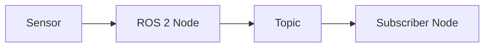
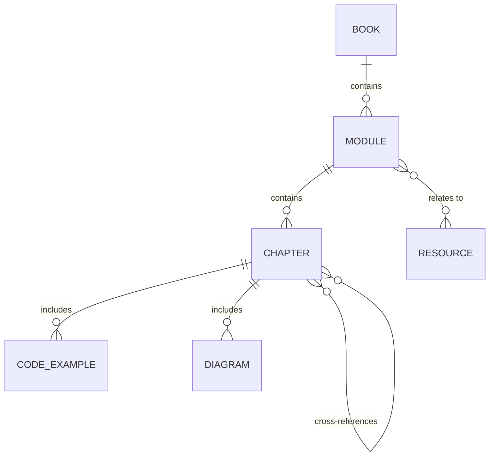

# Data Model: Physical AI & Humanoid Robotics Book

**Feature Branch**: `001-physical-ai-book`
**Created**: 2025-12-09

## Overview

This document defines the content structure and metadata schema for the educational book. Since this is a documentation project (not a database-backed application), the "data model" represents the file structure, frontmatter schema, and content organization patterns.

## Entity Definitions

### Module

A major content section covering a core topic area.

**Properties**:
| Field | Type | Required | Description |
|-------|------|----------|-------------|
| name | string | Yes | Module title (e.g., "ROS 2 Fundamentals") |
| slug | string | Yes | URL-safe identifier (e.g., "module-1-ros2") |
| position | integer | Yes | Display order in sidebar (1-4 for main modules) |
| description | string | Yes | Brief summary for navigation/SEO |
| learning_objectives | string[] | Yes | 3-5 high-level outcomes for the module |
| chapters | Chapter[] | Yes | List of chapters within the module |

**Directory Pattern**: `docs/{slug}/`

**Index File**: `docs/{slug}/_category_.json`
```json
{
  "label": "Module 1: ROS 2 Fundamentals",
  "position": 2,
  "link": {
    "type": "generated-index",
    "description": "Learn the foundation of robot operating systems"
  }
}
```

### Chapter

A focused learning unit within a module.

**Properties**:
| Field | Type | Required | Description |
|-------|------|----------|-------------|
| title | string | Yes | Chapter title |
| sidebar_position | integer | Yes | Order within module |
| description | string | Yes | Summary for search/SEO (< 160 chars) |
| prerequisites | string[] | No | Links to prior chapters/concepts |
| learning_outcomes | string[] | Yes | Minimum 3 measurable objectives |
| estimated_time | string | No | Reading time estimate |

**Frontmatter Schema**:
```yaml
---
sidebar_position: 1
title: "Nodes, Topics, and Services"
description: "Learn the core communication patterns in ROS 2 including nodes, topics, and services"
---
```

**Required Sections**:
1. Learning Outcomes (bullet list)
2. Prerequisites (if any)
3. Introduction/Overview
4. Main Content (theory + examples)
5. Code Examples (minimum 1 per chapter)
6. Practical Exercises
7. Self-Assessment Questions
8. Summary/Key Takeaways
9. References (links to official docs)

### Code Example

An executable code snippet demonstrating a concept.

**Properties**:
| Field | Type | Required | Description |
|-------|------|----------|-------------|
| language | string | Yes | Programming language (python, cpp, xml, yaml, bash) |
| title | string | No | Descriptive title for the code block |
| showLineNumbers | boolean | No | Display line numbers (default: false) |
| highlight | string | No | Lines to highlight (e.g., "{1,4-6}") |

**Markdown Pattern**:
````markdown
```python title="minimal_publisher.py" showLineNumbers
import rclpy
from rclpy.node import Node
# ...
```
````

### Diagram

A visual representation of architecture, workflow, or concept.

**Properties**:
| Field | Type | Required | Description |
|-------|------|----------|-------------|
| type | string | Yes | Mermaid diagram type (flowchart, sequenceDiagram, classDiagram, stateDiagram) |
| caption | string | Yes | Description below diagram |
| alt | string | Yes | Accessibility text |

**Markdown Pattern**:
````markdown

*Figure 1: Basic ROS 2 publish-subscribe pattern*
````

### Resource

An external reference entry.

**Properties**:
| Field | Type | Required | Description |
|-------|------|----------|-------------|
| title | string | Yes | Resource name |
| url | string | Yes | External URL |
| category | enum | Yes | "official_docs", "papers", "tools", "community" |
| description | string | No | Brief explanation of the resource |
| module_relevance | string[] | No | Which modules this relates to |

## File Structure

```
docs/
├── intro.md                          # Introduction (sidebar_position: 1)
├── module-1-ros2/                    # Module 1 folder
│   ├── _category_.json               # Module metadata
│   ├── 01-architecture.md            # Chapter 1
│   ├── 02-nodes-topics-services.md   # Chapter 2
│   ├── 03-rclpy-integration.md       # Chapter 3
│   └── 04-urdf-humanoids.md          # Chapter 4
├── module-2-simulation/              # Module 2 folder
│   ├── _category_.json
│   ├── 01-gazebo-basics.md
│   ├── 02-unity-integration.md
│   ├── 03-sensor-simulation.md
│   └── 04-digital-twins.md
├── module-3-isaac/                   # Module 3 folder
│   ├── _category_.json
│   ├── 01-isaac-sim-intro.md
│   ├── 02-isaac-ros.md
│   ├── 03-vslam.md
│   └── 04-nav2-bipedal.md
├── module-4-vla/                     # Module 4 folder
│   ├── _category_.json
│   ├── 01-voice-to-action.md
│   ├── 02-llm-planning.md
│   └── 03-multimodal-integration.md
├── capstone/                         # Capstone folder
│   ├── _category_.json
│   └── project.md
└── resources/                        # Resources folder
    ├── _category_.json
    ├── references.md
    └── glossary.md
```

## Relationships



## Validation Rules

1. **Module Validation**:
   - Must have _category_.json with valid label and position
   - Position must be unique within docs/
   - Must contain at least 3 chapters

2. **Chapter Validation**:
   - Must have frontmatter with sidebar_position, title, description
   - Must have Learning Outcomes section with 3+ items
   - Must have at least 1 code example
   - sidebar_position must be unique within module

3. **Code Example Validation**:
   - Must specify language for syntax highlighting
   - Language must be one of: python, cpp, javascript, typescript, xml, yaml, bash, json

4. **Diagram Validation**:
   - Must be valid Mermaid syntax
   - Must have caption text following the code block

5. **Cross-Reference Validation**:
   - Internal links must resolve to existing documents
   - Format: `[link text](/module-X-name/chapter-name)`

## Word Count Targets

| Section | Target Words | Actual (TBD) |
|---------|--------------|--------------|
| Introduction | 1,500 | - |
| Module 1 (ROS 2) | 4,000 | - |
| Module 2 (Simulation) | 3,500 | - |
| Module 3 (Isaac) | 4,000 | - |
| Module 4 (VLA) | 3,500 | - |
| Capstone | 2,000 | - |
| Resources | 500 | - |
| **Total** | **19,000** | - |

## Content Metrics

| Metric | Requirement |
|--------|-------------|
| Code examples per module | ≥ 3 |
| Diagrams per module | ≥ 2 |
| Learning outcomes per chapter | ≥ 3 |
| Assessment questions per chapter | ≥ 3 |
| Cross-references per module | ≥ 2 |
