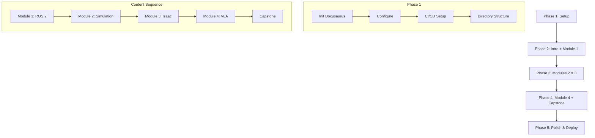

# Implementation Plan: Physical AI & Humanoid Robotics Book

**Branch**: `001-physical-ai-book` | **Date**: 2025-12-09 | **Spec**: [spec.md](./spec.md)
**Input**: Feature specification from `/specs/001-physical-ai-book/spec.md`

## Summary

Create a comprehensive educational book on Physical AI and Humanoid Robotics using Docusaurus v3.x, deployed to GitHub Pages. The book covers four core modules (ROS 2, Simulation, NVIDIA Isaac, VLA) plus introduction, capstone project, and resources. Content targets advanced CS students and AI practitioners transitioning to robotics, with emphasis on practical code examples and progressive learning.

## Technical Context

**Language/Version**: Node.js 18+, Markdown/MDX
**Primary Dependencies**: Docusaurus v3.x, @docusaurus/theme-mermaid
**Storage**: File-based (Markdown documents in docs/ folder)
**Testing**: Manual content review, `npm run build` for validation
**Target Platform**: Web (GitHub Pages static hosting)
**Project Type**: Documentation site (Docusaurus)
**Performance Goals**: Initial page load < 3 seconds, search response < 2 seconds
**Constraints**: 15,000-20,000 words total, minimum 3 code examples per module
**Scale/Scope**: ~20 markdown files, 4 modules + supporting content

## Constitution Check

*GATE: Must pass before Phase 0 research. Re-check after Phase 1 design.*

| Principle | Status | Evidence |
|-----------|--------|----------|
| I. Technical Accuracy | ✅ PASS | Code examples target ROS 2 Jazzy, Isaac Sim 4.x; all claims traceable to official docs |
| II. Educational Clarity | ✅ PASS | Every chapter has learning outcomes, prerequisites, assessments per data-model.md |
| III. Practical Applicability | ✅ PASS | Minimum 3 code examples per module, practical exercises in chapter contract |
| IV. Progressive Learning | ✅ PASS | Module sequence: ROS 2 → Simulation → Isaac → VLA; chapters build progressively |
| V. Industry Standards | ✅ PASS | Follows Docusaurus conventions, ROS 2 REP guidelines, PEP 8 for Python |
| VI. Quality Assurance | ✅ PASS | Build verification, link validation, accessibility requirements in contracts |

**Gate Status**: PASSED - All constitution principles satisfied

## Project Structure

### Documentation (this feature)

```text
specs/001-physical-ai-book/
├── plan.md              # This file
├── spec.md              # Feature specification
├── research.md          # Technology decisions and research
├── data-model.md        # Content structure and metadata schema
├── quickstart.md        # Setup and development guide
├── contracts/           # Content structure contracts
│   └── content-structure.md
└── tasks.md             # (Created by /sp.tasks)
```

### Source Code (repository root)

```text
ai-robotics-book/                    # Docusaurus project root
├── docs/                            # All book content
│   ├── intro.md                     # Introduction (position 1)
│   ├── module-1-ros2/               # ROS 2 Fundamentals (position 2)
│   │   ├── _category_.json
│   │   ├── 01-architecture.md
│   │   ├── 02-nodes-topics-services.md
│   │   ├── 03-rclpy-integration.md
│   │   └── 04-urdf-humanoids.md
│   ├── module-2-simulation/         # Gazebo & Unity (position 3)
│   │   ├── _category_.json
│   │   ├── 01-gazebo-basics.md
│   │   ├── 02-unity-integration.md
│   │   ├── 03-sensor-simulation.md
│   │   └── 04-digital-twins.md
│   ├── module-3-isaac/              # NVIDIA Isaac (position 4)
│   │   ├── _category_.json
│   │   ├── 01-isaac-sim-intro.md
│   │   ├── 02-isaac-ros.md
│   │   ├── 03-vslam.md
│   │   └── 04-nav2-bipedal.md
│   ├── module-4-vla/                # Vision-Language-Action (position 5)
│   │   ├── _category_.json
│   │   ├── 01-voice-to-action.md
│   │   ├── 02-llm-planning.md
│   │   └── 03-multimodal-integration.md
│   ├── capstone/                    # Capstone Project (position 6)
│   │   ├── _category_.json
│   │   └── project.md
│   └── resources/                   # References (position 7)
│       ├── _category_.json
│       ├── references.md
│       └── glossary.md
├── src/
│   └── css/
│       └── custom.css               # Custom styles
├── static/
│   └── img/                         # Static images and diagrams
├── .github/
│   └── workflows/
│       └── deploy.yml               # GitHub Pages deployment
├── docusaurus.config.js             # Main configuration
├── sidebars.js                      # Sidebar configuration
├── package.json                     # Dependencies
└── README.md                        # Project documentation
```

**Structure Decision**: Docusaurus documentation site with docs-only configuration (no blog), autogenerated sidebar from file structure, Mermaid diagrams via theme plugin.

## Implementation Phases

### Phase 1: Project Setup

**Goal**: Initialize Docusaurus project with proper configuration

**Tasks**:
1. Initialize Docusaurus project with classic preset
2. Install @docusaurus/theme-mermaid
3. Configure docusaurus.config.js for GitHub Pages
4. Configure sidebars.js for autogenerated sidebar
5. Create GitHub Actions deployment workflow
6. Create README with setup instructions
7. Remove default tutorial content
8. Create module directory structure with _category_.json files

**Outputs**: Working Docusaurus development environment, CI/CD pipeline

### Phase 2: Introduction & Module 1

**Goal**: Complete introduction and ROS 2 Fundamentals module

**Tasks**:
1. Write intro.md (Physical AI landscape, course overview) ~1,500 words
2. Write Module 1 Chapter 1: ROS 2 Architecture ~1,000 words
3. Write Module 1 Chapter 2: Nodes, Topics, Services ~1,000 words
4. Write Module 1 Chapter 3: rclpy Integration ~1,000 words
5. Write Module 1 Chapter 4: URDF for Humanoids ~1,000 words
6. Create 3+ code examples for Module 1
7. Create 2+ Mermaid diagrams for Module 1
8. Verify build and local preview

**Outputs**: Introduction + Module 1 complete (~5,500 words)

### Phase 3: Modules 2 & 3

**Goal**: Complete Simulation and NVIDIA Isaac modules

**Tasks**:
1. Write Module 2 Chapter 1: Gazebo Basics ~900 words
2. Write Module 2 Chapter 2: Unity Integration ~900 words
3. Write Module 2 Chapter 3: Sensor Simulation ~900 words
4. Write Module 2 Chapter 4: Digital Twins ~800 words
5. Create 3+ code examples for Module 2
6. Create 2+ Mermaid diagrams for Module 2
7. Write Module 3 Chapter 1: Isaac Sim Introduction ~1,000 words
8. Write Module 3 Chapter 2: Isaac ROS ~1,000 words
9. Write Module 3 Chapter 3: VSLAM ~1,000 words
10. Write Module 3 Chapter 4: Nav2 for Bipedal ~1,000 words
11. Create 3+ code examples for Module 3
12. Create 2+ Mermaid diagrams for Module 3
13. Verify cross-references between modules

**Outputs**: Modules 2 & 3 complete (~7,500 words)

### Phase 4: Module 4 & Capstone

**Goal**: Complete VLA module and capstone project guide

**Tasks**:
1. Write Module 4 Chapter 1: Voice-to-Action ~1,200 words
2. Write Module 4 Chapter 2: LLM Cognitive Planning ~1,200 words
3. Write Module 4 Chapter 3: Multi-modal Integration ~1,100 words
4. Create 3+ code examples for Module 4
5. Create 2+ Mermaid diagrams for Module 4
6. Write Capstone project guide ~2,000 words
7. Add cross-references to all modules in capstone
8. Verify capstone synthesizes all module concepts

**Outputs**: Module 4 + Capstone complete (~5,500 words)

### Phase 5: Polish & Deploy

**Goal**: Complete resources section and deploy to production

**Tasks**:
1. Write references.md with categorized external links ~300 words
2. Write glossary.md with key terms ~200 words
3. Run link validation (internal and external)
4. Verify all code examples have syntax highlighting
5. Verify mobile responsiveness
6. Run final build test
7. Deploy to GitHub Pages
8. Verify live site functionality
9. Test search functionality

**Outputs**: Complete book deployed to GitHub Pages

## Dependencies & Sequencing



**Key Dependencies**:
- Phase 1 MUST complete before any content creation
- Module 1 (ROS 2) written before Module 2 (builds on ROS concepts)
- Module 3 (Isaac) written after Modules 1 & 2 (integrates both)
- Module 4 (VLA) written last (highest level integration)
- Capstone requires all modules complete (synthesizes everything)

## Risk Mitigation

| Risk | Impact | Mitigation |
|------|--------|------------|
| External API changes (ROS 2, Isaac) | Medium | Version-lock documentation to specific releases |
| Broken external links | Low | Document source URLs in references; regular audits |
| Build failures | Medium | CI/CD catches issues before merge |
| Content scope creep | Medium | Strict word count targets per section |
| Mobile rendering issues | Low | Docusaurus default theme is responsive |

## Acceptance Criteria

From specification success criteria (SC-001 to SC-012):

- [ ] All 4 modules complete (15,000-20,000 words total)
- [ ] Each module has 3+ code examples
- [ ] Each chapter has 3+ learning outcomes
- [ ] 3-click navigation between any pages
- [ ] Search returns results in < 2 seconds
- [ ] Page load < 3 seconds
- [ ] 0 broken internal links
- [ ] Mobile-friendly test passes
- [ ] Build completes without errors
- [ ] GitHub Pages deployment succeeds
- [ ] 100% code examples have language tags
- [ ] Each module has 2+ diagrams

## Complexity Tracking

> No constitution violations requiring justification.

| Decision | Rationale |
|----------|-----------|
| Docs-only site (no blog) | Simplest configuration; blog adds unnecessary complexity |
| Autogenerated sidebar | Reduces maintenance; position controlled via frontmatter |
| Inline code (not separate files) | Code stays with explanatory context; easier authoring |
| Mermaid over static images | Version-controllable; dark mode support; smaller repo |

## Next Steps

Run `/sp.tasks` to generate the detailed task breakdown for implementation.
