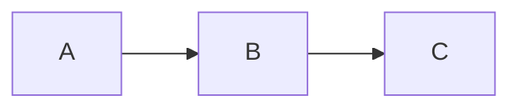

# Quickstart: Physical AI & Humanoid Robotics Book

**Feature Branch**: `001-physical-ai-book`
**Created**: 2025-12-09

## Prerequisites

- Node.js v18.0 or higher
- npm v9.0 or higher
- Git
- GitHub account (for deployment)

## Quick Setup (5 minutes)

### 1. Initialize Docusaurus Project

```bash
# Create new Docusaurus project
npx create-docusaurus@latest ai-robotics-book classic

# Navigate to project
cd ai-robotics-book

# Install Mermaid theme for diagrams
npm install @docusaurus/theme-mermaid
```

### 2. Configure for GitHub Pages

Edit `docusaurus.config.js`:

```javascript
export default {
  title: 'Physical AI & Humanoid Robotics',
  tagline: 'A comprehensive guide to building intelligent robots',
  favicon: 'img/favicon.ico',

  // GitHub Pages configuration
  url: 'https://YOUR_GITHUB_USERNAME.github.io',
  baseUrl: '/ai-robotics-book/',
  organizationName: 'YOUR_GITHUB_USERNAME',
  projectName: 'ai-robotics-book',
  trailingSlash: false,

  // Enable Mermaid diagrams
  markdown: {
    mermaid: true,
  },
  themes: ['@docusaurus/theme-mermaid'],

  presets: [
    [
      'classic',
      {
        docs: {
          sidebarPath: './sidebars.js',
          routeBasePath: '/', // Serve docs at root
        },
        blog: false, // Disable blog
        theme: {
          customCss: './src/css/custom.css',
        },
      },
    ],
  ],

  themeConfig: {
    navbar: {
      title: 'Physical AI Book',
      logo: {
        alt: 'Physical AI Logo',
        src: 'img/logo.svg',
      },
      items: [
        {
          type: 'docSidebar',
          sidebarId: 'tutorialSidebar',
          position: 'left',
          label: 'Curriculum',
        },
        {
          href: 'https://github.com/YOUR_GITHUB_USERNAME/ai-robotics-book',
          label: 'GitHub',
          position: 'right',
        },
      ],
    },
    mermaid: {
      theme: { light: 'neutral', dark: 'forest' },
    },
    footer: {
      style: 'dark',
      copyright: `Copyright © ${new Date().getFullYear()} Physical AI Book. Built with Docusaurus.`,
    },
  },
};
```

### 3. Configure Autogenerated Sidebar

Edit `sidebars.js`:

```javascript
export default {
  tutorialSidebar: [
    {
      type: 'autogenerated',
      dirName: '.',
    },
  ],
};
```

### 4. Create Content Structure

```bash
# Remove default tutorial content
rm -rf docs/tutorial-*

# Create module directories
mkdir -p docs/module-1-ros2
mkdir -p docs/module-2-simulation
mkdir -p docs/module-3-isaac
mkdir -p docs/module-4-vla
mkdir -p docs/capstone
mkdir -p docs/resources
```

### 5. Create Module Category Files

Create `docs/module-1-ros2/_category_.json`:
```json
{
  "label": "Module 1: ROS 2 Fundamentals",
  "position": 2,
  "link": {
    "type": "generated-index",
    "description": "Learn the foundation of robot operating systems"
  }
}
```

Repeat for other modules with positions 3, 4, 5, 6, 7.

### 6. Create Introduction Page

Create `docs/intro.md`:
```markdown
---
sidebar_position: 1
slug: /
title: "Introduction to Physical AI"
description: "Welcome to the comprehensive guide on Physical AI and Humanoid Robotics"
---

# Introduction to Physical AI & Humanoid Robotics

## Learning Outcomes

After completing this introduction, you will be able to:
- Define Physical AI and explain its importance in modern robotics
- Describe the course structure and learning path
- Set up your development environment for hands-on exercises

## What is Physical AI?

[Content here...]

## Course Overview

[Content here...]
```

### 7. Start Development Server

```bash
npm start
```

Visit http://localhost:3000 to see your site.

## Adding Content

### Chapter Template

Create new chapters using this template:

```markdown
---
sidebar_position: 1
title: "Chapter Title"
description: "Brief description for SEO (< 160 characters)"
---

# Chapter Title

## Learning Outcomes

After completing this chapter, you will be able to:
- Outcome 1
- Outcome 2
- Outcome 3

## Prerequisites

- [Link to prerequisite chapter](/module-X/chapter-name)

## Introduction

[Overview of the topic...]

## Main Content

### Subtopic 1

[Content with code examples...]

```python title="example.py"
# Your code here
```

### Subtopic 2

[More content...]


*Figure 1: Diagram caption*

## Practical Exercise

1. Exercise step 1
2. Exercise step 2
3. Exercise step 3

## Self-Assessment

1. Question 1?
2. Question 2?
3. Question 3?

## Summary

- Key point 1
- Key point 2
- Key point 3

## References

- [Official Documentation](https://example.com)
```

## Build and Deploy

### Local Build Test

```bash
npm run build
npm run serve
```

### GitHub Actions Deployment

Create `.github/workflows/deploy.yml`:

```yaml
name: Deploy to GitHub Pages

on:
  push:
    branches:
      - main

jobs:
  build:
    name: Build Docusaurus
    runs-on: ubuntu-latest
    steps:
      - uses: actions/checkout@v4
        with:
          fetch-depth: 0
      - uses: actions/setup-node@v4
        with:
          node-version: 20
          cache: npm

      - name: Install dependencies
        run: npm ci
      - name: Build website
        run: npm run build

      - name: Upload Build Artifact
        uses: actions/upload-pages-artifact@v3
        with:
          path: build

  deploy:
    name: Deploy to GitHub Pages
    needs: build
    permissions:
      pages: write
      id-token: write
    environment:
      name: github-pages
      url: ${{ steps.deployment.outputs.page_url }}
    runs-on: ubuntu-latest
    steps:
      - name: Deploy to GitHub Pages
        id: deployment
        uses: actions/deploy-pages@v4
```

### Enable GitHub Pages

1. Go to repository Settings > Pages
2. Set Source to "GitHub Actions"
3. Push to main branch to trigger deployment

## Verification Checklist

- [ ] `npm start` runs without errors
- [ ] All modules appear in sidebar
- [ ] Navigation works between chapters
- [ ] Code blocks have syntax highlighting
- [ ] Mermaid diagrams render correctly
- [ ] Search functionality works
- [ ] `npm run build` completes without errors
- [ ] GitHub Pages deployment succeeds

## Common Issues

### Mermaid diagrams not rendering
Ensure `markdown.mermaid: true` is set in config and theme is added to themes array.

### Sidebar not showing modules
Check `_category_.json` files have valid JSON and unique positions.

### Build fails with link errors
Verify all internal links use correct paths: `/module-X-name/chapter-name`

### GitHub Pages 404
Check baseUrl matches repository name exactly.
