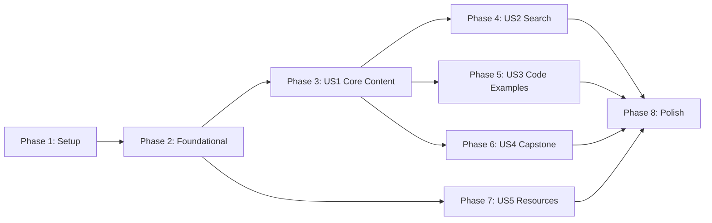

# Tasks: Physical AI & Humanoid Robotics Educational Book

**Input**: Design documents from `/specs/001-physical-ai-book/`
**Prerequisites**: plan.md (required), spec.md (required), research.md, data-model.md, contracts/

**Tests**: Tests are NOT explicitly requested - focusing on build verification and content validation.

**Organization**: Tasks are organized to enable incremental delivery:
- Phase 1: Setup (shared infrastructure)
- Phase 2: Foundational (blocking prerequisites)
- Phase 3+: Content organized by user story priority
- Final Phase: Polish and deployment

## Format: `[ID] [P?] [Story?] Description`

- **[P]**: Can run in parallel (different files, no dependencies)
- **[Story]**: Which user story this task belongs to (US1, US2, US3, US4, US5)
- Include exact file paths in descriptions

## Path Conventions

Project structure: Docusaurus documentation site at repository root

```text
ai-robotics-book/
├── docs/                    # Content files
├── src/css/                 # Custom styles
├── static/img/              # Static assets
├── .github/workflows/       # CI/CD
├── docusaurus.config.js     # Main config
├── sidebars.js              # Navigation
└── package.json             # Dependencies
```

---

## Phase 1: Setup (Shared Infrastructure)

**Purpose**: Initialize Docusaurus project and configure deployment pipeline

- [ ] T001 Initialize Docusaurus project with classic preset using `npx create-docusaurus@latest ai-robotics-book classic`
- [ ] T002 Install @docusaurus/theme-mermaid dependency in ai-robotics-book/package.json
- [ ] T003 [P] Configure docusaurus.config.js for GitHub Pages deployment (url, baseUrl, organizationName, projectName)
- [ ] T004 [P] Enable Mermaid diagrams in docusaurus.config.js (markdown.mermaid: true, themes array)
- [ ] T005 Configure sidebars.js for autogenerated sidebar from docs/ folder
- [ ] T006 [P] Create .github/workflows/deploy.yml for GitHub Actions deployment
- [ ] T007 [P] Create README.md with project overview and local development instructions
- [ ] T008 Remove default tutorial content from docs/ folder

**Checkpoint**: Project builds with `npm run build` and development server runs with `npm start`

---

## Phase 2: Foundational (Blocking Prerequisites)

**Purpose**: Create content structure that ALL user stories depend on

**⚠️ CRITICAL**: No content writing can begin until this phase is complete

- [ ] T009 Create docs/module-1-ros2/_category_.json with label "Module 1: ROS 2 Fundamentals" and position 2
- [ ] T010 [P] Create docs/module-2-simulation/_category_.json with label "Module 2: Simulation Environments" and position 3
- [ ] T011 [P] Create docs/module-3-isaac/_category_.json with label "Module 3: NVIDIA Isaac Platform" and position 4
- [ ] T012 [P] Create docs/module-4-vla/_category_.json with label "Module 4: Vision-Language-Action" and position 5
- [ ] T013 [P] Create docs/capstone/_category_.json with label "Capstone Project" and position 6
- [ ] T014 [P] Create docs/resources/_category_.json with label "Resources & References" and position 7
- [ ] T015 Create src/css/custom.css with basic theme customization (primary color, code block styling)

**Checkpoint**: All module folders appear in sidebar navigation; build succeeds

---

## Phase 3: User Story 1 - Browse and Learn Core Concepts (Priority: P1) 🎯 MVP

**Goal**: Deliver complete educational content across all modules with proper navigation

**Independent Test**: Access deployed site, navigate through all modules, verify content renders with formatting, code highlighting, and diagrams

### Introduction Content

- [ ] T016 [US1] Create docs/intro.md with frontmatter (sidebar_position: 1, slug: /) covering Physical AI landscape (~1,500 words)
- [ ] T017 [US1] Add learning outcomes section to docs/intro.md (3+ measurable objectives)
- [ ] T018 [US1] Add course structure overview and navigation guide to docs/intro.md

### Module 1: ROS 2 Fundamentals (~4,000 words)

- [ ] T019 [US1] Create docs/module-1-ros2/01-architecture.md covering ROS 2 middleware architecture (~1,000 words)
- [ ] T020 [P] [US1] Add 2 code examples to 01-architecture.md (ROS 2 node initialization, basic publisher)
- [ ] T021 [P] [US1] Add Mermaid diagram showing ROS 2 architecture to 01-architecture.md
- [ ] T022 [US1] Create docs/module-1-ros2/02-nodes-topics-services.md covering communication patterns (~1,000 words)
- [ ] T023 [P] [US1] Add 2 code examples to 02-nodes-topics-services.md (topic subscriber, service client)
- [ ] T024 [P] [US1] Add Mermaid sequence diagram showing pub/sub pattern to 02-nodes-topics-services.md
- [ ] T025 [US1] Create docs/module-1-ros2/03-rclpy-integration.md covering Python-ROS 2 bridge (~1,000 words)
- [ ] T026 [P] [US1] Add 2 code examples to 03-rclpy-integration.md (rclpy node class, callback handling)
- [ ] T027 [US1] Create docs/module-1-ros2/04-urdf-humanoids.md covering robot description format (~1,000 words)
- [ ] T028 [P] [US1] Add URDF code example for humanoid robot links/joints to 04-urdf-humanoids.md
- [ ] T029 [P] [US1] Add Mermaid diagram showing humanoid kinematic chain to 04-urdf-humanoids.md
- [ ] T030 [US1] Add learning outcomes and self-assessment questions to all Module 1 chapters

### Module 2: Simulation Environments (~3,500 words)

- [ ] T031 [US1] Create docs/module-2-simulation/01-gazebo-basics.md covering Gazebo simulation setup (~900 words)
- [ ] T032 [P] [US1] Add 2 code examples to 01-gazebo-basics.md (world file, launch configuration)
- [ ] T033 [P] [US1] Add Mermaid diagram showing Gazebo-ROS 2 integration to 01-gazebo-basics.md
- [ ] T034 [US1] Create docs/module-2-simulation/02-unity-integration.md covering Unity for robotics (~800 words)
- [ ] T035 [P] [US1] Add code example showing Unity-ROS 2 bridge configuration to 02-unity-integration.md
- [ ] T036 [US1] Create docs/module-2-simulation/03-sensor-simulation.md covering virtual sensors (~900 words)
- [ ] T037 [P] [US1] Add 2 code examples to 03-sensor-simulation.md (camera plugin, IMU configuration)
- [ ] T038 [US1] Create docs/module-2-simulation/04-digital-twins.md covering digital twin concepts (~900 words)
- [ ] T039 [P] [US1] Add Mermaid diagram showing digital twin architecture to 04-digital-twins.md
- [ ] T040 [US1] Add learning outcomes and self-assessment questions to all Module 2 chapters

### Module 3: NVIDIA Isaac Platform (~4,000 words)

- [ ] T041 [US1] Create docs/module-3-isaac/01-isaac-sim-intro.md covering Isaac Sim capabilities (~1,000 words)
- [ ] T042 [P] [US1] Add 2 code examples to 01-isaac-sim-intro.md (scene setup, synthetic data generation)
- [ ] T043 [P] [US1] Add Mermaid diagram showing Isaac Sim architecture to 01-isaac-sim-intro.md
- [ ] T044 [US1] Create docs/module-3-isaac/02-isaac-ros.md covering Isaac ROS integration (~1,000 words)
- [ ] T045 [P] [US1] Add 2 code examples to 02-isaac-ros.md (Isaac ROS node, perception pipeline)
- [ ] T046 [US1] Create docs/module-3-isaac/03-vslam.md covering visual SLAM for humanoids (~1,000 words)
- [ ] T047 [P] [US1] Add code example showing VSLAM configuration to 03-vslam.md
- [ ] T048 [P] [US1] Add Mermaid diagram showing VSLAM pipeline to 03-vslam.md
- [ ] T049 [US1] Create docs/module-3-isaac/04-nav2-bipedal.md covering bipedal navigation (~1,000 words)
- [ ] T050 [P] [US1] Add 2 code examples to 04-nav2-bipedal.md (Nav2 config, bipedal controller)
- [ ] T051 [US1] Add learning outcomes and self-assessment questions to all Module 3 chapters

### Module 4: Vision-Language-Action (~3,500 words)

- [ ] T052 [US1] Create docs/module-4-vla/01-voice-to-action.md covering voice command processing (~1,200 words)
- [ ] T053 [P] [US1] Add 2 code examples to 01-voice-to-action.md (Whisper integration, command parser)
- [ ] T054 [P] [US1] Add Mermaid diagram showing voice-to-action pipeline to 01-voice-to-action.md
- [ ] T055 [US1] Create docs/module-4-vla/02-llm-planning.md covering LLM cognitive planning (~1,200 words)
- [ ] T056 [P] [US1] Add 2 code examples to 02-llm-planning.md (LLM prompt template, action planner)
- [ ] T057 [P] [US1] Add Mermaid diagram showing LLM-ROS 2 integration to 02-llm-planning.md
- [ ] T058 [US1] Create docs/module-4-vla/03-multimodal-integration.md covering multi-modal fusion (~1,100 words)
- [ ] T059 [P] [US1] Add code example showing multi-modal integration to 03-multimodal-integration.md
- [ ] T060 [US1] Add learning outcomes and self-assessment questions to all Module 4 chapters

**Checkpoint**: All 4 modules complete with ~16,000 words, 12+ code examples, 8+ diagrams; navigation works

---

## Phase 4: User Story 2 - Search for Specific Topics (Priority: P2)

**Goal**: Enable efficient content discovery through search functionality

**Independent Test**: Enter search queries and verify relevant results appear with accurate links

- [ ] T061 [US2] Verify Docusaurus search plugin is enabled in docusaurus.config.js (default local search)
- [ ] T062 [US2] Add keywords array to frontmatter of all chapter files for improved search indexing
- [ ] T063 [US2] Verify search returns results for key terms: "ROS 2 nodes", "Isaac Sim", "URDF", "VSLAM"
- [ ] T064 [US2] Test search result navigation links to correct sections

**Checkpoint**: Search returns relevant results in < 2 seconds; clicking results navigates correctly

---

## Phase 5: User Story 3 - Run Code Examples Locally (Priority: P2)

**Goal**: Ensure all code examples are copy-paste ready and properly documented

**Independent Test**: Copy any code example, follow prerequisites, execute successfully

- [ ] T065 [US3] Verify all code blocks have language identifier (python, xml, yaml, bash) for syntax highlighting
- [ ] T066 [US3] Add title attribute to all code blocks for clear identification
- [ ] T067 [US3] Ensure each code example has surrounding context explaining prerequisites and expected output
- [ ] T068 [US3] Verify copy button functionality works for all code blocks (Docusaurus default)
- [ ] T069 [US3] Add version requirements (ROS 2 Jazzy, Isaac Sim 4.x, Python 3.10+) to intro.md prerequisites

**Checkpoint**: 100% code blocks have language tags; copy button works; prerequisites documented

---

## Phase 6: User Story 4 - Complete Capstone Project (Priority: P3)

**Goal**: Provide comprehensive project guide synthesizing all modules

**Independent Test**: Follow capstone guide and verify all cross-references work

- [ ] T070 [US4] Create docs/capstone/project.md with project overview and objectives (~500 words)
- [ ] T071 [US4] Add project prerequisites section referencing all module completion to project.md
- [ ] T072 [US4] Add Step 1: Robot setup using Module 1 concepts (~300 words) with cross-references
- [ ] T073 [US4] Add Step 2: Simulation environment using Module 2 concepts (~300 words) with cross-references
- [ ] T074 [US4] Add Step 3: Perception pipeline using Module 3 concepts (~300 words) with cross-references
- [ ] T075 [US4] Add Step 4: VLA integration using Module 4 concepts (~300 words) with cross-references
- [ ] T076 [US4] Add project milestones and validation criteria to project.md (~300 words)
- [ ] T077 [US4] Verify all internal cross-reference links in capstone work correctly

**Checkpoint**: Capstone complete (~2,000 words); all cross-references resolve; synthesizes all modules

---

## Phase 7: User Story 5 - Access Resources and References (Priority: P3)

**Goal**: Provide curated external resources and glossary

**Independent Test**: Navigate to Resources section; verify all external links resolve

- [ ] T078 [US5] Create docs/resources/references.md with categorized external links (~300 words)
- [ ] T079 [P] [US5] Add Official Documentation section with ROS 2, NVIDIA Isaac, Gazebo links to references.md
- [ ] T080 [P] [US5] Add Research Papers section with key robotics/VLA papers to references.md
- [ ] T081 [P] [US5] Add Community Resources section with forums, Discord, GitHub links to references.md
- [ ] T082 [P] [US5] Add Tools and Libraries section with recommended software to references.md
- [ ] T083 [US5] Create docs/resources/glossary.md with key terms and definitions (~200 words)
- [ ] T084 [US5] Verify all external links open in new tab and resolve correctly

**Checkpoint**: Resources section complete (~500 words); all external links work

---

## Phase 8: Polish & Cross-Cutting Concerns

**Purpose**: Final validation and deployment

- [ ] T085 Run internal link validation using Docusaurus build warnings
- [ ] T086 [P] Verify mobile responsiveness using browser dev tools
- [ ] T087 [P] Run `npm run build` and verify 0 errors and 0 warnings
- [ ] T088 Verify word count meets target (15,000-20,000 words total)
- [ ] T089 Push to main branch and verify GitHub Actions workflow triggers
- [ ] T090 Verify GitHub Pages deployment succeeds and site is accessible
- [ ] T091 Test live site navigation, search, and code block rendering
- [ ] T092 Verify site loads in < 3 seconds on standard connection

**Checkpoint**: Build passes, deployment succeeds, live site functional

---

## Dependencies & Execution Order

### Phase Dependencies

- **Setup (Phase 1)**: No dependencies - start immediately
- **Foundational (Phase 2)**: Depends on Setup completion - BLOCKS all content
- **User Story 1 (Phase 3)**: Depends on Foundational - Core MVP content
- **User Stories 2-3 (Phases 4-5)**: Can start after US1 Introduction complete
- **User Story 4 (Phase 6)**: Depends on ALL modules in US1 complete
- **User Story 5 (Phase 7)**: Can start after Foundational; independent of content
- **Polish (Phase 8)**: Depends on all user stories complete

### User Story Dependencies



### Parallel Opportunities

Within each phase, tasks marked [P] can run in parallel:

**Phase 1 (Setup):**
```
T003, T004 can run in parallel (different config sections)
T006, T007 can run in parallel (different files)
```

**Phase 2 (Foundational):**
```
T010, T011, T012, T013, T014 can ALL run in parallel (different folders)
```

**Phase 3 (US1 Content) - Per Module:**
```
After chapter .md created:
- Code examples [P] can run in parallel
- Diagrams [P] can run in parallel
```

---

## Implementation Strategy

### MVP First (Complete US1 Only)

1. Complete Phase 1: Setup
2. Complete Phase 2: Foundational
3. Complete Phase 3: US1 Core Content (Introduction + All 4 Modules)
4. **STOP and VALIDATE**: Test site navigation, content rendering
5. Deploy MVP to GitHub Pages

**MVP Deliverable**: Complete educational book with 4 modules, ~16,000 words

### Incremental Enhancement

1. MVP Complete → Deploy
2. Add US2: Search optimization → Test search
3. Add US3: Code example polish → Test copy/paste
4. Add US4: Capstone project → Test cross-references
5. Add US5: Resources section → Test external links
6. Final Polish → Production deployment

### Content Writing Order (Within US1)

1. Introduction (sets context for all modules)
2. Module 1: ROS 2 (foundational robotics concepts)
3. Module 2: Simulation (builds on ROS 2)
4. Module 3: Isaac (integrates ROS 2 + Simulation)
5. Module 4: VLA (highest-level integration)

Each module: Chapter 1 → Chapter 2 → Chapter 3 → Chapter 4 → Learning outcomes/assessments

---

## Task Summary

| Phase | Task Count | Story | Parallel Opportunities |
|-------|------------|-------|----------------------|
| Phase 1: Setup | 8 | - | 4 parallel groups |
| Phase 2: Foundational | 7 | - | 5 parallel tasks |
| Phase 3: US1 Content | 45 | US1 | ~20 parallel tasks |
| Phase 4: US2 Search | 4 | US2 | 0 (sequential validation) |
| Phase 5: US3 Code | 5 | US3 | 0 (validation) |
| Phase 6: US4 Capstone | 8 | US4 | 0 (sequential content) |
| Phase 7: US5 Resources | 7 | US5 | 4 parallel tasks |
| Phase 8: Polish | 8 | - | 2 parallel tasks |
| **Total** | **92** | - | **~35 parallel opportunities** |

---

## Notes

- [P] tasks = different files, no dependencies on incomplete tasks
- [Story] label maps task to specific user story for traceability
- Word counts are targets; adjust as needed while maintaining 15,000-20,000 total
- Code examples should target ROS 2 Jazzy and Isaac Sim 4.x
- All chapters MUST include: learning outcomes, main content, code examples, self-assessment
- Commit after each chapter or logical group of tasks
- Stop at any checkpoint to validate quality before proceeding
